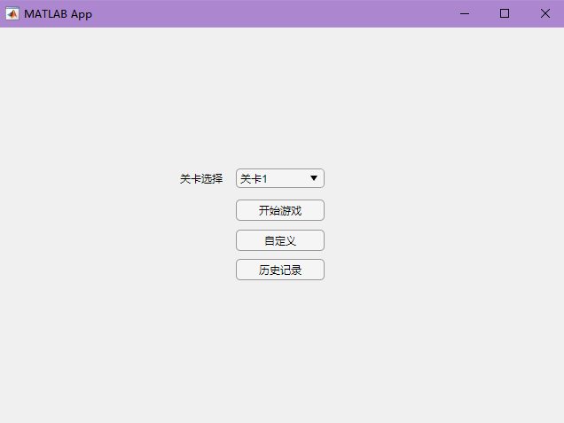
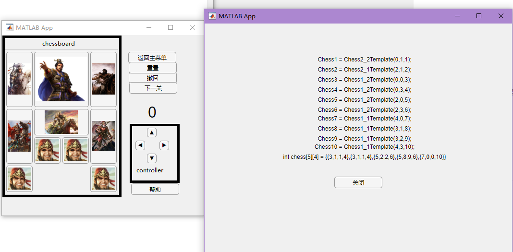
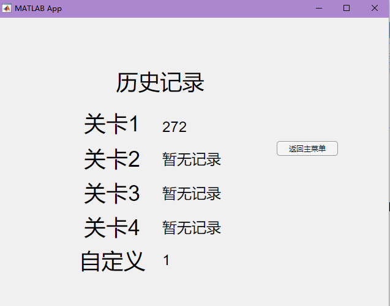

# User manual
[Toc]

# System Architecture

  

# Main Manual
## Menu UI

  

In this UI interface,you can choose to play the game ,review the grade or customize the chessboard.

- In '关卡选择',you can choose the set level that you like and you can play it after you press '开始游戏'.If you forget choosing one,we will start the game on level 1.
- If you press '开始游戏'，you'll enter the Game UI where you can play the level that you choose;
- If you press '自定义',you'll enter the Customized UI where you can customize the chessboard that you like;
- If you press '历史记录',you can review the record of each level.

## Game UI

  

In this UI ,you can play the HuaRong Path game. The left part is chessboard. In this part ,each chess piece is a button ,and you can choose one to press. You can use the 'controller' to control the chess piece that you are operation on moving .The buttons in controller mean the direction. You will win the game if you move the chess1 at the center bottom of the chessboard .  If you win the game ,the step counter will set `'Win!'`

- If you press the button in 'Chessboard' ,you can control the chess piece that you press.
- If you press the button in 'Controller' ,the chess will move if the movement is legal.
  - We define the movement is legal by the following rules below:
    -  The space is empty if the the chess try to move towards the direction in one step
    -  The chess piece cannot move beyond the boundary when it tries to move towards the direction in one step
- If you press '返回主菜单'，you'll enter the menu UI ;

- If you press '重置',you'll reset all the chess piece back to the init chessboard ;
- If you press '撤回',you'll set the chessboard back to the previous step.
- If you press '下一关',you'll get into the next level ;
- If you press '帮助',you can get a code piece and send it into the judge.xml with uppaal. Uppaal will help you to find the solution; 

## Customized UI

  

In this UI interface,you can customize your own level to play the game. You need to put all the chess on the chessboard so that you can play the game. If you put this chess on the invalid place, we'll  prompt you with the label above the chessboard.

- The buttons in '按钮选择' are the chess pieces need to be put on .You can choose only one chess piece at once. If  the button is dark,it means you are operating the chess piece or the chess piece is put on the chessboard. You can also use these button to release the chess pieces that you have put on the chessboard by clicking the button again.
- The buttons below '按钮放置' which is on the chessboard ,are the positions where you want to put the chess piece that you are operating on. Once the chess piece is put on ,the related buttons will be not available until you release the chess piece that is put on the chessboard.
- If you press '游玩'，you'll play the chessboard that you customize. This action will be valid only if you put all the chess pieces.
- If you press '重新放置',you'll reset the chessboard and delete all the chess piece that put on the chessboard;
- If you press '返回主菜单'，you'll enter the menu UI ;

## History UI

  

In this interface,you can review the best grade that you pass the level.

- If you press '返回主菜单'，you'll enter the menu UI ;
