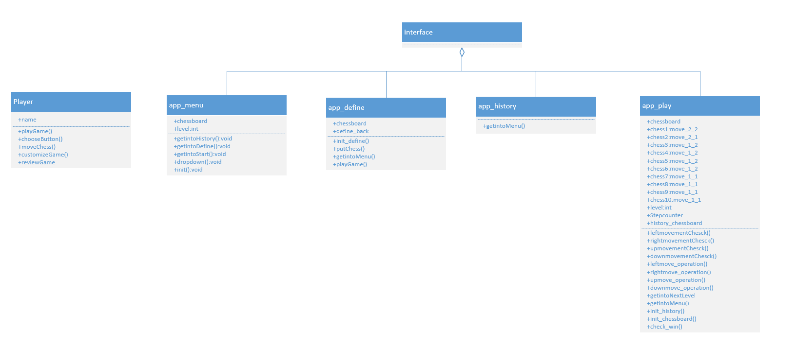
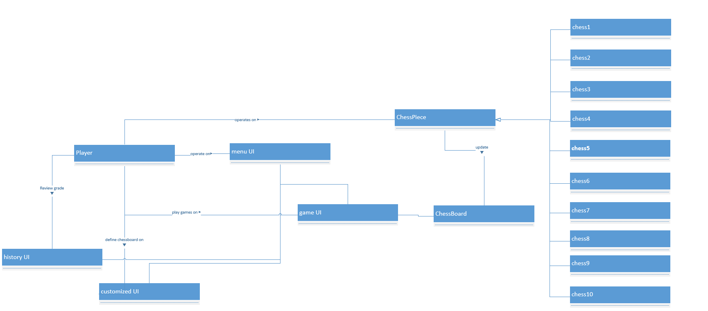
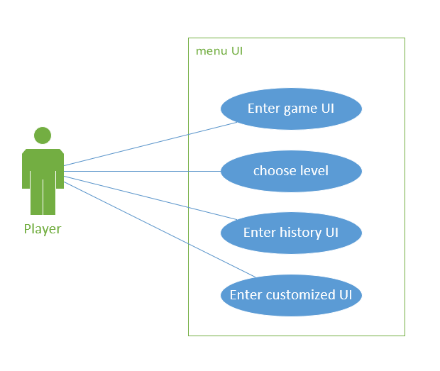
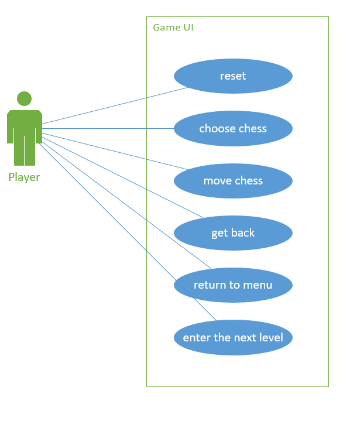
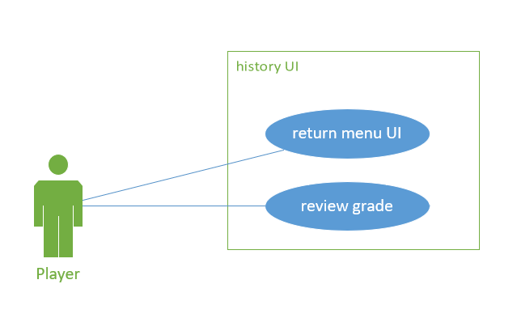
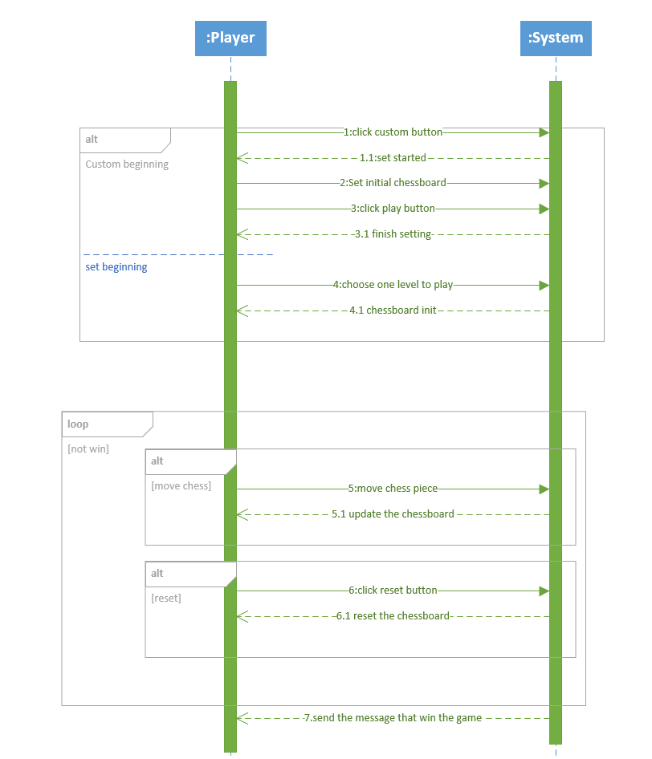

# HuaRong Path

[Toc]

# 1. System Objective
In this project, we are developing a Huarong Path game software. By providing interconnected interfaces to player, the player can play Huarong Path in any initial state he wants, and know whether he wins finally.  We also provide a uppaal code to judge whether the game have solution or not. The system can record the number of operations to help the player achieve better performance. This makes it easier for players to challenge higher scores.
The game is convenient for players. The players can customize the beginning of the game and place the chess pieces whatever they want, or choose from any of the level to play. The game also supports the function of resetting and setting back chess piece to help player to get better score.  

# 2. Domain Analysis
The player of the game in a HuaRong Path game can be categorized into player.

  

The relationship between the player and UI is :

  

Here is the sequence of events for a player to play the game:

  

# 3. System Architecture

From the users' action ,we design a software with 4 UI interface :menu UI,history UI,game UI,customized UI .Menu UI is the interface that connects the remaining UI and user can use it to enter the remaining UI .History UI is the interface that users can review their grade. Game UI is the main interface ,and users can play the Huarong Path in this interface. Customized UI is the interface that users set their own game and put it into Game UI.
These interfaces realize many interactions between users and system.The user can clearly know the current state of the game and the next action that can be performed:

  

# 4. Use Case
We achieve the following use case:
## 4.1. menu UI:

  

## 4.2. game UI

  

## 4.3. history UI

  

## 4.4. customized_UI

  

# 5. Passing Message Analysis

The communication between player and the system is shown below. To simplify the state flow,we just pay attention on the Game UI,while the customized UI has less details.

  
 

# 6. Software Requirements
## 6.1. R1 UI interface

### R1.1 The player can enter into history ,game and customized mode on menu UI.

- R1.1.1 The player should be able to choose which level to start the game on the menu UI; 
- R1.1.2 The player should be able to enter the game UI;
- R1.1.3 The player should be able to enter the history UI;
- R1.1.4 The player should be able to enter the customized mode;

### R1.2 The player can start a new game on the game UI.

- R1.2.1 The player should be able to start the game on the game UI;  
- R1.2.2 The player should be able to return to the menu UI;
- R1.2.3 The game status can be seen directly after moving the chess;
- R1.2.4 The player can only choose one chess at one time;
- R1.2.5 The player can move the chess;
- R1.2.6 The player can reset the game status to the original status;
- R1.2.7 The game should be able to record the steps;
- R1.2.8 The game should be able to determine whether the player wins;
- R1.2.9 The player can move to the next level if he wants.
- R1.2.10 The player can repent chess.
- R1.2.11 The player can ask for help if he can't solve the problem

### R1.3 The player can set his own game and play it on the customized UI.

- R1.3.1 The player can enter into the game UI if he put all chesses;
- R1.3.2 The player can get back to the menu UI;
- R1.3.3 The player can set his own game;
- R1.3.4 The player can set the chess pieces if the place is not occupied;
- R1.3.5 The player can't set the chess pieces if the place is occupied;
- R1.3.6 The player can start his game only when he puts all the chess pieces;
- R1.3.7 The player can only set one chess piece at one time; 
- R1.3.8 The player can delete the chess on the board if he doesn't want to put it on that place.
- R1.3.9 The player can reset all the chesses if he wants

### R1.4 The player can see his history on history UI.

- R1.4.1 The player can see his best grade in each level on the history UI;
- R1.4.2 The player can return back to the menu UI;

## 6.2. R2 Game processing

### R2.1 The position of the chess pieces should be initialized correctly before starting

### R2.2 The player can select any of his pieces in UI.

### R2.3 The player must legally move the pieces he chooses.

### R2.4 The piece in customized mode should be place legeally

### R2.5 The player can get the result whether the game can be solved or not by uppaal
