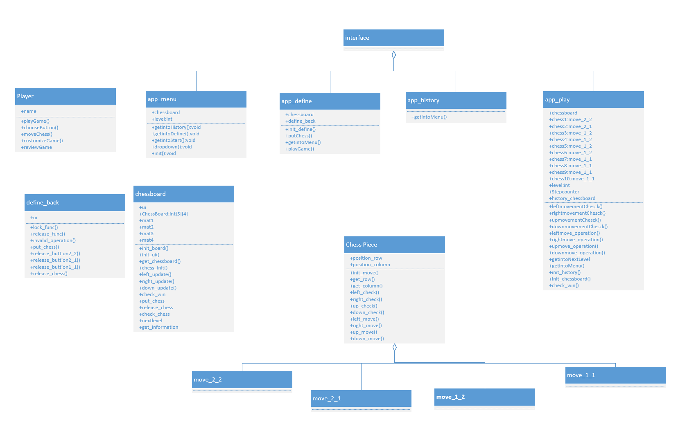
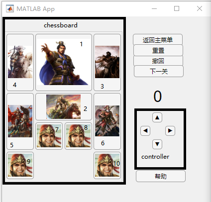
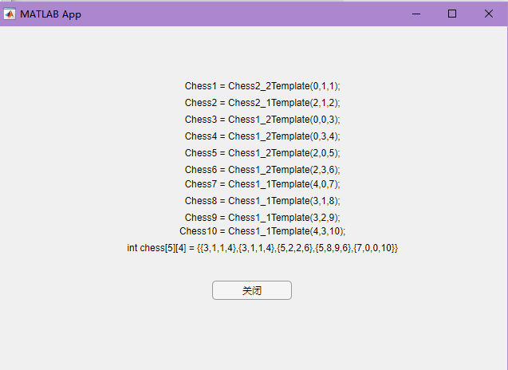
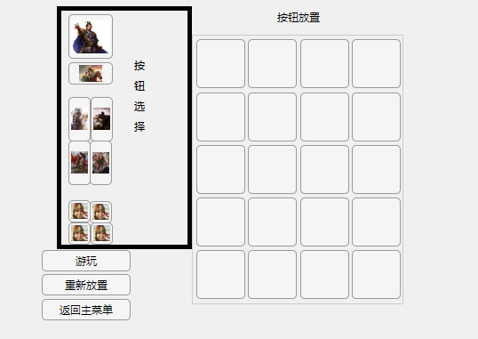

# HuaRong Path Specification

[Toc]

## 1.System Architecture

  
 

## 2.Software Specification

### S1.Menu UI(app_menu())

  
 

Select which system to open.

#### S1.1 select the level that we set

  
 

#### S1.1.1 press '关卡1'

Process will set the level at 1;

#### S1.1.2 press '关卡2'

Process will set the level at 2;

#### S1.1.3 press '关卡3'

Process will set the level at 3;

#### S1.1.4 press '关卡4'

Process will set the level at 4;

### S1.2 press '开始游戏' button

Process will open the app_play() and enter the Play UI. The game level is set to the level you selected in the menu UI. Then process will close down the menu UI.

### S1.3 press '自定义' button

Process will open the app_define() and enter the Customize UI. Then process will close down the menu UI.

### S1.3 press '历史记录' button

Process will open the app_history() and enter the History UI. Then process will close down the menu UI.

## S2.Play UI(app_play())

  
 

This is the main interface of the HuaRong Path. You can play the HuaRong Path game here. You can operate the chess piece on the chessboard and control them with the controller. The Label `'0'` is the step counter .It will update if you do a legal movement. You can also reset the game from the initial state and play it again. You will win the game if you move the chess1 at the center bottom of the chessboard .   

### S2.0 chessboard initialize

This operation doesn't have buttons but it's a very important function. Process will initialize the chessboard before the game start. So the game you play is up to the chessboard matrix you input. And the interface will be initialized well once you start the game.  

### S2.1 Press buttons in chessboard

The process will set the pressing chess as the operating chess. The operating will be only one. If there is a operating chess and you press another chess piece,the process will set the chess that you're pressing as the operating chess. You can move the operating chess through controller.

 #### S2.1.1 Press chess 1

Process will set the chess 1 as the operating chess.  

 #### S2.1.2 Press chess 2

Process will set the chess 2 as the operating chess.  

 #### S2.1.3 Press chess 3

Process will set the chess 3 as the operating chess.  

 #### S2.1.4 Press chess 4

Process will set the chess 4 as the operating chess.  

 #### S2.1.5 Press chess 5

Process will set the chess 5 as the operating chess.  

 #### S2.1.6 Press chess 6

Process will set the chess 6 as the operating chess.  

 #### S2.1.7 Press chess 7

Process will set the chess 7 as the operating chess.  

 #### S2.1.8 Press chess 8

Process will set the chess 8 as the operating chess.  

 #### S2.1.9 Press chess 9

Process will set the chess 9 as the operating chess.  

 #### S2.1.10 Press chess 10

Process will set the chess 10 as the operating chess.  

### S2.2 Press buttons in controller

The process will try to move the operating chess with the direction you give in controller. If the movement is legal, the chess will move a step towards the direction,and you can see the status changed on the chessboard.

We define the movement is legal by the following rules below:

-  The space is empty if the the chess try to move towards the direction in one step
-  The chess piece cannot move beyond the boundary when it tries to move towards the direction in one step

We will define you win the game if chess1 is at the center bottom of chessboard. 

#### S2.2.1 Press left direction button

Process will try to move the operating chess one step towards left direction . Do move and update the chessboard if the movement is legal. Then process will check the chessboard state to determine whether you win the game or not. If you win the game ,the step counter will set `'Win!'`

#### S2.2.2 Press up direction button

Process will try to move the operating chess one step towards up direction . Do move and update the chessboard if the movement is legal. Then process will check the chessboard state to determine whether you win the game or not. If you win the game ,the step counter will set `'Win!'`

#### S2.2.3 Press right direction button

Process will try to move the operating chess one step towards right direction. Do move and update the chessboard if the movement is legal. Then process will check the chessboard state to determine whether you win the game or not. If you win the game ,the step counter will set `'Win!'`

#### S2.2.4 Press down direction button

Process will try to move the operating chess one step towards down direction . Do move and update the chessboard if the movement is legal. Then process will check the chessboard state to determine whether you win the game or not. If you win the game ,the step counter will set `'Win!'`

### S2.3 Press '返回主菜单' button

Process will open the app_menu() and enter the menu UI. Then process will close down the play UI.

### S2.4 Press '重置' button

The Process will place all the pieces in the state they were in at the beginning of the level and set the step counter back to `'0'`

### S2.5 Press '撤回' button

The Process will move the pieces back to your previous move. The operation is only legal if the number of the step is more than `0`,which means there will be no reaction if you press the button at the step of `0`  

### S2.6 Press '下一关' button

The Process will place all the pieces in the state they will be in at the next level and set the step counter back to `'0'`.

### S2.7 Press '帮助' button

  
 

The process will give you a uppaal code in help interface. You can input the code into the judge.xml in the src and uppaal will give you a solution if this chessboard has solution. This progress will take a long time. 

## S3.Customized UI(app_define)

  
 

In this UI interface,you can customize your own level to play the game. You need to put all the chess on the chessboard so that you can play the game. If you put this chess on the invalid place, we'll  prompt you with the label above the chessboard.

### S3.1 Press the button  in '按钮选择'

The buttons in '按钮选择' are the chess pieces need to be put on .You can choose only one chess piece to put at once. If  the button is dark,it means you are operating the chess piece or the chess piece is put on the chessboard. You can also use these button to release the chess pieces that you have put on the chessboard by clicking the button again. 

If you press the button ,you can choose operate button or do release.There are some rules below:

#### S3.1.1 choose operating button 

- If the button is light and there is no other operating chess,you press it and the operating chess will the the pressing chess. 
- If there is an operating button which is dark and you press another button which is light , the pressing chess will be set to operating chess and the previous operating chess will be set to light. 

#### S3.1.2 put chess

- If you choose one operating chess ,and you press a legal position in the chessboard(we'll introduce it below).The chess piece will occupy the related position and set the operating chess to `'0'`which means no operating chess. The chess piece will stay dark to tell you this chess finishes putting.
- If you haven't chosen one operating chess which means  the operating chess is`'0'` and you press a position in the chessboard. We will prompt you `'请选择操作按键'` 

#### S3.1.3 release button

- If the button is dark and there is no operating chess,you press it .The chessboard will release the space that the chess piece is occupied and process will set these buttons `'enable'`. There won't be operating chess.
- If the button is dark and there is an operating chess,you press it .The chessboard will release the space that the chess piece is occupied,set the operating chess to light and set the operating chess to `'0'` which means there won't be operating chess.

#### Bonus

Compared to other customized UI,We give users freedom to choose the chess pieces to put. User can choose the order they put on the chessboard and change the chess piece position due to the chessboard. Also we allow users to repent their choice if they want not to put the chesses on the chessboard.

### S3.2 Press the buttons in chessboard

The buttons in chessboard mean the position that the chess will occupy. If you have chosen an operating chess and want to put the chess on the board,you need to press the buttons in chessboard. If the position is legal to put the operating chess,process will set the related button into `'disable' `to prevent you press it again until you release the chess piece.

We default the chessboard is `5*4` size. Here are some rules for process to judge whether this operation is legal:

#### S3.2.1 2*2 size chess put

We default that the 2*2 size chess have two information :`row` and `col` ,and the position is set by `row`and `col`.When it is put ,It will occupy the space `[row,col]`,`[row,col+1]`,`[row+1,col]`,`[row+1,col+1]`,The chess will be put if and only if:

- row < 5 and col < 4 
- There is no space occupied before it puts on.

#### S3.2.2 2*1 size chess put

We default that the 2*1 size chess have two information :`row` and `col` ,and the position is set by `row`and `col`.When it is put ,It will occupy the space `[row,col]`,`[row,col+1]`,The chess will be put if and only if:

- col < 4 
- There is no space occupied before it puts on.

#### S3.2.3 1*2 size chess put

We default that the 1*2 size chess have two information :`row` and `col` ,and the position is set by `row`and `col`.When it is put ,It will occupy the space `[row,col]`,`[row+1,col]`,The chess will be put if and only if:

- row < 5
- There is no space occupied before it puts on.

#### S3.2.4 1*1 size chess put

We default that the 1*1 size chess have two information :`row` and `col` ,and the position is set by `row`and `col`.When it is put ,It will occupy the space `[row,col]`,The chess will be put if and only if:

- There is no space occupied before it puts on.

If the operation is illegal,We will prompt you `'非法操作'`  

### S3.3 Press '游玩'  button

Process will open app_play and enter Play UI with the customized chessboard if all chess pieces is put on the chessboard. If there are still some of the chess pieces that remain putting,we'll prompt you `'未完成所有按钮的初始化'` 

### S3.4 Press '重新放置' button

Process will release all chess pieces and the space the occupied.

### S3.5 Press '返回主菜单' button

Process will open the app_menu() and enter the menu UI. Then process will close down the Customized UI.

## S4.History UI (app_history)

  
 

#### Bonus

This UI is not acquired in the demand list. In this UI, users can review the best grade they achieve,and the grade will update if user achieve a better score.

### S4.1 press '返回主菜单'

Process will open the app_menu() and enter the menu UI. Then process will close down the History UI.