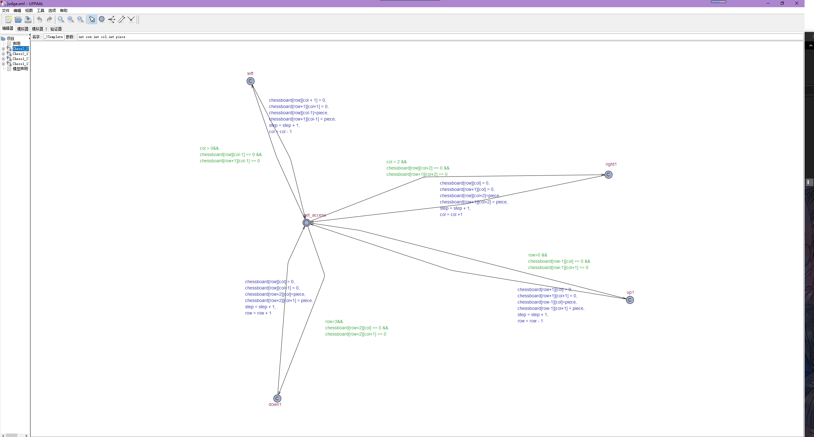
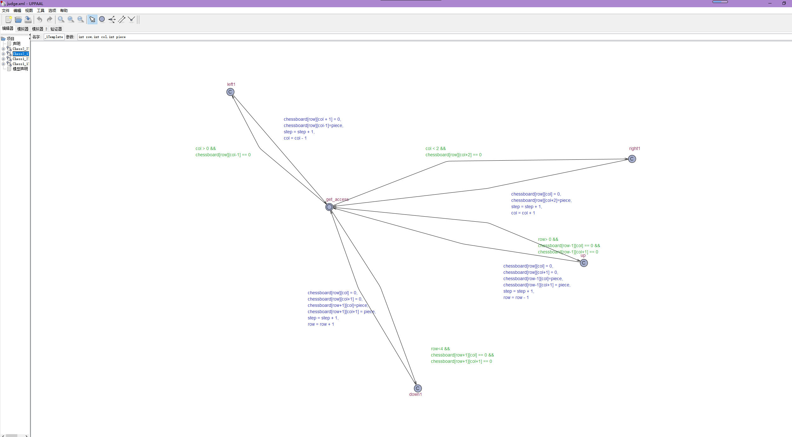
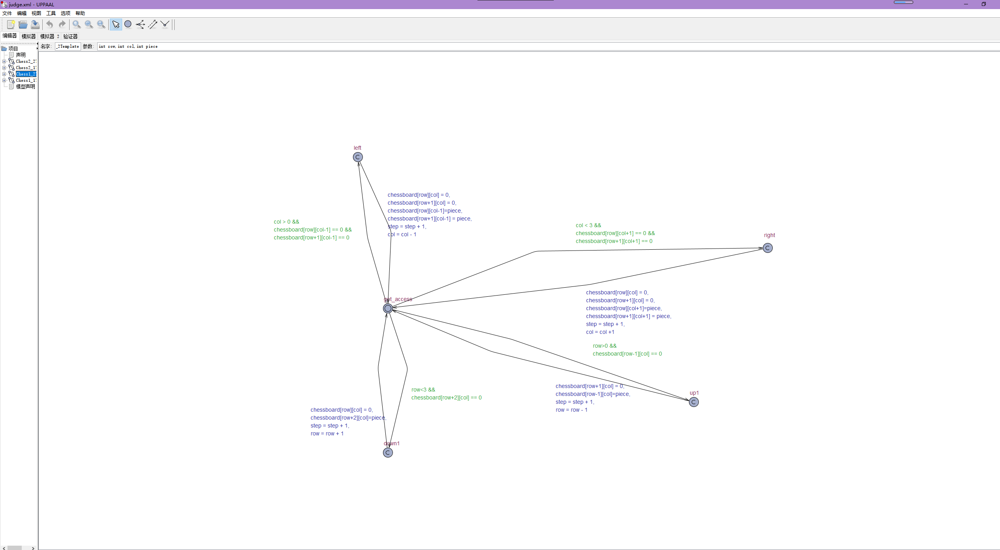
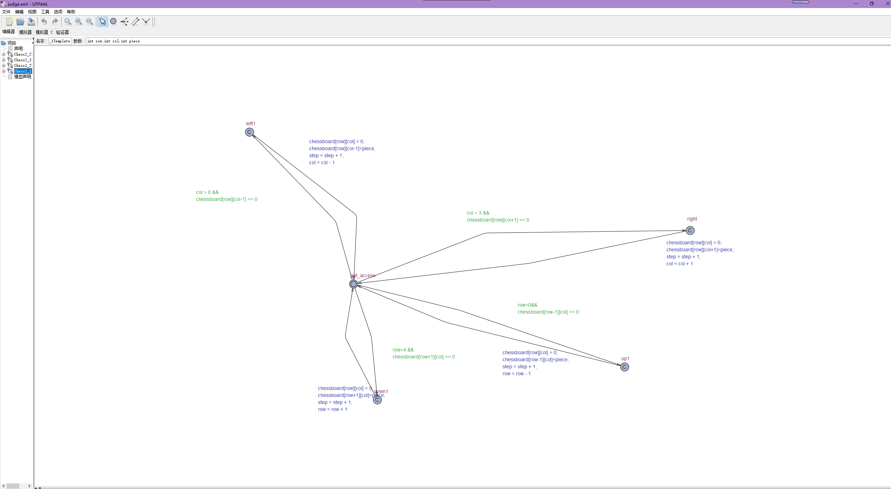
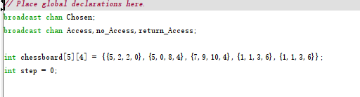
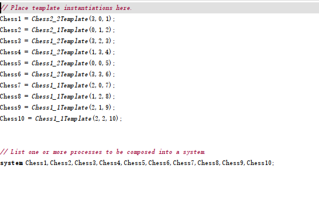

# Software validation

HuaRong Path
group 5

# Table of content
[Toc]

# System Architecture

<div align = 'center'>  </div>

# T1:Unit Test

There are two unit Test file.Unittest1 covers T1.1 to T1.5.Unittest2 covers T1.6

## T1.1 chessboard Unit test

### T1.1.1  init_board() Test

```matlab
function init_board(board,matrix)
            %no input
            %Tcover1.1.1
            board.ChessBoard = matrix ;
        end
```

- Coverage Criteria :Statement Coverage

- Test Case

  |                 | Test Case T1.1.1                                             |
  | --------------- | ------------------------------------------------------------ |
  | Coverage item   | Tcover 1.1.1                                                 |
  | input           | matrix:[1,1,2,2;1,1,3,4;6,5,3,4;6,5,7,9;8,10,0,0]            |
  | State           | Chessboard = [1,1,2,2;1,1,3,4;6,5,3,4;6,5,7,9;8,10,0,0]      |
  | Expected output | chessboard.Chessboard=[1,1,2,2;1,1,3,4;6,5,3,4;6,5,7,9;8,10,0,0] |

  - Test coverage :1/1 = 100%
  - Test Result:1 passed

### T1.1.2  left_update() Test

```matlab
function left_update(chessboard,button_number,row,column)
            if button_number == 1 %Tcover1.1.2.1
                chessboard.ChessBoard(row(1,1),column(1,2)) = 0;
                chessboard.ChessBoard(row(1,2),column(1,2)) = 0;
                chessboard.ChessBoard(row(1,1),column(1,1)-1) = button_number;
                chessboard.ChessBoard(row(1,2),column(1,1)-1) = button_number;
                return
            elseif button_number == 2 %Tcover1.1.2.2
                chessboard.ChessBoard(row,column(1,2)) = 0;
                chessboard.ChessBoard(row,column(1,1)-1) = button_number;
                return
            elseif button_number == 3 || button_number == 4 || button_number == 5 || button_number == 6
            	%Tcover1.1.2.3 - %Tcover1.1.2.6
                chessboard.ChessBoard(row(1,1),column) = 0;
                chessboard.ChessBoard(row(1,2),column) = 0;
                chessboard.ChessBoard(row(1,1),column-1) = button_number;
                chessboard.ChessBoard(row(1,2),column-1) = button_number;
                return
            elseif button_number == 7 || button_number == 8 || button_number == 9 || button_number == 10  
            	%Tcover1.1.2.7 - %Tcover1.1.2.10
                chessboard.ChessBoard(row,column) = 0;
                chessboard.ChessBoard(row,column-1) = button_number;
                return
            end
        end

      
```

- Coverage Criteria :Condition Coverage
- Test Case

|                 | Test Case T1.1.2.1                                      | Test Case T1.1.2.2                                     | Test Case T1.1.2.3                                     |
| :-------------- | ------------------------------------------------------- | ------------------------------------------------------ | ------------------------------------------------------ |
| Coverage item   | Tcover1.1.2.1                                           | Tcover1.1.2.2                                          | Tcover1.1.2.3                                          |
| input           | 1,[1,2],[2,3]                                           | 2,1,[2,3]                                              | 3,[1,2],3                                              |
| State           | chessboard = [0,1,1,0;0,1,1,0;0,0,0,0;0,0,0,0;0,0,0,0]  | chessboard = [0,2,2,0;0,0,0,0;0,0,0,0;0,0,0,0;0,0,0,0] | chessboard = [0,0,3,0;0,0,3,0;0,0,0,0;0,0,0,0;0,0,0,0] |
| Expected output | chessboard = [1,1,0,0;1,1,0,0;0,0,0,0;0,0,0,0;0,0,0,0]  | chessboard =[2,2,0,0;0,0,0,0;0,0,0,0;0,0,0,0;0,0,0,0]  | chessboard =[0,3,0,0;0,3,0,0;0,0,0,0;0,0,0,0;0,0,0,0]  |
|                 | Test Case T1.1.2.4                                      | Test Case T1.1.2.5                                     | Test Case T1.1.2.6                                     |
| Coverage item   | Tcover1.1.2.4                                           | Tcover1.1.2.5                                          | Tcover1.1.2.6                                          |
| input           | 4,[1,2],3                                               | 5,[1,2],3                                              | 6,[1,2],3                                              |
| State           | chessboard = [0,0,4,0;0,0,4,0;0,0,0,0;0,0,0,0;0,0,0,0]  | chessboard = [0,0,5,0;0,0,5,0;0,0,0,0;0,0,0,0;0,0,0,0] | chessboard = [0,0,6,0;0,0,6,0;0,0,0,0;0,0,0,0;0,0,0,0] |
| Expected output | chessboard =[0,4,0,0;0,4,0,0;0,0,0,0;0,0,0,0;0,0,0,0]   | chessboard =[0,5,0,0;0,5,0,0;0,0,0,0;0,0,0,0;0,0,0,0]  | chessboard =[0,6,0,0;0,6,0,0;0,0,0,0;0,0,0,0;0,0,0,0]  |
|                 | Test Case T1.1.2.7                                      | Test Case T1.1.2.8                                     | Test Case T1.1.2.9                                     |
| Coverage item   | Tcover1.1.2.7                                           | Tcover1.1.2.8                                          | Tcover1.1.2.9                                          |
| input           | 7,1,3                                                   | 8,1,3                                                  | 9,1,3                                                  |
| State           | chessboard = [0,0,7,0;0,0,0,0;0,0,0,0;0,0,0,0;0,0,0,0]  | chessboard = [0,0,8,0;0,0,0,0;0,0,0,0;0,0,0,0;0,0,0,0] | chessboard = [0,0,9,0;0,0,0,0;0,0,0,0;0,0,0,0;0,0,0,0] |
| Expected output | chessboard = [0,7,0,0;0,0,0,0;0,0,0,0;0,0,0,0;0,0,0,0]  | chessboard = [0,8,0,0;0,0,0,0;0,0,0,0;0,0,0,0;0,0,0,0] | chessboard = [0,9,0,0;0,0,0,0;0,0,0,0;0,0,0,0;0,0,0,0] |
|                 | Test Case T1.1.2.10                                     |                                                        |                                                        |
| Coverage item   | Tcover1.1.2.10                                          |                                                        |                                                        |
| input           | 10,1,3                                                  |                                                        |                                                        |
| State           | chessboard = [0,0,10,0;0,0,0,0;0,0,0,0;0,0,0,0;0,0,0,0] |                                                        |                                                        |
| Expected output | chessboard = [0,10,0,0;0,0,0,0;0,0,0,0;0,0,0,0;0,0,0,0] |                                                        |                                                        |

- Test coverage :10/10 = 100%
- Test Result:10 passed

### T1.1.3 right_update() Test

```matlab
function right_update(chessboard,button_number,row,column)
            if button_number == 1 %Tcover1.1.3.1
                chessboard.ChessBoard(row(1,1),column(1,1)) = 0;
                chessboard.ChessBoard(row(1,2),column(1,1)) = 0;
                chessboard.ChessBoard(row(1,1),column(1,2)+1) = button_number;
                chessboard.ChessBoard(row(1,2),column(1,2)+1) = button_number;
                return
            elseif button_number == 2 %Tcover1.1.3.2 
                chessboard.ChessBoard(row,column(1,1)) = 0;
                chessboard.ChessBoard(row,column(1,2)+1) = button_number;
                return
            elseif button_number == 3 || button_number == 4 || button_number == 5 || button_number == 6
            	%Tcover1.1.3.3 - %Tcover1.1.3.6
                chessboard.ChessBoard(row(1,1),column) = 0;
                chessboard.ChessBoard(row(1,2),column) = 0;
                chessboard.ChessBoard(row(1,1),column+1) = button_number;
                chessboard.ChessBoard(row(1,2),column+1) = button_number;
                return
            elseif button_number == 7 || button_number == 8 || button_number == 9 || button_number == 10
            	%Tcover1.1.3.7 - %Tcover1.1.3.10
                chessboard.ChessBoard(row,column) = 0;
                chessboard.ChessBoard(row,column+1) = button_number;
                return
            end
        end
```

- Coverage Criteria :Condition Coverage
- Test Case

|                 | Test Case T1.1.3.1                                      | Test Case T1.1.3.2                                     | Test Case T1.1.3.3                                     |
| :-------------- | ------------------------------------------------------- | ------------------------------------------------------ | ------------------------------------------------------ |
| Coverage item   | Tcover1.1.3.1                                           | Tcover1.1.3.2                                          | Tcover1.1.3.3                                          |
| input           | 1,[1,2],[2,3]                                           | 2,1,[2,3]                                              | 3,[1,2],3                                              |
| State           | chessboard = [0,1,1,0;0,1,1,0;0,0,0,0;0,0,0,0;0,0,0,0]  | chessboard = [0,2,2,0;0,0,0,0;0,0,0,0;0,0,0,0;0,0,0,0] | chessboard = [0,0,3,0;0,0,3,0;0,0,0,0;0,0,0,0;0,0,0,0] |
| Expected output | chessboard = [0,0,1,1;0,0,1,1;0,0,0,0;0,0,0,0;0,0,0,0]  | chessboard =[0,0,2,2;0,0,0,0;0,0,0,0;0,0,0,0;0,0,0,0]  | chessboard =[0,0,0,3;0,0,0,3;0,0,0,0;0,0,0,0;0,0,0,0]  |
|                 | Test Case T1.1.3.4                                      | Test Case T1.1.3.5                                     | Test Case T1.1.3.6                                     |
| Coverage item   | Tcover1.1.3.4                                           | Tcover1.1.3.5                                          | Tcover1.1.3.6                                          |
| input           | 4,[1,2],3                                               | 5,[1,2],3                                              | 6,[1,2],3                                              |
| State           | chessboard = [0,0,4,0;0,0,4,0;0,0,0,0;0,0,0,0;0,0,0,0]  | chessboard = [0,0,5,0;0,0,5,0;0,0,0,0;0,0,0,0;0,0,0,0] | chessboard = [0,0,6,0;0,0,6,0;0,0,0,0;0,0,0,0;0,0,0,0] |
| Expected output | chessboard =[0,0,0,4;0,0,0,4;0,0,0,0;0,0,0,0;0,0,0,0]   | chessboard =[0,0,0,5;0,0,0,5;0,0,0,0;0,0,0,0;0,0,0,0]  | chessboard =[0,0,0,6;0,0,0,6;0,0,0,0;0,0,0,0;0,0,0,0]  |
|                 | Test Case T1.1.3.7                                      | Test Case T1.1.3.8                                     | Test Case T1.1.3.9                                     |
| Coverage item   | Tcover1.1.3.7                                           | Tcover1.1.3.8                                          | Tcover1.1.3.9                                          |
| input           | 7,1,3                                                   | 8,1,3                                                  | 9,1,3                                                  |
| State           | chessboard = [0,0,7,0;0,0,0,0;0,0,0,0;0,0,0,0;0,0,0,0]  | chessboard = [0,0,8,0;0,0,0,0;0,0,0,0;0,0,0,0;0,0,0,0] | chessboard = [0,0,9,0;0,0,0,0;0,0,0,0;0,0,0,0;0,0,0,0] |
| Expected output | chessboard = [0,0,0,7;0,0,0,0;0,0,0,0;0,0,0,0;0,0,0,0]  | chessboard = [0,0,0,8;0,0,0,0;0,0,0,0;0,0,0,0;0,0,0,0] | chessboard = [0,0,0,9;0,0,0,0;0,0,0,0;0,0,0,0;0,0,0,0] |
|                 | Test Case T1.1.3.10                                     |                                                        |                                                        |
| Coverage item   | Tcover1.1.3.10                                          |                                                        |                                                        |
| input           | 10,1,3                                                  |                                                        |                                                        |
| State           | chessboard = [0,0,10,0;0,0,0,0;0,0,0,0;0,0,0,0;0,0,0,0] |                                                        |                                                        |
| Expected output | chessboard = [0,0,0,10;0,0,0,0;0,0,0,0;0,0,0,0;0,0,0,0] |                                                        |                                                        |

- Test coverage :10/10 = 100%
- Test Result:10 passed


### T1.1.4 up_update() Test

```matlab
function up_update(chessboard,button_number,row,column)
            if button_number == 1
            	%Tcover1.1.4.1 
                chessboard.ChessBoard(row(1,2),column(1,1)) = 0;
                chessboard.ChessBoard(row(1,2),column(1,2)) = 0;
                chessboard.ChessBoard(row(1,1)-1,column(1,1)) = button_number;
                chessboard.ChessBoard(row(1,1)-1,column(1,2)) = button_number;
                return
            elseif button_number == 2
            	%Tcover1.1.4.2 
                chessboard.ChessBoard(row,column(1,1)) = 0;
                chessboard.ChessBoard(row,column(1,2)) = 0;
                chessboard.ChessBoard(row-1,column(1,1)) = button_number;
                chessboard.ChessBoard(row-1,column(1,2)) = button_number;                
                return
            elseif button_number == 3 || button_number == 4 || button_number == 5 || button_number == 6
            	%Tcover1.1.4.3 - %Tcover1.1.4.6
                chessboard.ChessBoard(row(1,2),column) = 0;
                chessboard.ChessBoard(row(1,1)-1,column) = button_number;
                return
            elseif button_number == 7 || button_number == 8 || button_number == 9 || button_number == 10
           		%Tcover1.1.4.7 - %Tcover1.1.4.10
                chessboard.ChessBoard(row,column) = 0;
                chessboard.ChessBoard(row-1,column) = button_number;
                return
            end
        end
```

- Coverage Criteria :Condition Coverage
- Test Case

|                 | Test Case T1.1.4.1                                      | Test Case T1.1.4.2                                     | Test Case T1.1.4.3                                     |
| :-------------- | ------------------------------------------------------- | ------------------------------------------------------ | ------------------------------------------------------ |
| Coverage item   | Tcover1.1.4.1                                           | Tcover1.1.4.2                                          | Tcover1.1.4.3                                          |
| input           | 1,[2,3],[2,3]                                           | 2,2,[2,3]                                              | 3,[2,3],3                                              |
| State           | chessboard = [0,0,0,0;0,1,1,0;0,1,1,0;0,0,0,0;0,0,0,0]  | chessboard = [0,0,0,0;0,2,2,0;0,0,0,0;0,0,0,0;0,0,0,0] | chessboard = [0,0,0,0;0,0,3,0;0,0,3,0;0,0,0,0;0,0,0,0] |
| Expected output | chessboard = [0,1,1,0;0,1,1,0;0,0,0,0;0,0,0,0;0,0,0,0]  | chessboard = [0,2,2,0;0,0,0,0;0,0,0,0;0,0,0,0;0,0,0,0] | chessboard = [0,0,3,0;0,0,3,0;0,0,0,0;0,0,0,0;0,0,0,0] |
|                 | Test Case T1.1.4.4                                      | Test Case T1.1.4.5                                     | Test Case T1.1.4.6                                     |
| Coverage item   | Tcover1.1.4.4                                           | Tcover1.1.4.5                                          | Tcover1.1.4.6                                          |
| input           | 4,[2,3],3                                               | 5,[2,3],3                                              | 6,[2,3],3                                              |
| State           | chessboard = [0,0,0,0;0,0,4,0;0,0,4,0;0,0,0,0;0,0,0,0]  | chessboard = [0,0,0,0;0,0,5,0;0,0,5,0;0,0,0,0;0,0,0,0] | chessboard = [0,0,0,0;0,0,6,0;0,0,6,0;0,0,0,0;0,0,0,0] |
| Expected output | chessboard = [0,0,4,0;0,0,4,0;0,0,0,0;0,0,0,0;0,0,0,0]  | chessboard = [0,0,5,0;0,0,5,0;0,0,0,0;0,0,0,0;0,0,0,0] | chessboard = [0,0,6,0;0,0,6,0;0,0,0,0;0,0,0,0;0,0,0,0] |
|                 | Test Case T1.1.4.7                                      | Test Case T1.1.4.8                                     | Test Case T1.1.4.9                                     |
| Coverage item   | Tcover1.1.4.7                                           | Tcover1.1.4.8                                          | Tcover1.1.4.9                                          |
| input           | 7,2,3                                                   | 8,2,3                                                  | 9,2,3                                                  |
| State           | chessboard = [0,0,0,0;0,0,7,0;0,0,0,0;0,0,0,0;0,0,0,0]  | chessboard = [0,0,0,0;0,0,8,0;0,0,0,0;0,0,0,0;0,0,0,0] | chessboard = [0,0,0,0;0,0,9,0;0,0,0,0;0,0,0,0;0,0,0,0] |
| Expected output | chessboard = [0,0,7,0;0,0,0,0;0,0,0,0;0,0,0,0;0,0,0,0]  | chessboard = [0,0,8,0;0,0,0,0;0,0,0,0;0,0,0,0;0,0,0,0] | chessboard = [0,0,0,9;0,0,0,0;0,0,0,0;0,0,0,0;0,0,0,0] |
|                 | Test Case T1.1.4.10                                     |                                                        |                                                        |
| Coverage item   | Tcover1.1.4.10                                          |                                                        |                                                        |
| input           | 10,2,3                                                  |                                                        |                                                        |
| State           | chessboard = [0,0,0,0;0,0,10,0;0,0,0,0;0,0,0,0;0,0,0,0] |                                                        |                                                        |
| Expected output | chessboard = [0,0,10,0;0,0,0,0;0,0,0,0;0,0,0,0;0,0,0,0] |                                                        |                                                        |

- Test coverage :10/10 = 100%
- Test Result:10 passed

### T1.1.5 down_update() Test

```matlab
function down_update(chessboard,button_number,row,column)
            if button_number == 1
            	%Tcover1.1.5.1 
                chessboard.ChessBoard(row(1,1),column(1,1)) = 0;
                chessboard.ChessBoard(row(1,1),column(1,2)) = 0;
                chessboard.ChessBoard(row(1,2)+1,column(1,1)) = button_number;
                chessboard.ChessBoard(row(1,2)+1,column(1,2)) = button_number;
                return
            elseif button_number == 2
            	%Tcover1.1.5.2 
                chessboard.ChessBoard(row,column(1,1)) = 0;
                chessboard.ChessBoard(row,column(1,2)) = 0;
                chessboard.ChessBoard(row+1,column(1,1)) = button_number;
                chessboard.ChessBoard(row+1,column(1,2)) = button_number;                
                return
            elseif button_number == 3 || button_number == 4 || button_number == 5 || button_number == 6
            	%Tcover1.1.5.3 - %Tcover1.1.5.6
                chessboard.ChessBoard(row(1,1),column) = 0;
                chessboard.ChessBoard(row(1,2)+1,column) = button_number;
                return
            elseif button_number == 7 || button_number == 8 || button_number == 9 || button_number == 10
            	%Tcover1.1.5.7 - %Tcover1.1.5.10
                chessboard.ChessBoard(row,column) = 0;
                chessboard.ChessBoard(row+1,column) = button_number;
                return
            end
        end
```

- Coverage Criteria :Condition Coverage
- Test Case

|                 | Test Case T1.1.5.1                                      | Test Case T1.1.5.2                                     | Test Case T1.1.5.3                                     |
| :-------------- | ------------------------------------------------------- | ------------------------------------------------------ | ------------------------------------------------------ |
| Coverage item   | Tcover1.1.5.1                                           | Tcover1.1.5.2                                          | Tcover1.1.5.3                                          |
| input           | 1,[2,3],[2,3]                                           | 2,2,[2,3]                                              | 3,[2,3],3                                              |
| State           | chessboard = [0,0,0,0;0,1,1,0;0,1,1,0;0,0,0,0;0,0,0,0]  | chessboard = [0,0,0,0;0,2,2,0;0,0,0,0;0,0,0,0;0,0,0,0] | chessboard = [0,0,0,0;0,0,3,0;0,0,3,0;0,0,0,0;0,0,0,0] |
| Expected output | chessboard = [0,0,0,0;0,0,0,0;0,1,1,0;0,1,1,0;0,0,0,0]  | chessboard = [0,0,0,0;0,0,0,0;0,2,2,0;0,0,0,0;0,0,0,0] | chessboard = [0,0,0,0;0,0,0,0;0,0,3,0;0,0,3,0;0,0,0,0] |
|                 | chessboard = Test Case T1.1.5.4                         | Test Case T1.1.5.5                                     | Test Case T1.1.5.6                                     |
| Coverage item   | Tcover1.1.5.4                                           | Tcover1.1.5.5                                          | Tcover1.1.5.6                                          |
| input           | 4,[2,3],3                                               | 5,[2,3],3                                              | 6,[2,3],3                                              |
| State           | chessboard = [0,0,0,0;0,0,4,0;0,0,4,0;0,0,0,0;0,0,0,0]  | chessboard = [0,0,0,0;0,0,5,0;0,0,5,0;0,0,0,0;0,0,0,0] | chessboard = [0,0,0,0;0,0,6,0;0,0,6,0;0,0,0,0;0,0,0,0] |
| Expected output | chessboard = [0,0,0,0;0,0,0,0;0,0,4,0;0,0,4,0;0,0,0,0]  | chessboard = [0,0,0,0;0,0,0,0;0,0,5,0;0,0,5,0;0,0,0,0] | chessboard = [0,0,0,0;0,0,0,0;0,0,6,0;0,0,6,0;0,0,0,0] |
|                 | Test Case T1.1.5.7                                      | Test Case T1.1.5.8                                     | Test Case T1.1.5.9                                     |
| Coverage item   | Tcover1.1.5.7                                           | Tcover1.1.5.8                                          | Tcover1.1.5.9                                          |
| input           | 7,2,3                                                   | 8,2,3                                                  | 9,2,3                                                  |
| State           | chessboard = [0,0,0,0;0,0,7,0;0,0,0,0;0,0,0,0;0,0,0,0]  | chessboard = [0,0,0,0;0,0,8,0;0,0,0,0;0,0,0,0;0,0,0,0] | chessboard = [0,0,0,0;0,0,9,0;0,0,0,0;0,0,0,0;0,0,0,0] |
| Expected output | chessboard = [0,0,0,0;0,0,0,0;0,0,7,0;0,0,0,0;0,0,0,0]  | chessboard = [0,0,0,0;0,0,0,0;0,0,8,0;0,0,0,0;0,0,0,0] | chessboard = [0,0,0,0;0,0,0,0;0,0,9,0;0,0,0,0;0,0,0,0] |
|                 | Test Case T1.1.5.10                                     |                                                        |                                                        |
| Coverage item   | Tcover1.1.5.10                                          |                                                        |                                                        |
| input           | 10,2,3                                                  |                                                        |                                                        |
| State           | chessboard = [0,0,0,0;0,0,10,0;0,0,0,0;0,0,0,0;0,0,0,0] |                                                        |                                                        |
| Expected output | chessboard = [0,0,0,0;0,0,0,0;0,0,10,0;0,0,0,0;0,0,0,0] |                                                        |                                                        |

- Test coverage :10/10 = 100%
- Test Result:10 passed

### T1.1.6 check_win() Test

```matlab
function result = check_win(chessboard)
            result = false;
            %Tcover1.1.6.1 - %Tcover1.1.6.2
            if(chessboard.ChessBoard(5,2) == 1 && chessboard.ChessBoard(5,3) == 1)
                result = true;
            end
        end
```

- Coverage Criteria :Branch Coverage
- Test Case

|                 | Test Case T1.1.6.1                                   | Test Case T1.1.6.2                                   |
| --------------- | ---------------------------------------------------- | ---------------------------------------------------- |
| Coverage item   | Tcover1.1.6.1                                        | Tcover1.1.6.2                                        |
| input           | null                                                 | null                                                 |
| State           | chessboard=[0,0,0,0;0,0,0,0;0,0,0,0;0,1,1,0;0,1,1,0] | chessboard=[0,0,0,0;0,0,0,0;0,1,1,0;0,1,1,0;0,0,0,0] |
| Expected output | true                                                 | false                                                |

- Test coverage :2/2 = 100%
- Test Result:2 passed

### T1.1.7 put_chess() Test

```matlab
function result = put_chess(chessboard,button_number,row,column)
            % 1 --- no button 
            % 2 --- having space 
            % 3 --- no space
            result = 1; %T1.1.7.1
            if button_number == 1 
                %put 2*2 button
                if(row == 5 || column ==  4) %T1.1.7.2
                    result = 3;
                    return
                end
                if chessboard.ChessBoard(row,column) ==0 && chessboard.ChessBoard(row+1,column) == 0 && chessboard.ChessBoard(row,column+1) == 0 && chessboard.ChessBoard(row+1,column+1) == 0 %T1.1.7.3
                    chessboard.ChessBoard(row,column) = button_number;
                    chessboard.ChessBoard(row+1,column) = button_number;
                    chessboard.ChessBoard(row,column+1) = button_number;
                    chessboard.ChessBoard(row+1,column+1) = button_number;
                    result = 2;
                    return
                else %T1.1.7.4
                    result = 3;
                    return
                end
            elseif button_number == 2 
                %put 1*2 button
                if(column == 4) %T1.1.7.5
                    result = 3;
                    return
                end
                if chessboard.ChessBoard(row,column) ==0 && chessboard.ChessBoard(row,column+1) == 0  %T1.1.7.6
                   chessboard.ChessBoard(row,column) = button_number;
                   chessboard.ChessBoard(row,column+1) = button_number;
                   result = 2;
                   return
                else %T1.1.7.7
                   result = 3;
                   return
                end
            elseif button_number == 3 ||button_number == 4 ||button_number == 5 || button_number ==6 
                %put 2*1 button
                if(row == 5) %T1.1.7.8
                    result = 3;
                    return
                end
                if chessboard.ChessBoard(row,column) ==0 && chessboard.ChessBoard(row+1,column) == 0  %T1.1.7.9
                   chessboard.ChessBoard(row,column) = button_number;
                   chessboard.ChessBoard(row+1,column) = button_number;
                   result = 2;
                   return
                elseb  %T1.1.7.10
                   result = 3;
                   return
                end
            elseif button_number == 7 ||button_number == 8 ||button_number == 9 || button_number == 10
                %put 2*1 button
                if chessboard.ChessBoard(row,column) ==0 %T1.1.7.11
                   chessboard.ChessBoard(row,column) = button_number;
                   result = 2;
                   return
                else %T1.1.7.12
                   result = 3;
                   return
                end
            end
            
        end
```

- Coverage Criteria :Branch Coverage

- Test Case

  |                 | Test Case T1.1.7.1                                     | Test Case T1.1.7.2                                     |
  | --------------- | ------------------------------------------------------ | ------------------------------------------------------ |
  | Coverage item   | Tcover1.1.7.1                                          | Tcover1.1.7.2                                          |
  | input           | 0,1,1                                                  | 1,5,1                                                  |
  | State           | chessboard = [0,0,0,0;0,0,0,0;0,0,0,0;0,0,0,0;0,0,0,0] | chessboard = [0,0,0,0;0,0,0,0;0,0,0,0;0,0,0,0;0,0,0,0] |
  | Expected output | 1                                                      | 3                                                      |
  |                 | Test Case T1.1.7.3                                     | Test Case T1.1.7.4                                     |
  | Coverage item   | Tcover1.1.7.3                                          | Tcover1.1.7.4                                          |
  | input           | 1,1,1                                                  | 1,1,1                                                  |
  | State           | chessboard = [7,0,0,0;0,0,0,0;0,0,0,0;0,0,0,0;0,0,0,0] | chessboard = [0,0,0,0;0,0,0,0;0,0,0,0;0,0,0,0;0,0,0,0] |
  | Expected output | 3                                                      | 2                                                      |
  |                 | Test Case T1.1.7.5                                     | Test Case T1.1.7.6                                     |
  | Coverage item   | Tcover1.1.7.5                                          | Tcover1.1.7.6                                          |
  | input           | 2,1,4                                                  | 2,1,1                                                  |
  | State           | chessboard = [0,0,0,0;0,0,0,0;0,0,0,0;0,0,0,0;0,0,0,0] | chessboard = [7,0,0,0;0,0,0,0;0,0,0,0;0,0,0,0;0,0,0,0] |
  | Expected output | 3                                                      | 3                                                      |
  |                 | Test Case T1.1.7.7                                     | Test Case T1.1.7.8                                     |
  | Coverage item   | Tcover1.1.7.7                                          | Tcover1.1.7.8                                          |
  | input           | 2,1,1                                                  | 3,5,1                                                  |
  | State           | chessboard = [0,0,0,0;0,0,0,0;0,0,0,0;0,0,0,0;0,0,0,0] | chessboard = [0,0,0,0;0,0,0,0;0,0,0,0;0,0,0,0;0,0,0,0] |
  | Expected output | 2                                                      | 3                                                      |
  |                 | Test Case T1.1.7.9                                     | Test Case T1.1.7.10                                    |
  | Coverage item   | Tcover1.1.7.9                                          | Tcover1.1.7.10                                         |
  | input           | 3,1,1                                                  | 3,1,1                                                  |
  | State           | chessboard = [7,0,0,0;0,0,0,0;0,0,0,0;0,0,0,0;0,0,0,0] | chessboard = [0,0,0,0;0,0,0,0;0,0,0,0;0,0,0,0;0,0,0,0] |
  | Expected output | 3                                                      | 2                                                      |
  |                 | Test Case T1.1.7.11                                    | Test Case T1.1.7.12                                    |
  | Coverage item   | Tcover1.1.7.11                                         | Tcover1.1.7.12                                         |
  | input           | 7,1,1                                                  | 7,1,1                                                  |
  | State           | chessboard =[2,2,0,0;0,0,0,0;0,0,0,0;0,0,0,0;0,0,0,0]  | chessboard = [0,0,0,0;0,0,0,0;0,0,0,0;0,0,0,0;0,0,0,0] |
  | Expected output | 3                                                      | 2                                                      |

- Test coverage :12/12 = 100%

- Test Result:12 passed

### T1.1.8 release_chess() Test

```matlab
        function  release_chess(chessboard,button_number)
            for i = 1:5
                for m = 1:4 %T1.1.8.1
                    if chessboard.ChessBoard(i,m) == button_number
                        chessboard.ChessBoard(i,m) = 0; 
                    end
                end
            end
        end
```

- Coverage Criteria :Statement Coverage
- Test Case

|                      | TestCase1.1.8.1                                        |
| -------------------- | ------------------------------------------------------ |
| Coverage item        | Tcover1.1.8.1                                          |
| input                | 1                                                      |
| State                | chessboard = [1,1,0,0;1,1,0,0;0,0,0,0;0,0,0,0;0,0,0,0] |
| Expected final state | chessboard = [0,0,0,0;0,0,0,0;0,0,0,0;0,0,0,0;0,0,0,0] |

- Test coverage :1/1 = 100%
- Test Result:1 passed

### T1.1.9 check_chess() Test

```matlab
        function bool = check_chess(chessboard,button_number)
            bool = false;%T1.1.9.1
            for i = 1:5
                for m = 1:4 %T1.1.9.2
                    if chessboard.ChessBoard(i,m) == button_number
                        bool = true; 
                    end
                end
            end        
        end
```

- Coverage Criteria :Branch Coverage
- Test Case

|                      | TestCase1.1.9.1                                        | TestCase1.1.9.2                                        |
| -------------------- | ------------------------------------------------------ | ------------------------------------------------------ |
| Coverage item        | Tcover1.1.9.1                                          | Tcover1.1.9.2                                          |
| input                | 1                                                      | 1                                                      |
| State                | chessboard = [1,1,0,0;1,1,0,0;0,0,0,0;0,0,0,0;0,0,0,0] | chessboard = [0,0,0,0;0,0,0,0;0,0,0,0;0,0,0,0;0,0,0,0] |
| Expected final state | true                                                   | false                                                  |

- Test coverage :2/2 = 100%
- Test Result:2 passed

##  T1.2 move_2_2

###  T1.2.1 init_move() Test

```matlab
function init_move(chess,chessboard,botton_num)
            %get the position of the botton
            for i = 1:5 %row
                for t = 1:4 %column
                    if chessboard(i,t) == botton_num
                        chess.position_row = [i,i+1];
                        chess.position_column = [t t+1]; 
                        return
                    end
                end
            end
end
```

- Coverage Criteria :state Coverage

- Test Case

  |                      | TestCase1.2.1.1                             |
  | -------------------- | ------------------------------------------- |
  | Coverage item        | Tcover1.2.1.1                               |
  | input                | [1,1,0,0;1,1,0,0;0,0,0,0;0,0,0,0;0,0,0,0],1 |
  | State                | null                                        |
  | Expected final state | position_row= [1,2];position_column = [1,2] |

- Test coverage :1/1 = 100%
- Test Result:1 passed

### T1.2.2 left_check() Test

```matlab
         function result = left_check(chess,chessboard)
            % check 0 around the button
            left = false;
            %left? %T1.2.2.1
            if chess.position_column(1,1) ~= 1 %T1.2.2.2
                if (chessboard(chess.position_row(1,1),chess.position_column(1,1)-1) == 0)&&(chessboard(chess.position_row(1,2),chess.position_column(1,1)-1) == 0)%T1.2.2.3
                    left = true;
                end
            end
            result = left;
            return
         end
```


- Coverage Criteria :Branch Coverage
- Test Case

|                 | TestCase1.2.2.1                            | TestCase1.2.2.2                             | TestCase1.2.2.3                             |
| --------------- | ------------------------------------------ | ------------------------------------------- | ------------------------------------------- |
| Coverage item   | Tcover1.2.2.1                              | Tcover1.2.2.2                               | Tcover1.2.2.3                               |
| input           | [1,1,0,0;1,1,0,0;0,0,0,0;0,0,0,0;0,0,0,0]  | [3,1,1,0;3,1,1,0;0,0,0,0;0,0,0,0;0,0,0,0]   | [0,1,1,0;0,1,1,0;0,0,0,0;0,0,0,0;0,0,0,0]   |
| State           | position_row= [1,2];position_column= [1,2] | position_row= [1,2];position_column = [2,3] | position_row= [1,2];position_column = [2,3] |
| Expected output | false                                      | false                                       | true                                        |

- Test coverage :3/3 = 100%
- Test Result:3 passed

### T1.2.3 right_check() Test

```matlab
        function result = right_check(chess,chessboard)
            % check 0 around the button
            right = false;
            %right%T1.2.3.1
            if chess.position_column(1,2) ~= 4 %T1.2.3.2
                if (chessboard(chess.position_row(1,1),chess.position_column(1,2)+1) == 0)&&(chessboard(chess.position_row(1,2),chess.position_column(1,2)+1) == 0) %T1.2.3.3
                    right = true;
                end
            end
            result = right;
            return
        end
```


- Coverage Criteria :Branch Coverage
- Test Case

|                 | TestCase1.2.3.1                            | TestCase1.2.3.2                             | TestCase1.2.3.3                             |
| --------------- | ------------------------------------------ | ------------------------------------------- | ------------------------------------------- |
| Coverage item   | Tcover1.2.3.1                              | Tcover1.2.3.2                               | Tcover1.2.3.3                               |
| input           | [0,0,1,1;0,0,1,1;0,0,0,0;0,0,0,0;0,0,0,0]  | [0,1,1,3;0,1,1,3;0,0,0,0;0,0,0,0;0,0,0,0]   | [0,1,1,0;0,1,1,0;0,0,0,0;0,0,0,0;0,0,0,0]   |
| State           | position_row= [1,2];position_column= [3,4] | position_row= [1,2];position_column = [2,3] | position_row= [1,2];position_column = [2,3] |
| Expected output | false                                      | false                                       | true                                        |

- Test coverage :3/3 = 100%
- Test Result:3 passed


### T1.2.4 up_check() Test

```matlab
        function result = up_check(chess,chessboard)
            % check 0 around the button
            up = false;%T1.2.4.1
            %up
            if chess.position_row(1,1) ~= 1 %T1.2.4.2
                if (chessboard(chess.position_row(1,1)-1,chess.position_column(1,1)) == 0)&&(chessboard(chess.position_row(1,1)-1,chess.position_column(1,2)) == 0) %T1.2.4.3
                    up = true;
                end
            end
            result = up;
            return
        end
```


- Coverage Criteria :Branch Coverage
- Test Case

|                 | TestCase1.2.4.1                            | TestCase1.2.4.2                             | TestCase1.2.4.3                             |
| --------------- | ------------------------------------------ | ------------------------------------------- | ------------------------------------------- |
| Coverage item   | Tcover1.2.4.1                              | Tcover1.2.4.2                               | Tcover1.2.4.3                               |
| input           | [1,1,0,0;1,1,0,0;0,0,0,0;0,0,0,0;0,0,0,0]  | [0,2,2,0;0,1,1,0;0,1,1,0;0,0,0,0;0,0,0,0]   | [0,0,0,0;0,1,1,0;0,1,1,0;0,0,0,0;0,0,0,0]   |
| State           | position_row= [1,2];position_column= [1,2] | position_row= [2,3];position_column = [2,3] | position_row= [2,3];position_column = [2,3] |
| Expected output | false                                      | false                                       | true                                        |

- Test coverage :3/3 = 100%
- Test Result:3 passed


### T1.2.5 down_check() Test

```matlab
        function result = down_check(chess,chessboard)
            % check 0 around the button
            down = false;%T1.2.5.1
            %down
            if chess.position_row(1,2) ~= 5 %T1.2.5.2
                if (chessboard(chess.position_row(1,2)+1,chess.position_column(1,1)) == 0)&&(chessboard(chess.position_row(1,2)+1,chess.position_column(1,2)) == 0) %T1.2.5.3
                    down = true;
                end
            end
            result = down;
            return
        end
```


- Coverage Criteria :Branch Coverage
- Test Case

|                 | TestCase1.2.5.1                            | TestCase1.2.5.2                             | TestCase1.2.5.3                             |
| --------------- | ------------------------------------------ | ------------------------------------------- | ------------------------------------------- |
| Coverage item   | Tcover1.2.5.1                              | Tcover1.2.5.2                               | Tcover1.2.5.3                               |
| input           | [0,0,0,0;0,0,0,0;0,0,0,0;1,1,0,0;1,1,0,0]  | [0,1,1,0;0,1,1,0;0,2,2,0;0,0,0,0;0,0,0,0]   | [0,1,1,0;0,1,1,0;0,0,0,0;0,0,0,0;0,0,0,0]   |
| State           | position_row= [4,5];position_column= [2,3] | position_row= [1,2];position_column = [2,3] | position_row= [1,2];position_column = [2,3] |
| Expected output | false                                      | false                                       | true                                        |

- Test coverage :3/3 = 100%
- Test Result:3 passed

##  T1.3 move_2_1

###  T1.3.1 init_move() Test

```matlab
function init_move(chess,chessboard,botton_num)
            %get the position of the botton
            for i = 1:5 %row
                for t = 1:4 %column
                    if chessboard(i,t) == botton_num
                        chess.position_row = i;
                        chess.position_column = [t t+1]; 
                        return
                    end
                end
            end
            
        end
```

- Coverage Criteria :state Coverage

- Test Case

  |                      | TestCase1.3.1.1                             |
  | -------------------- | ------------------------------------------- |
  | Coverage item        | Tcover1.3.1.1                               |
  | input                | [2,2,0,0;0,0,0,0;0,0,0,0;0,0,0,0;0,0,0,0],2 |
  | State                | null                                        |
  | Expected final state | position_row= 1;position_column = [1,2]     |

- Test coverage :1/1 = 100%
- Test Result:1 passed

### T1.3.2 left_check() Test

```matlab
        function result = left_check(chess,chessboard)
            % check 0 around the button
            left = false;%T1.3.2.1
            %left?
            if chess.position_column(1,1) ~= 1 %T1.3.2.2
                if chessboard(chess.position_row,chess.position_column(1,1)-1) == 0 %T1.3.3.1
                    left = true;
                end
            end
            result = left;
            return
        end
```


- Coverage Criteria :Branch Coverage
- Test Case

|                 | TestCase1.3.2.1                           | TestCase1.3.2.2                           | TestCase1.3.2.3                           |
| --------------- | ----------------------------------------- | ----------------------------------------- | ----------------------------------------- |
| Coverage item   | Tcover1.3.2.1                             | Tcover1.3.2.2                             | Tcover1.3.2.3                             |
| input           | [2,2,0,0;0,0,0,0;0,0,0,0;0,0,0,0;0,0,0,0] | [7,2,2,0;0,0,0,0;0,0,0,0;0,0,0,0;0,0,0,0] | [0,2,2,0;0,0,0,0;0,0,0,0;0,0,0,0;0,0,0,0] |
| State           | position_row= 1;position_column= [1,2]    | position_row= 1;position_column = [2,3]   | position_row= 1;position_column = [2,3]   |
| Expected output | false                                     | false                                     | true                                      |

- Test coverage :3/3 = 100%
- Test Result:3 passed

### T1.3.3 right_check() Test

```matlab
        function result = right_check(chess,chessboard)
            % check 0 around the button
            right = false;%T1.3.3.1
            %right
            if chess.position_column(1,2) ~= 4 %T1.3.3.2
                if chessboard(chess.position_row,chess.position_column(1,2)+1) == 0 %T1.3.3.3
                    right = true;
                end
            end
            result = right;
            return
        end
```


- Coverage Criteria :Branch Coverage
- Test Case

|                 | TestCase1.3.3.1                           | TestCase1.3.3.2                           | TestCase1.3.3.3                           |
| --------------- | ----------------------------------------- | ----------------------------------------- | ----------------------------------------- |
| Coverage item   | Tcover1.3.3.1                             | Tcover1.3.3.2                             | Tcover1.3.3.3                             |
| input           | [0,0,2,2;0,0,0,0;0,0,0,0;0,0,0,0;0,0,0,0] | [2,2,3,0;0,0,0,0;0,0,0,0;0,0,0,0;0,0,0,0] | [2,2,0,0;0,0,0,0;0,0,0,0;0,0,0,0;0,0,0,0] |
| State           | position_row= 1;position_column= [3,4]    | position_row= 1;position_column = [1,2]   | position_row=1;position_column =[1,2]     |
| Expected output | false                                     | false                                     | true                                      |

- Test coverage :3/3 = 100%
- Test Result:3 passed


### T1.3.4 up_check() Test

```matlab
        function result = up_check(chess,chessboard)
            % check 0 around the button
            up = false;%T1.3.4.1
            %up
            if chess.position_row ~= 1 %T1.3.4.2
                if (chessboard(chess.position_row-1,chess.position_column(1,1)) == 0)&&(chessboard(chess.position_row-1,chess.position_column(1,2)) == 0)%T1.3.4.3
                    up = true;
                end
            end
            result = up;
            return
        end
```


- Coverage Criteria :Branch Coverage
- Test Case

|                 | TestCase1.3.4.1                           | TestCase1.3.4.2                           | TestCase1.3.4.3                           |
| --------------- | ----------------------------------------- | ----------------------------------------- | ----------------------------------------- |
| Coverage item   | Tcover1.3.4.1                             | Tcover1.3.4.2                             | Tcover1.3.4.3                             |
| input           | [2,2,0,0;0,0,0,0;0,0,0,0;0,0,0,0;0,0,0,0] | [0,7,0,0;2,2,0,0;0,0,0,0;0,0,0,0;0,0,0,0] | [0,0,0,0;2,2,0,0;0,0,0,0;0,0,0,0;0,0,0,0] |
| State           | position_row=1;position_column= [1,2]     | position_row= 2;position_column = [2,3]   | position_row= 2;position_column = [2,3]   |
| Expected output | false                                     | false                                     | true                                      |

- Test coverage :3/3 = 100%
- Test Result:3 passed


### T1.3.5 down_check() Test

```matlab
        function result = down_check(chess,chessboard)
            % check 0 around the button
            down = false;%T1.3.5.1
            %down
            if chess.position_row ~= 5 %T1.3.5.2
                if (chessboard(chess.position_row+1,chess.position_column(1,1)) == 0)&&(chessboard(chess.position_row+1,chess.position_column(1,2)) == 0) %T1.3.5.3
                    down = true;
                end
            end
            result = down;
            return
        end   
```


- Coverage Criteria :Branch Coverage
- Test Case

|                 | TestCase1.3.5.1                           | TestCase1.3.5.2                           | TestCase1.3.5.3                           |
| --------------- | ----------------------------------------- | ----------------------------------------- | ----------------------------------------- |
| Coverage item   | Tcover1.3.5.1                             | Tcover1.3.5.2                             | Tcover1.3.5.3                             |
| input           | [0,0,0,0;0,0,0,0;0,0,0,0;0,0,0,0;0,2,2,0] | [2,2,0,0;0,7,0,0;0,0,0,0;0,0,0,0;0,0,0,0] | [2,2,0,0;0,0,0,0;0,0,0,0;0,0,0,0;0,0,0,0] |
| State           | position_row= 5;position_column= [2,3]    | position_row= 1;position_column = [2,3]   | position_row=1;position_column = [2,3]    |
| Expected output | false                                     | false                                     | true                                      |

- Test coverage :3/3 = 100%
- Test Result:3 passed

##  T1.4 move_1_2

###  T1.4.1 init_move() Test

```matlab
        function init_move(chess,chessboard,botton_num)
            %get the position of the botton
            for i = 1:5 %row
                for t = 1:4 %column
                    if chessboard(i,t) == botton_num
                        chess.position_row = [i,i+1];
                        chess.position_column = t; 
                        return
                    end
                end
            end
            
        end
```

- Coverage Criteria :state Coverage

- Test Case

  |                      | TestCase1.4.1.1                             |
  | -------------------- | ------------------------------------------- |
  | Coverage item        | Tcover1.4.1.1                               |
  | input                | [3,0,0,0;3,0,0,0;0,0,0,0;0,0,0,0;0,0,0,0],3 |
  | State                | null                                        |
  | Expected final state | position_row= [1,2];position_column = 1     |

- Test coverage :1/1 = 100%
- Test Result:1 passed

### T1.4.2 left_check() Test

```matlab
         function result = left_check(chess,chessboard)
            % check 0 around the button
            left = false;%T1.4.2.1
            %left?
            if chess.position_column ~= 1 %T1.4.2.2
                if (chessboard(chess.position_row(1,1),chess.position_column-1) == 0)&&(chessboard(chess.position_row(1,2),chess.position_column-1) == 0) %T1.4.2.3
                    left = true;
                end
            end
            result = left;
         end
```


- Coverage Criteria :Branch Coverage
- Test Case

|                 | TestCase1.4.2.1                           | TestCase1.4.2.2                           | TestCase1.4.2.3                           |
| --------------- | ----------------------------------------- | ----------------------------------------- | ----------------------------------------- |
| Coverage item   | Tcover1.4.2.1                             | Tcover1.4.2.2                             | Tcover1.3.2.3                             |
| input           | [3,0,0,0;3,0,0,0;0,0,0,0;0,0,0,0;0,0,0,0] | [7,3,0,0;0,3,0,0;0,0,0,0;0,0,0,0;0,0,0,0] | [0,3,0,0;0,3,0,0;0,0,0,0;0,0,0,0;0,0,0,0] |
| State           | position_row= [1,2];position_column= 1    | position_row= [1,2];position_column = 2   | position_row= [1,2];position_column = 2   |
| Expected output | false                                     | false                                     | true                                      |

- Test coverage :3/3 = 100%
- Test Result:3 passed

### T1.4.3 right_check() Test

```matlab
        function result = right_check(chess,chessboard)
            % check 0 around the button
            right = false; %T1.4.3.1
            %right
            if chess.position_column ~= 4 %T1.4.3.2
                if (chessboard(chess.position_row(1,1),chess.position_column+1) == 0)&&(chessboard(chess.position_row(1,2),chess.position_column+1) == 0) %T1.4.3.3
                    right = true;
                end
            end
            result = right;
        end
```


- Coverage Criteria :Branch Coverage
- Test Case

|                 | TestCase1.4.3.1                           | TestCase1.4.3.2                           | TestCase1.4.3.3                           |
| --------------- | ----------------------------------------- | ----------------------------------------- | ----------------------------------------- |
| Coverage item   | Tcover1.4.3.1                             | Tcover1.4.3.2                             | Tcover1.4.3.3                             |
| input           | [0,0,0,3;0,0,0,3;0,0,0,0;0,0,0,0;0,0,0,0] | [0,3,7,0;0,3,0,0;0,0,0,0;0,0,0,0;0,0,0,0] | [0,3,0,0;0,3,0,0;0,0,0,0;0,0,0,0;0,0,0,0] |
| State           | position_row= [1,2];position_column= 4    | position_row= [1,2];position_column= 2    | position_row= [1,2];position_column= 2    |
| Expected output | false                                     | false                                     | true                                      |

- Test coverage :3/3 = 100%
- Test Result:3 passed


### T1.4.4 up_check() Test

```matlab
      function result = up_check(chess,chessboard)
            % check 0 around the button
            up = false; %T1.4.4.1
            %up
            if chess.position_row(1,1) ~= 1 %T1.4.4.2
                if chessboard(chess.position_row(1,1)-1,chess.position_column) == 0 %T1.4.4.3
                    up = true;
                end
            end

            result = up;
          end
```


- Coverage Criteria :Branch Coverage
- Test Case

|                 | TestCase1.4.4.1                           | TestCase1.4.4.2                           | TestCase1.4.4.3                           |
| --------------- | ----------------------------------------- | ----------------------------------------- | ----------------------------------------- |
| Coverage item   | Tcover1.4.4.1                             | Tcover1.4.4.2                             | Tcover1.4.4.3                             |
| input           | [0,3,0,0;0,3,0,0;0,0,0,0;0,0,0,0;0,0,0,0] | [0,7,0,0;0,3,0,0;0,3,0,0;0,0,0,0;0,0,0,0] | [0,0,0,0;0,3,0,0;0,3,0,0;0,0,0,0;0,0,0,0] |
| State           | position_row= [1,2];position_column= 2    | position_row= [2,3];position_column= 2    | position_row= [2,3];position_column= 2    |
| Expected output | false                                     | false                                     | true                                      |

- Test coverage :3/3 = 100%
- Test Result:3 passed


### T1.4.5 down_check() Test

```matlab
      function result = down_check(chess,chessboard)
        % check 0 around the button
        down = false;%T1.4.5.1
        %down
        if chess.position_row(1,2) ~= 5 %T1.4.5.2
            if chessboard(chess.position_row(1,2)+1,chess.position_column) == 0 %T1.4.5.3
                down = true;
            end
        end
        result = down;
      end
```


- Coverage Criteria :Branch Coverage
- Test Case

|                 | TestCase1.4.5.1                           | TestCase1.4.5.2                           | TestCase1.4.5.3                           |
| --------------- | ----------------------------------------- | ----------------------------------------- | ----------------------------------------- |
| Coverage item   | Tcover1.4.5.1                             | Tcover1.4.5.2                             | Tcover1.4.5.3                             |
| input           | [0,0,0,0;0,0,0,0;0,0,0,0;0,3,0,0;0,3,0,0] | [0,0,0,0;0,0,0,0;0,3,0,0;0,3,0,0;0,7,0,0] | [0,0,0,0;0,0,0,0;0,3,0,0;0,3,0,0;0,0,0,0] |
| State           | position_row= [4,5];position_column= 2    | position_row= [3,4];position_column= 2    | position_row= [3,4];position_column= 2    |
| Expected output | false                                     | false                                     | true                                      |

- Test coverage :3/3 = 100%
- Test Result:3 passed

##  T1.5 move_1_1

###  T1.5.1 init_move() Test

```matlab
        function init_move(chess,chessboard,botton_num)
            %get the position of the botton
            for i = 1:5 %row
                for t = 1:4 %column
                    if chessboard(i,t) == botton_num
                        chess.position_row = i;
                        chess.position_column = t;
                        return
                    end
                end
            end
            
        end
```

- Coverage Criteria :state Coverage

- Test Case

  |                      | TestCase1.5.1.1                             |
  | -------------------- | ------------------------------------------- |
  | Coverage item        | Tcover1.5.1.1                               |
  | input                | [7,0,0,0;0,0,0,0;0,0,0,0;0,0,0,0;0,0,0,0],7 |
  | State                | null                                        |
  | Expected final state | position_row= 1;position_column = 1         |

- Test coverage :1/1 = 100%
- Test Result:1 passed

### T1.5.2 left_check() Test

```matlab
        function result = left_check(chess,chessboard)
            % check 0 around the button
            left = false;%T1.5.2.1
            %left?
            if chess.position_column ~= 1 %T1.5.2.2
                if chessboard(chess.position_row,chess.position_column-1) == 0 %T1.5.2.3
                    left = true;
                end
            end
            result = left;
        end
```


- Coverage Criteria :Branch Coverage
- Test Case

|                 | TestCase1.5.2.1                           | TestCase1.5.2.2                           | TestCase1.5.2.3                           |
| --------------- | ----------------------------------------- | ----------------------------------------- | ----------------------------------------- |
| Coverage item   | Tcover1.5.2.1                             | Tcover1.5.2.2                             | Tcover1.5.2.3                             |
| input           | [7,0,0,0;0,0,0,0;0,0,0,0;0,0,0,0;0,0,0,0] | [8,7,0,0;0,0,0,0;0,0,0,0;0,0,0,0;0,0,0,0] | [0,7,0,0;0,0,0,0;0,0,0,0;0,0,0,0;0,0,0,0] |
| State           | position_row= 1;position_column= 1        | position_row= 1;position_column = 2       | position_row= 1;position_column = 2       |
| Expected output | false                                     | false                                     | true                                      |

- Test coverage :3/3 = 100%
- Test Result:3 passed

### T1.5.3 right_check() Test

```matlab
        function result = right_check(chess,chessboard)
            % check 0 around the button
            right = false;%T1.5.3.1
            %right
            if chess.position_column ~= 4 %T1.5.3.2
                if chessboard(chess.position_row,chess.position_column+1) == 0 %T1.5.3.3
                    right = true;
                end
            end
            result = right;
        end
```


- Coverage Criteria :Branch Coverage
- Test Case

|                 | TestCase1.5.3.1                           | TestCase1.5.3.2                           | TestCase1.5.3.3                           |
| --------------- | ----------------------------------------- | ----------------------------------------- | ----------------------------------------- |
| Coverage item   | Tcover1.5.3.1                             | Tcover1.5.3.2                             | Tcover1.5.3.3                             |
| input           | [0,0,0,7;0,0,0,0;0,0,0,0;0,0,0,0;0,0,0,0] | [0,0,7,8;0,0,0,0;0,0,0,0;0,0,0,0;0,0,0,0] | [0,0,7,0;0,0,0,0;0,0,0,0;0,0,0,0;0,0,0,0] |
| State           | position_row= 1;position_column= 4        | position_row= 1;position_column= 3        | position_row= 1position_column= 3         |
| Expected output | false                                     | false                                     | true                                      |

- Test coverage :3/3 = 100%
- Test Result:3 passed


### T1.5.4 up_check() Test

```matlab
        function result = up_check(chess,chessboard)
            % check 0 around the button
            up = false;%T1.5.4.1
            %up
            if chess.position_row ~= 1 %T1.5.4.2
                if chessboard(chess.position_row-1,chess.position_column) == 0 %T1.5.4.3
                    up = true;
                end
            end
            result = up;
        end
```


- Coverage Criteria :Branch Coverage
- Test Case

|                 | TestCase1.5.4.1                           | TestCase1.5.4.2                           | TestCase1.5.4.3                           |
| --------------- | ----------------------------------------- | ----------------------------------------- | ----------------------------------------- |
| Coverage item   | Tcover1.5.4.1                             | Tcover1.5.4.2                             | Tcover1.5.4.3                             |
| input           | [0,0,7,0;0,0,0,0;0,0,0,0;0,0,0,0;0,0,0,0] | [0,0,8,0;0,0,7,0;0,0,0,0;0,0,0,0;0,0,0,0] | [0,0,0,0;0,0,7,0;0,0,0,0;0,0,0,0;0,0,0,0] |
| State           | position_row= 1;position_column= 3        | position_row= 2;position_column= 3        | position_row= 2;position_column= 3        |
| Expected output | false                                     | false                                     | true                                      |

- Test coverage :3/3 = 100%
- Test Result:3 passed


### T1.5.5 down_check() Test

```matlab
        function result = down_check(chess,chessboard)
            % check 0 around the button
            down = false;%T1.5.5.1
            %down
            if chess.position_row ~= 5 %T1.5.5.2
                if chessboard(chess.position_row+1,chess.position_column) == 0 %T1.5.5.3
                    down = true;
                end
            end
            result = down;
        end
```


- Coverage Criteria :Branch Coverage
- Test Case

|                 | TestCase1.5.5.1                           | TestCase1.5.5.2                           | TestCase1.5.5.3                           |
| --------------- | ----------------------------------------- | ----------------------------------------- | ----------------------------------------- |
| Coverage item   | Tcover1.5.5.1                             | Tcover1.5.5.2                             | Tcover1.5.5.3                             |
| input           | [0,0,0,0;0,0,0,0;0,0,0,0;0,0,0,0;0,0,7,0] | [0,0,0,0;0,0,7,0;0,0,0,0;0,0,0,0;0,0,0,0] | [0,0,0,0;0,0,7,0;0,0,0,0;0,0,0,0;0,0,0,0] |
| State           | position_row= 5;position_column= 3        | position_row= 2;position_column= 3        | position_row= 2;position_column= 3        |
| Expected output | false                                     | false                                     | true                                      |

- Test coverage :3/3 = 100%
- Test Result:3 passed

## T1.6 define_back

### T1.6.1 lock_func() Test

```matlab
function lock_func(obj,button_number)
                switch(button_number)
                    case 1 %T1.6.1.1
                        obj.ui.Button.Value = 0;
                        obj.ui.Button.Enable = false;
                        obj.ui.Button.Text = num2str(obj.ui.operating_button);
                    case 2 %T1.6.1.2
                        obj.ui.Button_2.Value = 0;
                        obj.ui.Button_2.Enable = false;
                        obj.ui.Button_2.Text = num2str(obj.ui.operating_button);
                    case 3 %T1.6.1.3
                        obj.ui.Button_3.Value = 0;
                        obj.ui.Button_3.Enable = false; 
                        obj.ui.Button_3.Text = num2str(obj.ui.operating_button);
                    case 4 %T1.6.1.4
                        obj.ui.Button_4.Value = 0;
                        obj.ui.Button_4.Enable = false; 
                        obj.ui.Button_4.Text = num2str(obj.ui.operating_button);
                    case 5 %T1.6.1.5
                        obj.ui.Button_5.Value = 0;
                        obj.ui.Button_5.Enable = false; 
                        obj.ui.Button_5.Text = num2str(obj.ui.operating_button);
                    case 6 %T1.6.1.6
                        obj.ui.Button_6.Value = 0;
                        obj.ui.Button_6.Enable = false; 
                        obj.ui.Button_6.Text = num2str(obj.ui.operating_button);
                    case 7 %T1.6.1.7
                        obj.ui.Button_7.Value = 0;
                        obj.ui.Button_7.Enable = false; 
                        obj.ui.Button_7.Text = num2str(obj.ui.operating_button);
                    case 8 %T1.6.1.8
                        obj.ui.Button_8.Value = 0;
                        obj.ui.Button_8.Enable = false; 
                        obj.ui.Button_8.Text = num2str(obj.ui.operating_button);
                    case 9 %T1.6.1.9
                        obj.ui.Button_9.Value = 0;
                        obj.ui.Button_9.Enable = false; 
                        obj.ui.Button_9.Text = num2str(obj.ui.operating_button);
                    case 10 %T1.6.1.10
                        obj.ui.Button_10.Value = 0;
                        obj.ui.Button_10.Enable = false; 
                        obj.ui.Button_10.Text = num2str(obj.ui.operating_button);
                    case 11 %T1.6.1.11
                        obj.ui.Button_11.Value = 0;
                        obj.ui.Button_11.Enable = false; 
                        obj.ui.Button_11.Text = num2str(obj.ui.operating_button);
                    case 12 %T1.6.1.12
                        obj.ui.Button_12.Value = 0;
                        obj.ui.Button_12.Enable = false; 
                        obj.ui.Button_12.Text = num2str(obj.ui.operating_button);
                    case 13 %T1.6.1.13
                        obj.ui.Button_13.Value = 0;
                        obj.ui.Button_13.Enable = false; 
                        obj.ui.Button_13.Text = num2str(obj.ui.operating_button);
                    case 14 %T1.6.1.14
                        obj.ui.Button_14.Value = 0;
                        obj.ui.Button_14.Enable = false; 
                        obj.ui.Button_14.Text = num2str(obj.ui.operating_button);
                    case 15 %T1.6.1.15
                        obj.ui.Button_15.Value = 0;
                        obj.ui.Button_15.Enable = false; 
                        obj.ui.Button_15.Text = num2str(obj.ui.operating_button);
                    case 16 %T1.6.1.16
                        obj.ui.Button_16.Value = 0;
                        obj.ui.Button_16.Enable = false; 
                        obj.ui.Button_16.Text = num2str(obj.ui.operating_button);
                    case 17 %T1.6.1.17
                        obj.ui.Button_17.Value = 0;
                        obj.ui.Button_17.Enable = false; 
                        obj.ui.Button_17.Text = num2str(obj.ui.operating_button);
                    case 18 %T1.6.1.18
                        obj.ui.Button_18.Value = 0;
                        obj.ui.Button_18.Enable = false; 
                        obj.ui.Button_18.Text = num2str(obj.ui.operating_button);
                    case 19 %T1.6.1.19
                        obj.ui.Button_19.Value = 0;
                        obj.ui.Button_19.Enable = false; 
                        obj.ui.Button_19.Text = num2str(obj.ui.operating_button);
                    case 20 %T1.6.1.20
                        obj.ui.Button_20.Value = 0;
                        obj.ui.Button_20.Enable = false; 
                        obj.ui.Button_20.Text = num2str(obj.ui.operating_button);
    
                end
            end
```

- Coverage Criteria :Branch Coverage
- Test Case

|               | TestCase1.6.8                  |
| ------------- | ------------------------------ |
| Coverage item | Tcover1.6.1.1 - Tcover1.6.1.20 |

- Test coverage :20/20 = 100%
- Test Result:1 passed

### T1.6.2  release_func() Test

```matlab
function release_func(obj,button_number)
                switch(button_number)
                    case 1 %T1.6.2.1
                        obj.ui.Button.Value = 0;
                        obj.ui.Button.Enable = true;
                        obj.ui.Button.Text = '';
                    case 2 %T1.6.2.2
                        obj.ui.Button_2.Value = 0;
                        obj.ui.Button_2.Enable = true;   
                        obj.ui.Button_2.Text = '';
                    case 3 %T1.6.2.3
                        obj.ui.Button_3.Value = 0;
                        obj.ui.Button_3.Enable = true; 
                        obj.ui.Button_3.Text = '';
                    case 4 %T1.6.2.4
                        obj.ui.Button_4.Value = 0;
                        obj.ui.Button_4.Enable = true; 
                        obj.ui.Button_4.Text = '';
                    case 5 %T1.6.2.5
                        obj.ui.Button_5.Value = 0;
                        obj.ui.Button_5.Enable = true; 
                        obj.ui.Button_5.Text = '';
                    case 6 %T1.6.2.6
                        obj.ui.Button_6.Value = 0;
                        obj.ui.Button_6.Enable = true; 
                        obj.ui.Button_6.Text = '';
                    case 7 %T1.6.2.7
                        obj.ui.Button_7.Value = 0;
                        obj.ui.Button_7.Enable = true; 
                        obj.ui.Button_7.Text = '';
                    case 8 %T1.6.2.8
                        obj.ui.Button_8.Value = 0;
                        obj.ui.Button_8.Enable = true; 
                        obj.ui.Button_8.Text = '';
                    case 9 %T1.6.2.9
                        obj.ui.Button_9.Value = 0;
                        obj.ui.Button_9.Enable = true; 
                        obj.ui.Button_9.Text = '';
                    case 10 %T1.6.2.10
                        obj.ui.Button_10.Value = 0;
                        obj.ui.Button_10.Enable = true; 
                        obj.ui.Button_10.Text = '';
                    case 11 %T1.6.2.11
                        obj.ui.Button_11.Value = 0;
                        obj.ui.Button_11.Enable = true; 
                        obj.ui.Button_11.Text = '';
                    case 12 %T1.6.2.12
                        obj.ui.Button_12.Value = 0;
                        obj.ui.Button_12.Enable = true; 
                        obj.ui.Button_12.Text = '';
                    case 13 %T1.6.2.13
                        obj.ui.Button_13.Value = 0;
                        obj.ui.Button_13.Enable = true; 
                        obj.ui.Button_13.Text = '';
                    case 14 %T1.6.2.14
                        obj.ui.Button_14.Value = 0;
                        obj.ui.Button_14.Enable = true; 
                        obj.ui.Button_14.Text = '';
                    case 15 %T1.6.2.15
                        obj.ui.Button_15.Value = 0;
                        obj.ui.Button_15.Enable = true; 
                        obj.ui.Button_15.Text = '';
                    case 16 %T1.6.2.16
                        obj.ui.Button_16.Value = 0;
                        obj.ui.Button_16.Enable = true; 
                        obj.ui.Button_16.Text = '';
                    case 17 %T1.6.2.17
                        obj.ui.Button_17.Value = 0;
                        obj.ui.Button_17.Enable = true; 
                        obj.ui.Button_17.Text = '';
                    case 18 %T1.6.2.18
                        obj.ui.Button_18.Value = 0;
                        obj.ui.Button_18.Enable = true; 
                        obj.ui.Button_18.Text = '';
                    case 19 %T1.6.2.19
                        obj.ui.Button_19.Value = 0;
                        obj.ui.Button_19.Enable = true; 
                        obj.ui.Button_19.Text = '';
                    case 20 %T1.6.2.20
                        obj.ui.Button_20.Value = 0;
                        obj.ui.Button_20.Enable = true; 
                        obj.ui.Button_20.Text = '';
    
                end
            end
```

- Coverage Criteria :Branch Coverage
- Test Case

|               | TestCase1.6.8                  |
| ------------- | ------------------------------ |
| Coverage item | Tcover1.6.2.1 - Tcover1.6.2.20 |

- Test coverage :20/20 = 100%
- Test Result:1 passed

### T1.6.3 invalid_operation() Test

```matlab
function invalid_operation(obj,button_number)
                        obj.ui.Label.Text = '无效操作'; 
                        obj.release_func(button_number)
end
```

- Coverage Criteria :State Coverage
- Test Case

|               | TestCase1.6.2 |
| ------------- | ------------- |
| Coverage item | Tcover1.6.3.1 |

- Test coverage :1/1 = 100%
- Test Result:1 passed

### T1.6.4  put_chess() Test 

```matlab
function put_chess(obj,button_number,row,col)
                switch (obj.ui.operating_button) 
                    case 0 %Tcover1.6.4.0
                        obj.ui.Label.Text = '请选择操作按键'; 
                        obj.release_func(button_number)
                    case 1 
                        switch(obj.ui.chessboard.put_chess(1,row,col)) 
                            case 1  %Tcover1.6.4.1
                                obj.invalid_operation(button_number)
                                obj.ui.B1.Value = 0;
                            case 2 %Tcover1.6.4.2
                                obj.ui.B1_space = [button_number button_number+1 button_number+4 button_number+5];
                               for i = 1:4
                                 obj.lock_func(obj.ui.B1_space(i))
                               end
                               obj.ui.Label.Text = '按钮放置'; 
                               obj.ui.B1_put = true;
                            case 3 %Tcover1.6.4.3
                               obj.invalid_operation(button_number)
                               obj.ui.B1.Value = 0;
                        end
                    case 2
                        switch(obj.ui.chessboard.put_chess(2,row,col)) 
                            case 1  %Tcover1.6.4.4
                               obj.invalid_operation(button_number)
                               obj.ui.B2.Value = 0;
                            case 2 %Tcover1.6.4.5
                                obj.ui.B2_space = [button_number button_number+1];
                                for i = 1:2
                                    obj.lock_func(obj.ui.B2_space(i))
                                end
                               obj.ui.Label.Text = '按钮放置'; 
                               obj.ui.B2_put = true;
                            case 3 %Tcover1.6.4.6
                               obj.invalid_operation(button_number)
                               obj.ui.B2.Value = 0;
                        end
                        
                    case 3
                        switch(obj.ui.chessboard.put_chess(3,row,col)) 
                            case 1  %Tcover1.6.4.7
                                obj.invalid_operation(button_number)
                                obj.ui.B3.Value = 0;
                            case 2 %Tcover1.6.4.8
                                obj.ui.B3_space = [button_number button_number+4];
                                for i = 1:2
                                    obj.lock_func(obj.ui.B3_space(i))
                                end 
                               obj.ui.Label.Text = '按钮放置'; 
                               obj.ui.B3_put = true;
                            case 3 %Tcover1.6.4.9
                                obj.invalid_operation(button_number)
                                obj.ui.B3.Value = 0;
                        end
        
                    case 4
                        switch(obj.ui.chessboard.put_chess(4,row,col)) 
                            case 1  %Tcover1.6.4.10
                                obj.invalid_operation(button_number)
                                obj.ui.B4.Value = 0;
                            case 2 %Tcover1.6.4.11
                                obj.ui.B4_space = [button_number button_number+4];
                                for i = 1:2
                                    obj.lock_func(obj.ui.B4_space(i))
                                end
                                obj.ui.Label.Text = '按钮放置'; 
                                obj.ui.B4_put = true;
                            case 3 %Tcover1.6.4.12
                                obj.invalid_operation(button_number)
                                obj.ui.B4.Value = 0;
                        end
                        
                    case 5
                        switch(obj.ui.chessboard.put_chess(5,row,col)) 
                            case 1  %Tcover1.6.4.13
                                obj.invalid_operation(button_number)
                                obj.ui.B5.Value = 0;
                            case 2 %Tcover1.6.4.14
                                obj.ui.B5_space = [button_number button_number+4];
                                for i = 1:2
                                    obj.lock_func(obj.ui.B5_space(i))
                                end
                               obj.ui.Label.Text = '按钮放置'; 
                               obj.ui.B5_put = true;
                            case 3 %Tcover1.6.4.15
                                obj.invalid_operation(button_number)
                                obj.ui.B5.Value = 0;
                        end
                    case 6
                        switch(obj.ui.chessboard.put_chess(6,row,col)) 
                            case 1  %Tcover1.6.4.16
                               obj.invalid_operation(button_number)
                               obj.ui.B6.Value = 0;
                            case 2 %Tcover1.6.4.17
                                obj.ui.B6_space = [button_number button_number+4];
                                for i = 1:2
                                    obj.lock_func(obj.ui.B6_space(i))
                                end
                               obj.ui.Label.Text = '按钮放置'; 
                               obj.ui.B6_put = true;
                            case 3 %Tcover1.6.4.18
                               obj.invalid_operation(button_number)
                               obj.ui.B6.Value = 0;
                        end
                    case 7
                        switch(obj.ui.chessboard.put_chess(7,row,col)) 
                            case 1 %Tcover1.6.4.19
                                obj.invalid_operation(button_number)
                                obj.ui.B7.Value = 0;
                            case 2 %Tcover1.6.4.20
                                obj.ui.B7_space = button_number;
                                obj.lock_func(obj.ui.B7_space)
                                obj.ui.Label.Text = '按钮放置'; 
                                obj.ui.B7_put = true;
                            case 3 %Tcover1.6.4.21
                                obj.invalid_operation(button_number)
                                obj.ui.B7.Value = 0;
                        end
                    case 8
                        switch(obj.ui.chessboard.put_chess(8,row,col)) 
                            case 1 %Tcover1.6.4.22
                                obj.invalid_operation(button_number)
                                obj.ui.B8.Value = 0;
                            case 2 %Tcover1.6.4.23
                                obj.ui.B8_space = button_number;
                                obj.lock_func(obj.ui.B8_space)
                                obj.ui.Label.Text = '按钮放置'; 
                                obj.ui.B8_put = true;
                            case 3 %Tcover1.6.4.24
                                obj.invalid_operation(button_number)
                                obj.ui.B8.Value = 0;
                        end
                    case 9
                        switch(obj.ui.chessboard.put_chess(9,row,col)) 
                            case 1  %Tcover1.6.4.25
                                obj.invalid_operation(button_number)
                                obj.ui.B9.Value = 0;
                            case 2 %Tcover1.6.4.26
                                obj.ui.B9_space = button_number;
                                obj.lock_func(obj.ui.B9_space)
                                obj.ui.Label.Text = '按钮放置'; 
                                obj.ui.B9_put = true;
                            case 3 %Tcover1.6.4.27
                                obj.invalid_operation(button_number)
                                obj.ui.B9.Value = 0;
                        end
                    case 10
                        switch(obj.ui.chessboard.put_chess(10,row,col)) 
                            case 1 %Tcover1.6.4.28
                                obj.invalid_operation(button_number)
                                obj.ui.B9.Value = 0;
                            case 2 %Tcover1.6.4.29
                                obj.ui.B10_space = button_number;
                                obj.lock_func(obj.ui.B10_space)
                                obj.ui.Label.Text = '按钮放置'; 
                                obj.ui.B10_put = true;
                            case 3 %Tcover1.6.4.30
                                obj.invalid_operation(button_number)
                                obj.ui.B9.Value = 0;
                        end
        
                end
            end
```

- Coverage Criteria :State Coverage
- Test Case

|               | TestCase1.6.2                   | TestCase1.6.3                   | TestCase1.6.4                   |
| ------------- | ------------------------------- | ------------------------------- | ------------------------------- |
| Coverage item | Tcover1.6.4.0 - Tcover1.6.4.3   | Tcover1.6.4.4 - Tcover1.6.4.6   | Tcover1.6.4.7 - Tcover1.6.4.9   |
|               | TestCase1.6.5                   | TestCase1.6.6                   | TestCase1.6.7                   |
| Coverage item | Tcover1.6.4.10 - Tcover1.6.4.12 | Tcover1.6.4.13 - Tcover1.6.4.15 | Tcover1.6.4.16 - Tcover1.6.4.18 |
|               | TestCase1.6.8                   | TestCase1.6.9                   | TestCase1.6.10                  |
| Coverage item | Tcover1.6.4.19 - Tcover1.6.4.21 | Tcover1.6.4.22 - Tcover1.6.4.24 | Tcover1.6.4.25 - Tcover1.6.4.27 |
|               | TestCase1.6.11                  |                                 |                                 |
| Coverage item | Tcover1.6.4.28 - Tcover1.6.4.30 |                                 |                                 |


- Test coverage :30/30 = 100%
- Test Result:10 passed

### T1.6.5 release_button2_2() Test

```matlab
        function release_button2_2(obj,button,number)
            if button%Tcover1.6.5.1
                    for i = 1:4
                        obj.release_func(button(i))
                    end
                    obj.ui.operating_button = 0;
                    obj.ui.chessboard.release_chess(number)
            end
			%Tcover1.6.5.2
        end
```

- Coverage Criteria :State Coverage
- Test Case

|               | TestCase1.6.2                |
| ------------- | ---------------------------- |
| Coverage item | Tcover1.6.5.1 ,Tcover1.6.5.2 |

- Test coverage :2/2 = 100%
- Test Result:1 passed

### T1.6.6 release_button2_1() Test

```matlab
        function release_button2_1(obj,button,number)
            if button %Tcover1.6.6.1
                    for i = 1:2
                        obj.release_func(button(i))
                    end
                    obj.ui.operating_button = 0;
                    obj.ui.chessboard.release_chess(number)
                    
            end
			%Tcover1.6.6.2
        end
```

- Coverage Criteria :State Coverage
- Test Case

|               | TestCase1.6.3                |
| ------------- | ---------------------------- |
| Coverage item | Tcover1.6.6.1 ,Tcover1.6.6.2 |

- Test coverage :2/2 = 100%
- Test Result:1 passed

### T1.6.7 release_button1_1() Test

```matlab
        function release_button1_1(obj,button,number)
            if button %Tcover1.6.7.1
                    obj.release_func(button)
                    obj.ui.operating_button = 0;
                    obj.ui.chessboard.release_chess(number)
            end
			%Tcover1.6.7.2
        end
```

- Coverage Criteria :State Coverage
- Test Case

|               | TestCase1.6.8                |
| ------------- | ---------------------------- |
| Coverage item | Tcover1.6.7.1 ,Tcover1.6.7.2 |

- Test coverage :2/2 = 100%
- Test Result:1 passed

# T2 Function Test

## T2.1 choose 2*2 chess and do operation

### T2.1.1 left move

#### T2.1.1.1 left move fail because of edge

```matlab
function unit_2_2test_left1(testCase)
            matrix = [1,1,2,2;1,1,3,4;6,5,3,4;6,5,7,9;8,10,0,0];
            testCase.start(matrix,0)
            testCase.press(testCase.ui.chess2_2)
            testCase.press(testCase.ui.left_move)
            testCase.verifyEqual(testCase.ui.board.get_chessboard(),matrix)
            testCase.verifyEqual(testCase.ui.move2_2.get_row(),[1,2])
            testCase.verifyEqual(testCase.ui.move2_2.get_column(),[1,2])
            testCase.verifyEqual(testCase.ui.score_board.Text,'0')
            close all force;
        end
```

|               | TestCase2.1.1.1                |
| ------------- | ------------------------------ |
| Coverage item | Tcover1.1.2 ,Tcover1.2.2       |
| input         | press chess1 ->press left move |
| output        | no output                      |

#### T2.1.1.2 left move fail because of other chess

```matlab
%T2.1.1.2 left move false because of no empty space
function unit_2_2test_left2(testCase)
    matrix = [3 1 1 4 ; 3 1 1 4;5 2 2 6;5 8 9 6;7 0 0 10];
    testCase.start(matrix,0)
    testCase.press(testCase.ui.chess2_2)
    testCase.press(testCase.ui.left_move)
    testCase.verifyEqual(testCase.ui.board.get_chessboard(),matrix)
    testCase.verifyEqual(testCase.ui.move2_2.get_row(),[1,2])
    testCase.verifyEqual(testCase.ui.move2_2.get_column(),[2,3])
    testCase.verifyEqual(testCase.ui.score_board.Text,'0')
    close all force;
end
```

|               | TestCase2.1.1.2                |
| ------------- | ------------------------------ |
| Coverage item | Tcover1.1.2 ,Tcover1.2.2       |
| input         | press chess1 ->press left move |
| output        | no output                      |

#### T2.1.1.3 left move succeed

```matlab
        function unit_2_2test_left3(testCase)
            matrix = [0,1,1,6;0,1,1,6;5,2,2,4;5,3,9,4;7,3,10,8];
            testCase.start(matrix,0)
            testCase.press(testCase.ui.chess2_2)
            testCase.press(testCase.ui.left_move)
            testCase.verifyEqual(testCase.ui.move2_2.get_row(),[1,2])
            testCase.verifyEqual(testCase.ui.move2_2.get_column(),[1,2])
            testCase.verifyEqual(testCase.ui.score_board.Text,'1')
            testCase.verifyEqual(testCase.ui.board.get_chessboard(),[1,1,0,6;1,1,0,6;5,2,2,4;5,3,9,4;7,3,10,8])
            close all force;
        end
```

|               | TestCase2.1.1.2                |
| ------------- | ------------------------------ |
| Coverage item | Tcover1.1.2 ,Tcover1.2.2       |
| input         | press chess1 ->press left move |
| output        | chess1 left move               |

- Test case : TestCase2.1.1.1 - TestCase2.1.1.3
- Test coverage :3/3 = 100%
- Test Result:3 passed

### T2.1.2 up move

#### T2.1.2.1 up move fail because of edge

```matlab
        % up move false because of edge
        function unit_2_2test_up1(testCase)
            matrix = [1,1,2,2;1,1,3,4;6,5,3,4;6,5,7,9;8,10,0,0];
            testCase.start(matrix,0)
            testCase.press(testCase.ui.chess2_2)
            testCase.press(testCase.ui.up_move)
            testCase.verifyEqual(testCase.ui.board.get_chessboard(),matrix)
            testCase.verifyEqual(testCase.ui.move2_2.get_row(),[1,2])
            testCase.verifyEqual(testCase.ui.move2_2.get_column(),[1,2])
            testCase.verifyEqual(testCase.ui.score_board.Text,'0')
            close all force;
        end
```

|               | TestCase2.1.1.1             |
| ------------- | --------------------------- |
| Coverage item | Tcover1.1.4 ,Tcover1.2.4    |
| input         | press chess1 ->press upmove |
| output        | no output                   |

#### T2.1.2.2 up move fail because of other chess

```matlab
        % up move false because of no emtpy space
        function unit_2_2test_up2(testCase)
            matrix = [6,2,2,5;6,1,1,5;4,1,1,3;4,9,7,3;8,0,0,10];
            testCase.start(matrix,0)
            testCase.press(testCase.ui.chess2_2)
            testCase.press(testCase.ui.up_move)
            testCase.verifyEqual(testCase.ui.board.get_chessboard(),matrix)
            testCase.verifyEqual(testCase.ui.move2_2.get_row(),[2,3])
            testCase.verifyEqual(testCase.ui.move2_2.get_column(),[2,3])
            testCase.verifyEqual(testCase.ui.score_board.Text,'0')
            close all force;
        end
```

|               | TestCase2.1.1.2             |
| ------------- | --------------------------- |
| Coverage item | Tcover1.1.4 ,Tcover1.2.4    |
| input         | press chess1 ->press upmove |
| output        | no output                   |

#### T2.1.2.3 up move succeed

```matlab
        % up move successfully
        function unit_2_2test_up3(testCase)
            matrix = [6,0,0,5;6,1,1,5;4,1,1,3;4,9,7,3;8,2,2,10];
            testCase.start(matrix,0)
            testCase.press(testCase.ui.chess2_2)
            testCase.press(testCase.ui.up_move)
            testCase.verifyEqual(testCase.ui.board.get_chessboard(),[6,1,1,5;6,1,1,5;4,0,0,3;4,9,7,3;8,2,2,10])
            testCase.verifyEqual(testCase.ui.move2_2.get_row(),[1,2])
            testCase.verifyEqual(testCase.ui.move2_2.get_column(),[2,3])
            testCase.verifyEqual(testCase.ui.score_board.Text,'1')
            close all force;
        end
```

|               | TestCase2.1.1.2             |
| ------------- | --------------------------- |
| Coverage item | Tcover1.1.4 ,Tcover1.2.4    |
| input         | press chess1 ->press upmove |
| output        | chess1 up move              |

- Test case : TestCase2.1.2.1 - TestCase2.1.2.3

- Test coverage :3/3 = 100%
- Test Result:3 passed

### T2.1.3 right move

#### T2.1.3.1 right move fail because of edge

```matlab
        function unit_2_2test_right1(testCase)
            matrix = [3 4 1 1 ; 3 4 1 1;5 2 2 6;5 8 9 6;7 0 0 10];
            testCase.start(matrix,0)
            testCase.press(testCase.ui.chess2_2)
            testCase.press(testCase.ui.right_move)
            testCase.verifyEqual(testCase.ui.board.get_chessboard(),matrix)
            testCase.verifyEqual(testCase.ui.move2_2.get_row(),[1,2])
            testCase.verifyEqual(testCase.ui.move2_2.get_column(),[3,4])
            testCase.verifyEqual(testCase.ui.score_board.Text,'0')
            close all force;
        end
```

|               | TestCase2.1.31                 |
| ------------- | ------------------------------ |
| Coverage item | Tcover1.1.3 ,Tcover1.2.3       |
| input         | press chess1 ->press rightmove |
| output        | no output                      |

#### T2.1.3.2 right move fail because of other chess

```matlab
        function unit_2_2test_right2(testCase)
            matrix = [3 1 1 4 ; 3 1 1 4;5 2 2 6;5 8 9 6;7 0 0 10];
            testCase.start(matrix,0)
            testCase.press(testCase.ui.chess2_2)
            testCase.press(testCase.ui.right_move)
            testCase.verifyEqual(testCase.ui.board.get_chessboard(),matrix)
            testCase.verifyEqual(testCase.ui.move2_2.get_row(),[1,2])
            testCase.verifyEqual(testCase.ui.move2_2.get_column(),[2,3])
            testCase.verifyEqual(testCase.ui.score_board.Text,'0')
            close all force;
        end
```

|               | TestCase2.1.3.2                |
| ------------- | ------------------------------ |
| Coverage item | Tcover1.1.3 ,Tcover1.2.3       |
| input         | press chess1 ->press rightmove |
| output        | no output                      |

#### T2.1.3.3 right move succeed

```matlab
        function unit_2_2test_right3(testCase)
            matrix = [3 1 1 0 ; 3 1 1 0;5 4 7 6;5 4 9 6;8 2 2 10];
            testCase.start(matrix,0)
            testCase.press(testCase.ui.chess2_2)
            testCase.press(testCase.ui.right_move)
            testCase.verifyEqual(testCase.ui.board.get_chessboard(),[3 0 1 1 ; 3 0 1 1;5 4 7 6;5 4 9 6;8 2 2 10])
            testCase.verifyEqual(testCase.ui.move2_2.get_row(),[1,2])
            testCase.verifyEqual(testCase.ui.move2_2.get_column(),[3,4])
            testCase.verifyEqual(testCase.ui.score_board.Text,'1')
            close all force;
        end
```

|               | TestCase2.1.3.2                |
| ------------- | ------------------------------ |
| Coverage item | Tcover1.1.3 ,Tcover1.2.3       |
| input         | press chess1 ->press rightmove |
| output        | chess1 right move              |

- Test case : TestCase2.1.3.1 - TestCase2.1.3.3

- Test coverage :3/3 = 100%
- Test Result:3 passed

### T2.1.4 down move

#### T2.1.4.1 down move fail because of edge

```matlab
        function unit_2_2test_down1(testCase)
            matrix = [5,2,2,6;5,4,3,6;7,4,3,9;1,1,8,0;1,1,10,0];
            testCase.start(matrix,0)
            testCase.press(testCase.ui.chess2_2)
            testCase.press(testCase.ui.down_move)
            testCase.verifyEqual(testCase.ui.board.get_chessboard(),matrix)
            testCase.verifyEqual(testCase.ui.move2_2.get_row(),[4,5])
            testCase.verifyEqual(testCase.ui.move2_2.get_column(),[1,2])
            testCase.verifyEqual(testCase.ui.score_board.Text,'0')
            close all force;
        end
```

|               | TestCase2.1.4.1               |
| ------------- | ----------------------------- |
| Coverage item | Tcover1.1.5 ,Tcover1.2.5      |
| input         | press chess1 ->press downmove |
| output        | no output                     |

#### T2.1.4.2 down move fail because of other chess

```matlab
        function unit_2_2test_down2(testCase)
            matrix = [3 1 1 4 ; 3 1 1 4;5 2 2 6;5 8 9 6;7 0 0 10];
            testCase.start(matrix,0)
            testCase.press(testCase.ui.chess2_2)
            testCase.press(testCase.ui.down_move)
            testCase.verifyEqual(testCase.ui.board.get_chessboard(),matrix)
            testCase.verifyEqual(testCase.ui.move2_2.get_row(),[1,2])
            testCase.verifyEqual(testCase.ui.move2_2.get_column(),[2,3])
            testCase.verifyEqual(testCase.ui.score_board.Text,'0')
            close all force;
        end
```

|               | TestCase2.1.4.2               |
| ------------- | ----------------------------- |
| Coverage item | Tcover1.1.5 ,Tcover1.2.5      |
| input         | press chess1 ->press downmove |
| output        | no output                     |

#### T2.1.4.3 down move succeed

```matlab
        function unit_2_2test_down3(testCase)
            matrix = [3 1 1 4 ; 3 1 1 4;5 0 0 6;5 8 9 6;7 2 2 10];
            testCase.start(matrix,0)
            testCase.press(testCase.ui.chess2_2)
            testCase.press(testCase.ui.down_move)
            testCase.verifyEqual(testCase.ui.board.get_chessboard(),[3 0 0 4 ; 3 1 1 4;5 1 1 6;5 8 9 6;7 2 2 10])
            testCase.verifyEqual(testCase.ui.move2_2.get_row(),[2,3])
            testCase.verifyEqual(testCase.ui.move2_2.get_column(),[2,3])
            testCase.verifyEqual(testCase.ui.score_board.Text,'1')
            close all force;
        end
```

|               | TestCase2.1.4.2               |
| ------------- | ----------------------------- |
| Coverage item | Tcover1.1.5 ,Tcover1.2.5      |
| input         | press chess1 ->press downmove |
| output        | chess1 down move              |

- Test case : TestCase2.1.4.1 - TestCase2.1.4.3

- Test coverage :3/3 = 100%
- Test Result:3 passed

## T2.2 choose 2*1 chess and do operation

### T2.2.1 left move

#### T2.2.1.1 left move fail because of edge

```matlab
        function unit_2_1test_left1(testCase)
            matrix = [2,2,8,10;1,1,5,6;1,1,5,6;4,7,9,3;4,0,0,3];
            testCase.start(matrix,0)
            testCase.press(testCase.ui.chess2_1)
            testCase.press(testCase.ui.left_move)
            testCase.verifyEqual(testCase.ui.board.get_chessboard(),matrix)
            testCase.verifyEqual(testCase.ui.move2_1.get_row(),1)
            testCase.verifyEqual(testCase.ui.move2_1.get_column(),[1,2])
            testCase.verifyEqual(testCase.ui.score_board.Text,'0')
            close all force;
        end
```

|               | TestCase2.2.1.1                |
| ------------- | ------------------------------ |
| Coverage item | Tcover1.1.2 ,Tcover1.3.2       |
| input         | press chess2 ->press left move |
| output        | no output                      |

#### T2.2.1.2 left move fail because of other chess

```matlab
        function unit_2_1test_left2(testCase)
            matrix = [8,2,2,10;1,1,5,6;1,1,5,6;4,7,9,3;4,0,0,3];
            testCase.start(matrix,0)
            testCase.press(testCase.ui.chess2_1)
            testCase.press(testCase.ui.left_move)
            testCase.verifyEqual(testCase.ui.board.get_chessboard(),matrix)
            testCase.verifyEqual(testCase.ui.move2_1.get_row(),1)
            testCase.verifyEqual(testCase.ui.move2_1.get_column(),[2,3])
            testCase.verifyEqual(testCase.ui.score_board.Text,'0')
            close all force;
        end
```

|               | TestCase2.2.1.2                |
| ------------- | ------------------------------ |
| Coverage item | Tcover1.1.2 ,Tcover1.3.2       |
| input         | press chess2 ->press left move |
| output        | no output                      |

#### T2.2.1.3 left move succeed

```matlab
        function unit_2_1test_left3(testCase)
            matrix = [0,2,2,10;1,1,5,6;1,1,5,6;4,7,9,3;4,8,0,3];
            testCase.start(matrix,0)
            testCase.press(testCase.ui.chess2_1)
            testCase.press(testCase.ui.left_move)
            testCase.verifyEqual(testCase.ui.move2_1.get_row(),1)
            testCase.verifyEqual(testCase.ui.move2_1.get_column(),[1,2])
            testCase.verifyEqual(testCase.ui.score_board.Text,'1')
            testCase.verifyEqual(testCase.ui.board.get_chessboard(),[2,2,0,10;1,1,5,6;1,1,5,6;4,7,9,3;4,8,0,3])
            close all force;
        end
```

|               | TestCase2.2.1.2                |
| ------------- | ------------------------------ |
| Coverage item | Tcover1.1.2 ,Tcover1.3.2       |
| input         | press chess2 ->press left move |
| output        | chess2 left move               |

- Test case : TestCase2.2.1.1 - TestCase2.2.1.3
- Test coverage :3/3 = 100%
- Test Result:3 passed

### T2.2.2 up move

#### T2.2.2.1 up move fail because of edge

```matlab
        function unit_2_1test_up1(testCase)
            matrix = [6,2,2,5;6,1,1,5;4,1,1,3;4,9,7,3;8,0,0,10];
            testCase.start(matrix,0)
            testCase.press(testCase.ui.chess2_1)
            testCase.press(testCase.ui.up_move)
            testCase.verifyEqual(testCase.ui.board.get_chessboard(),matrix)
            testCase.verifyEqual(testCase.ui.move2_1.get_row(),1)
            testCase.verifyEqual(testCase.ui.move2_1.get_column(),[2,3])
            testCase.verifyEqual(testCase.ui.score_board.Text,'0')
            close all force;
        end
```

|               | TestCase2.1.1.1             |
| ------------- | --------------------------- |
| Coverage item | Tcover1.1.4 ,Tcover1.3.4    |
| input         | press chess2 ->press upmove |
| output        | no output                   |

#### T2.2.2.2 up move fail because of other chess

```matlab
        function unit_2_1test_up2(testCase)
            matrix = [5,7,9,6;5,2,2,6;4,1,1,3;4,1,1,3;8,0,0,10];
            testCase.start(matrix,0)
            testCase.press(testCase.ui.chess2_1)
            testCase.press(testCase.ui.up_move)
            testCase.verifyEqual(testCase.ui.board.get_chessboard(),matrix)
            testCase.verifyEqual(testCase.ui.move2_1.get_row(),2)
            testCase.verifyEqual(testCase.ui.move2_1.get_column(),[2,3])
            testCase.verifyEqual(testCase.ui.score_board.Text,'0')
            close all force;
        end
```

|               | TestCase2.2.1.2             |
| ------------- | --------------------------- |
| Coverage item | Tcover1.1.4 ,Tcover1.3.4    |
| input         | press chess2 ->press upmove |
| output        | no output                   |

#### T2.2.2.3 up move succeed

```matlab
        function unit_2_1test_up3(testCase)
            matrix = [5,0,0,6;5,2,2,6;4,1,1,3;4,1,1,3;8,7,9,10];
            testCase.start(matrix,0)
            testCase.press(testCase.ui.chess2_1)
            testCase.press(testCase.ui.up_move)
            testCase.verifyEqual(testCase.ui.board.get_chessboard(),[5,2,2,6;5,0,0,6;4,1,1,3;4,1,1,3;8,7,9,10])
            testCase.verifyEqual(testCase.ui.move2_1.get_row(),1)
            testCase.verifyEqual(testCase.ui.move2_1.get_column(),[2,3])
            testCase.verifyEqual(testCase.ui.score_board.Text,'1')
            close all force;
        end
```

|               | TestCase2.2.1.3             |
| ------------- | --------------------------- |
| Coverage item | Tcover1.1.4 ,Tcover1.3.4    |
| input         | press chess2 ->press upmove |
| output        | chess2 up move              |

- Test case : TestCase2.2.2.1 - TestCase2.2.2.3

- Test coverage :3/3 = 100%
- Test Result:3 passed

### T2.2.3 right move

#### T2.2.3.1 right move fail because of edge

```matlab
        function unit_2_1test_right1(testCase)
            matrix = [8,10,2,2;1,1,5,6;1,1,5,6;4,7,9,3;4,0,0,3];
            testCase.start(matrix,0)
            testCase.press(testCase.ui.chess2_1)
            testCase.press(testCase.ui.right_move)
            testCase.verifyEqual(testCase.ui.board.get_chessboard(),matrix)
            testCase.verifyEqual(testCase.ui.move2_1.get_row(),1)
            testCase.verifyEqual(testCase.ui.move2_1.get_column(),[3,4])
            testCase.verifyEqual(testCase.ui.score_board.Text,'0')
            close all force;
        end
```

|               | TestCase2.1.3.1                |
| ------------- | ------------------------------ |
| Coverage item | Tcover1.1.3 ,Tcover1.3.3       |
| input         | press chess2 ->press rightmove |
| output        | no output                      |

#### T2.2.3.2 right move fail because of other chess

```matlab
        function unit_2_1test_right2(testCase)
            matrix = [2,2,8,10;1,1,5,6;1,1,5,6;4,7,9,3;4,0,0,3];
            testCase.start(matrix,0)
            testCase.press(testCase.ui.chess2_1)
            testCase.press(testCase.ui.right_move)
            testCase.verifyEqual(testCase.ui.board.get_chessboard(),matrix)
            testCase.verifyEqual(testCase.ui.move2_1.get_row(),1)
            testCase.verifyEqual(testCase.ui.move2_1.get_column(),[1,2])
            testCase.verifyEqual(testCase.ui.score_board.Text,'0')
            close all force;
        end
```

|               | TestCase2.1.3.2                |
| ------------- | ------------------------------ |
| Coverage item | Tcover1.1.3 ,Tcover1.3.3       |
| input         | press chess2 ->press rightmove |
| output        | no output                      |

#### T2.2.3.3 right move succeed

```matlab
        function unit_2_1test_right3(testCase)
            matrix = [2,2,0,10;1,1,5,6;1,1,5,6;4,7,9,3;4,8,0,3];
            testCase.start(matrix,0)
            testCase.press(testCase.ui.chess2_1)
            testCase.press(testCase.ui.right_move)
            testCase.verifyEqual(testCase.ui.board.get_chessboard(),[0,2,2,10;1,1,5,6;1,1,5,6;4,7,9,3;4,8,0,3])
            testCase.verifyEqual(testCase.ui.move2_1.get_row(),1)
            testCase.verifyEqual(testCase.ui.move2_1.get_column(),[2,3])
            testCase.verifyEqual(testCase.ui.score_board.Text,'1')
            close all force;
        end
```

|               | TestCase2.1.3.2                |
| ------------- | ------------------------------ |
| Coverage item | Tcover1.1.3 ,Tcover1.3.3       |
| input         | press chess1 ->press rightmove |
| output        | chess2 right move              |

- Test case : TestCase2.2.3.1 - TestCase2.2.3.3

- Test coverage :3/3 = 100%
- Test Result:3 passed

### T2.2.4 down move

#### T2.2.4.1 down move fail because of edge

```matlab
        function unit_2_1test_down1(testCase)
            matrix = [0,1,1,0;4,1,1,3;4,9,7,3;5,8,10,6;5,2,2,6];
            testCase.start(matrix,0)
            testCase.press(testCase.ui.chess2_1)
            testCase.press(testCase.ui.down_move)
            testCase.verifyEqual(testCase.ui.board.get_chessboard(),matrix)
            testCase.verifyEqual(testCase.ui.move2_1.get_row(),5)
            testCase.verifyEqual(testCase.ui.move2_1.get_column(),[2,3])
            testCase.verifyEqual(testCase.ui.score_board.Text,'0')
            close all force;
        end
```

|               | TestCase2.2.4.1               |
| ------------- | ----------------------------- |
| Coverage item | Tcover1.1.5 ,Tcover1.3.5      |
| input         | press chess1 ->press downmove |
| output        | no output                     |

#### T2.2.4.2 down move fail because of other chess

```matlab
        function unit_2_1test_down2(testCase)
            matrix = [0,1,1,0;4,1,1,3;4,9,7,3;5,2,2,6;5,8,10,6];
            testCase.start(matrix,0)
            testCase.press(testCase.ui.chess2_1)
            testCase.press(testCase.ui.down_move)
            testCase.verifyEqual(testCase.ui.board.get_chessboard(),matrix)
            testCase.verifyEqual(testCase.ui.move2_1.get_row(),4)
            testCase.verifyEqual(testCase.ui.move2_1.get_column(),[2,3])
            testCase.verifyEqual(testCase.ui.score_board.Text,'0')
            close all force;
        end
```

|               | TestCase2.2.4.2               |
| ------------- | ----------------------------- |
| Coverage item | Tcover1.1.5 ,Tcover1.3.5      |
| input         | press chess1 ->press downmove |
| output        | no output                     |

#### T2.2.4.3 down move succeed

```matlab
        function unit_2_1test_down3(testCase)
            matrix = [8,1,1,10;4,1,1,3;4,9,7,3;5,2,2,6;5,0,0,6];
            testCase.start(matrix,0)
            testCase.press(testCase.ui.chess2_1)
            testCase.press(testCase.ui.down_move)
            testCase.verifyEqual(testCase.ui.board.get_chessboard(),[8,1,1,10;4,1,1,3;4,9,7,3;5,0,0,6;5,2,2,6])
            testCase.verifyEqual(testCase.ui.move2_1.get_row(),5)
            testCase.verifyEqual(testCase.ui.move2_1.get_column(),[2,3])
            testCase.verifyEqual(testCase.ui.score_board.Text,'1')
            close all force;
        end
```

|               | TestCase2.2.4.2               |
| ------------- | ----------------------------- |
| Coverage item | Tcover1.1.5 ,Tcover1.3.5      |
| input         | press chess1 ->press downmove |
| output        | chess2 down move              |

- Test case : TestCase2.2.4.1 - TestCase2.2.4.3

- Test coverage :3/3 = 100%
- Test Result:3 passed

## T2.3 choose 1*2 chess and do operation

### T2.3.1 left move

#### T2.3.1.1 left move fail because of edge

```matlab
        function unit_1_2test_left1(testCase)
            matrix = [3,1,1,4;3,1,1,4;5,2,2,6;5,7,8,6;9,0,0,10];
            testCase.start(matrix,0)
            testCase.press(testCase.ui.chess1_2_0)
            testCase.press(testCase.ui.left_move)
            testCase.verifyEqual(testCase.ui.board.get_chessboard(),matrix)
            testCase.verifyEqual(testCase.ui.move_1_2_0.get_row(),[1,2])
            testCase.verifyEqual(testCase.ui.move_1_2_0.get_column(),1)
            testCase.verifyEqual(testCase.ui.score_board.Text,'0')
            close all force;
        end
```

|               | TestCase2.3.1.1                |
| ------------- | ------------------------------ |
| Coverage item | Tcover1.1.2 ,Tcover1.4.2       |
| input         | press chess3 ->press left move |
| output        | no output                      |

#### T2.3.1.2 left move fail because of other chess

```matlab
        function unit_1_2test_left2(testCase)
            matrix = [4,1,1,3;4,1,1,3;5,2,2,6;5,7,8,6;9,0,0,10];
            testCase.start(matrix,0)
            testCase.press(testCase.ui.chess1_2_0)
            testCase.press(testCase.ui.left_move)
            testCase.verifyEqual(testCase.ui.board.get_chessboard(),matrix)
            testCase.verifyEqual(testCase.ui.move_1_2_0.get_row(),[1,2])
            testCase.verifyEqual(testCase.ui.move_1_2_0.get_column(),4)
            testCase.verifyEqual(testCase.ui.score_board.Text,'0')
            close all force;
        end
```

|               | TestCase2.3.1.2                |
| ------------- | ------------------------------ |
| Coverage item | Tcover1.1.2 ,Tcover1.4.2       |
| input         | press chess3 ->press left move |
| output        | no output                      |

#### T2.3.1.3 left move succeed

```matlab
        function unit_1_2test_left3(testCase)
            matrix = [1,1,0,3;1,1,0,3;2,2,6,5;4,9,6,5;4,10,7,8];
            testCase.start(matrix,0)
            testCase.press(testCase.ui.chess1_2_0)
            testCase.press(testCase.ui.left_move)
            testCase.verifyEqual(testCase.ui.move_1_2_0.get_row(),[1,2])
            testCase.verifyEqual(testCase.ui.move_1_2_0.get_column(),3)
            testCase.verifyEqual(testCase.ui.score_board.Text,'1')
            testCase.verifyEqual(testCase.ui.board.get_chessboard(),[1,1,3,0;1,1,3,0;2,2,6,5;4,9,6,5;4,10,7,8])
            close all force;
        end
```

|               | TestCase2.3.1.2                |
| ------------- | ------------------------------ |
| Coverage item | Tcover1.1.2 ,Tcover1.4.2       |
| input         | press chess3 ->press left move |
| output        | chess3 left move               |

- Test case : TestCase2.3.1.1 - TestCase2.3.1.3
- Test coverage :3/3 = 100%
- Test Result:3 passed

### T2.3.2 up move

#### T2.3.2.1 up move fail because of edge

```matlab
        function unit_1_2test_up1(testCase)
            matrix = [3,1,1,4;3,1,1,4;5,2,2,6;5,7,8,6;9,0,0,10];
            testCase.start(matrix,0)
            testCase.press(testCase.ui.chess1_2_0)
            testCase.press(testCase.ui.up_move)
            testCase.verifyEqual(testCase.ui.board.get_chessboard(),matrix)
            testCase.verifyEqual(testCase.ui.move_1_2_0.get_row(),[1,2])
            testCase.verifyEqual(testCase.ui.move_1_2_0.get_column(),1)
            testCase.verifyEqual(testCase.ui.score_board.Text,'0')
            close all force;
        end
```

|               | TestCase2.3.2.1             |
| ------------- | --------------------------- |
| Coverage item | Tcover1.1.4 ,Tcover1.4.4    |
| input         | press chess3 ->press upmove |
| output        | no output                   |

#### T2.3.2.2 up move fail because of other chess

```matlab
        function unit_1_2test_up2(testCase)
            matrix = [5,1,1,4;5,1,1,4;3,2,2,6;3,7,8,6;9,0,0,10];
            testCase.start(matrix,0)
            testCase.press(testCase.ui.chess1_2_0)
            testCase.press(testCase.ui.up_move)
            testCase.verifyEqual(testCase.ui.board.get_chessboard(),matrix)
            testCase.verifyEqual(testCase.ui.move_1_2_0.get_row(),[3,4])
            testCase.verifyEqual(testCase.ui.move_1_2_0.get_column(),1)
            testCase.verifyEqual(testCase.ui.score_board.Text,'0')
            close all force;
        end
```

|               | TestCase2.3.2.2             |
| ------------- | --------------------------- |
| Coverage item | Tcover1.1.4 ,Tcover1.4.4    |
| input         | press chess3 ->press upmove |
| output        | no output                   |

#### T2.3.2.3 up move succeed

```matlab
        function unit_1_2test_up3(testCase)
            matrix = [0,1,1,6;0,1,1,6;3,2,2,9;3,5,4,10;7,5,4,8];
            testCase.start(matrix,0)
            testCase.press(testCase.ui.chess1_2_0)
            testCase.press(testCase.ui.up_move)
            testCase.verifyEqual(testCase.ui.board.get_chessboard(),[0,1,1,6;3,1,1,6;3,2,2,9;0,5,4,10;7,5,4,8])
            testCase.verifyEqual(testCase.ui.move_1_2_0.get_row(),[2,3])
            testCase.verifyEqual(testCase.ui.move_1_2_0.get_column(),1)
            testCase.verifyEqual(testCase.ui.score_board.Text,'1')
            close all force;
        end
```

|               | TestCase2.3.2.3             |
| ------------- | --------------------------- |
| Coverage item | Tcover1.1.4 ,Tcover1.4.4    |
| input         | press chess3 ->press upmove |
| output        | chess3 up move              |

- Test case : TestCase2.2.2.1 - TestCase2.2.2.3

- Test coverage :3/3 = 100%
- Test Result:3 passed

### T2.3.3 right move

#### T2.3.3.1 right move fail because of edge

```matlab
        function unit_1_2test_right1(testCase)
            matrix = [4,1,1,3;4,1,1,3;5,2,2,6;5,7,8,6;9,0,0,10];
            testCase.start(matrix,0)
            testCase.press(testCase.ui.chess1_2_0)
            testCase.press(testCase.ui.right_move)
            testCase.verifyEqual(testCase.ui.board.get_chessboard(),matrix)
            testCase.verifyEqual(testCase.ui.move_1_2_0.get_row(),[1,2])
            testCase.verifyEqual(testCase.ui.move_1_2_0.get_column(),4)
            testCase.verifyEqual(testCase.ui.score_board.Text,'0')
            close all force;
        end
```

|               | TestCase2.2.3.1                |
| ------------- | ------------------------------ |
| Coverage item | Tcover1.1.3 ,Tcover1.4.3       |
| input         | press chess3 ->press rightmove |
| output        | no output                      |

#### T2.3.3.2 right move fail because of other chess

```matlab
        function unit_1_2test_right2(testCase)
            matrix = [3 1 1 4 ; 3 1 1 4;5 2 2 6;5 8 9 6;7 0 0 10];
            testCase.start(matrix,0)
            testCase.press(testCase.ui.chess1_2_0)
            testCase.press(testCase.ui.right_move)
            testCase.verifyEqual(testCase.ui.board.get_chessboard(),matrix)
            testCase.verifyEqual(testCase.ui.move_1_2_0.get_row(),[1,2])
            testCase.verifyEqual(testCase.ui.move_1_2_0.get_column(),1)
            testCase.verifyEqual(testCase.ui.score_board.Text,'0')
            close all force;
        end
```

|               | TestCase2.3.3.2                |
| ------------- | ------------------------------ |
| Coverage item | Tcover1.1.3 ,Tcover1.4.3       |
| input         | press chess3 ->press rightmove |
| output        | no output                      |

#### T2.3.3.3 right move succeed

```matlab
        function unit_1_2test_right3(testCase)
            matrix = [3,0,1,1;3,0,1,1;2,2,6,5;4,9,6,5;4,10,7,8];
            testCase.start(matrix,0)
            testCase.press(testCase.ui.chess1_2_0)
            testCase.press(testCase.ui.right_move)
            testCase.verifyEqual(testCase.ui.board.get_chessboard(),[0,3,1,1;0,3,1,1;2,2,6,5;4,9,6,5;4,10,7,8])
            testCase.verifyEqual(testCase.ui.move_1_2_0.get_row(),[1,2])
            testCase.verifyEqual(testCase.ui.move_1_2_0.get_column(),2)
            testCase.verifyEqual(testCase.ui.score_board.Text,'1')
            close all force;
        end
```

|               | TestCase2.3.3.2                |
| ------------- | ------------------------------ |
| Coverage item | Tcover1.1.3 ,Tcover1.4.3       |
| input         | press chess3 ->press rightmove |
| output        | chess3 right move              |

- Test case : TestCase2.3.3.1 - TestCase2.3.3.3

- Test coverage :3/3 = 100%
- Test Result:3 passed

### T2.3.4 down move

#### T2.3.4.1 down move fail because of edge

```matlab
        function unit_1_2test_down1(testCase)
            matrix = [7,8,9,10;5,2,2,4;5,1,1,4;3,1,1,6;3,0,0,6];
            testCase.start(matrix,0)
            testCase.press(testCase.ui.chess1_2_0)
            testCase.press(testCase.ui.down_move)
            testCase.verifyEqual(testCase.ui.board.get_chessboard(),matrix)
            testCase.verifyEqual(testCase.ui.move_1_2_0.get_row(),[4,5])
            testCase.verifyEqual(testCase.ui.move_1_2_0.get_column(),1)
            testCase.verifyEqual(testCase.ui.score_board.Text,'0')
            close all force;
        end
```

|               | TestCase2.3.4.1               |
| ------------- | ----------------------------- |
| Coverage item | Tcover1.1.5 ,Tcover1.4.5      |
| input         | press chess3 ->press downmove |
| output        | no output                     |

#### T2.3.4.2 down move fail because of other chess

```matlab
        %T2.3.4.2
        function unit_1_2test_down2(testCase)
            matrix = [7,8,9,10;3,2,2,4;3,1,1,4;5,1,1,6;5,0,0,6];
            testCase.start(matrix,0)
            testCase.press(testCase.ui.chess1_2_0)
            testCase.press(testCase.ui.down_move)
            testCase.verifyEqual(testCase.ui.board.get_chessboard(),matrix)
            testCase.verifyEqual(testCase.ui.move_1_2_0.get_row(),[2,3])
            testCase.verifyEqual(testCase.ui.move_1_2_0.get_column(),1)
            testCase.verifyEqual(testCase.ui.score_board.Text,'0')
            close all force;
        end
```

|               | TestCase2.3.4.2               |
| ------------- | ----------------------------- |
| Coverage item | Tcover1.1.5 ,Tcover1.4.5      |
| input         | press chess3 ->press downmove |
| output        | no output                     |

#### T2.3.4.3 down move succeed

```matlab
        function unit_1_2test_down3(testCase)
            matrix = [5,8,9,10;5,2,2,4;3,1,1,4;3,1,1,6;0,7,0,6];
            testCase.start(matrix,0)
            testCase.press(testCase.ui.chess1_2_0)
            testCase.press(testCase.ui.down_move)
            testCase.verifyEqual(testCase.ui.board.get_chessboard(),[5,8,9,10;5,2,2,4;0,1,1,4;3,1,1,6;3,7,0,6])
            testCase.verifyEqual(testCase.ui.move_1_2_0.get_row(),[4,5])
            testCase.verifyEqual(testCase.ui.move_1_2_0.get_column(),1)
            testCase.verifyEqual(testCase.ui.score_board.Text,'1')
            close all force;
        end
```

|               | TestCase2.3.4.3               |
| ------------- | ----------------------------- |
| Coverage item | Tcover1.1.5 ,Tcover1.4.5      |
| input         | press chess3 ->press downmove |
| output        | chess3 down move              |

- Test case : TestCase2.3.4.1 - TestCase2.3.4.3

- Test coverage :3/3 = 100%
- Test Result:3 passed

## T2.4 choose 1*1 chess and do operation

### T2.4.1 left move

#### T2.4.1.1 left move fail because of edge

```matlab
        function unit_1_1test_left1(testCase)
            matrix = [7,8,9,10;3,2,2,4;3,1,1,4;5,1,1,6;5,0,0,6];
            testCase.start(matrix,0)
            testCase.press(testCase.ui.chess1_1_0)
            testCase.press(testCase.ui.left_move)
            testCase.verifyEqual(testCase.ui.board.get_chessboard(),matrix)
            testCase.verifyEqual(testCase.ui.move_1_1_0.get_row(),1)
            testCase.verifyEqual(testCase.ui.move_1_1_0.get_column(),1)
            testCase.verifyEqual(testCase.ui.score_board.Text,'0')
            close all force;
        end
```

|               | TestCase2.4.1.1                |
| ------------- | ------------------------------ |
| Coverage item | Tcover1.1.2 ,Tcover1.6.2       |
| input         | press chess7 ->press left move |
| output        | no output                      |

#### T2.4.1.2 left move fail because of other chess

```matlab
        function unit_1_1test_left2(testCase)
            matrix = [8,7,9,10;3,2,2,4;3,1,1,4;5,1,1,6;5,0,0,6];
            testCase.start(matrix,0)
            testCase.press(testCase.ui.chess1_1_0)
            testCase.press(testCase.ui.left_move)
            testCase.verifyEqual(testCase.ui.board.get_chessboard(),matrix)
            testCase.verifyEqual(testCase.ui.move_1_1_0.get_row(),1)
            testCase.verifyEqual(testCase.ui.move_1_1_0.get_column(),2)
            testCase.verifyEqual(testCase.ui.score_board.Text,'0')
            close all force;
        end
```

|               | TestCase2.3.1.2                |
| ------------- | ------------------------------ |
| Coverage item | Tcover1.1.2 ,Tcover1.6.2       |
| input         | press chess7 ->press left move |
| output        | no output                      |

#### T2.4.1.3 left move succeed

```matlab
        function unit_1_1test_left3(testCase)
            matrix = [0,7,9,10;3,2,2,4;3,1,1,4;5,1,1,6;5,8,0,6];
            testCase.start(matrix,0)
            testCase.press(testCase.ui.chess1_1_0)
            testCase.press(testCase.ui.left_move)
            testCase.verifyEqual(testCase.ui.move_1_1_0.get_row(),1)
            testCase.verifyEqual(testCase.ui.move_1_1_0.get_column(),1)
            testCase.verifyEqual(testCase.ui.score_board.Text,'1')
            testCase.verifyEqual(testCase.ui.board.get_chessboard(),[7,0,9,10;3,2,2,4;3,1,1,4;5,1,1,6;5,8,0,6])
            close all force;
        end
```

|               | TestCase2.3.1.2                |
| ------------- | ------------------------------ |
| Coverage item | Tcover1.1.2 ,Tcover1.6.2       |
| input         | press chess7 ->press left move |
| output        | chess7 left move               |

- Test case : TestCase2.4.1.1 - TestCase2.4.1.3
- Test coverage :3/3 = 100%
- Test Result:3 passed

### T2.4.2 up move

#### T2.4.2.1 up move fail because of edge

```matlab
        function unit_1_1test_up1(testCase)
            matrix = [7,8,9,10;3,2,2,4;3,1,1,4;5,1,1,6;5,0,0,6];
            testCase.start(matrix,0)
            testCase.press(testCase.ui.chess1_1_0)
            testCase.press(testCase.ui.up_move)
            testCase.verifyEqual(testCase.ui.board.get_chessboard(),matrix)
            testCase.verifyEqual(testCase.ui.move_1_1_0.get_row(),1)
            testCase.verifyEqual(testCase.ui.move_1_1_0.get_column(),1)
            testCase.verifyEqual(testCase.ui.score_board.Text,'0')
            close all force;
        end
```

|               | TestCase2.4.2.1             |
| ------------- | --------------------------- |
| Coverage item | Tcover1.1.4 ,Tcover1.6.4    |
| input         | press chess7 ->press upmove |
| output        | no output                   |

#### T2.4.2.2 up move fail because of other chess

```matlab
        function unit_1_1test_up2(testCase)
            matrix = [10,9,8,0;5,7,0,6;5,2,2,6;1,1,4,3;1,1,4,3];
            testCase.start(matrix,0)
            testCase.press(testCase.ui.chess1_1_0)
            testCase.press(testCase.ui.up_move)
            testCase.verifyEqual(testCase.ui.board.get_chessboard(),matrix)
            testCase.verifyEqual(testCase.ui.move_1_1_0.get_row(),2)
            testCase.verifyEqual(testCase.ui.move_1_1_0.get_column(),2)
            testCase.verifyEqual(testCase.ui.score_board.Text,'0')
            close all force;
        end
```

|               | TestCase2.3.2.2            |
| ------------- | -------------------------- |
| Coverage item | Tcover1.1.4 ,Tcover1.6.4   |
| input         | press chess7->press upmove |
| output        | no output                  |

#### T2.4.2.3 up move succeed

```matlab
        function unit_1_1test_up3(testCase)
            matrix = [10,0,8,9;5,7,0,6;5,2,2,6;1,1,4,3;1,1,4,3];
            testCase.start(matrix,0)
            testCase.press(testCase.ui.chess1_1_0)
            testCase.press(testCase.ui.up_move)
            testCase.verifyEqual(testCase.ui.board.get_chessboard(),[10,7,8,9;5,0,0,6;5,2,2,6;1,1,4,3;1,1,4,3])
            testCase.verifyEqual(testCase.ui.move_1_1_0.get_row(),1)
            testCase.verifyEqual(testCase.ui.move_1_1_0.get_column(),2)
            testCase.verifyEqual(testCase.ui.score_board.Text,'1')
            close all force;
        end
```

|               | TestCase2.3.2.3             |
| ------------- | --------------------------- |
| Coverage item | Tcover1.1.4 ,Tcover1.6.4    |
| input         | press chess7 ->press upmove |
| output        | chess7 up move              |

- Test case : TestCase2.4.2.1 - TestCase2.4.2.3

- Test coverage :3/3 = 100%
- Test Result:3 passed

### T2.4.3 right move

#### T2.4.3.1 right move fail because of edge

```matlab
        function unit_1_1test_right1(testCase)
            matrix = [10,9,8,7;5,0,0,6;5,2,2,6;1,1,4,3;1,1,4,3];
            testCase.start(matrix,0)
            testCase.press(testCase.ui.chess1_1_0)
            testCase.press(testCase.ui.right_move)
            testCase.verifyEqual(testCase.ui.board.get_chessboard(),matrix)
            testCase.verifyEqual(testCase.ui.move_1_1_0.get_row(),1)
            testCase.verifyEqual(testCase.ui.move_1_1_0.get_column(),4)
            testCase.verifyEqual(testCase.ui.score_board.Text,'0')
            close all force;
        end
```

|               | TestCase2.4.3.1                |
| ------------- | ------------------------------ |
| Coverage item | Tcover1.1.3 ,Tcover1.6.3       |
| input         | press chess7 ->press rightmove |
| output        | no output                      |

#### T2.4.3.2 right move fail because of other chess

```matlab
        function unit_1_1test_right2(testCase)
            matrix = [10,9,8,0;5,0,7,6;5,2,2,6;1,1,4,3;1,1,4,3];
            testCase.start(matrix,0)
            testCase.press(testCase.ui.chess1_1_0)
            testCase.press(testCase.ui.right_move)
            testCase.verifyEqual(testCase.ui.board.get_chessboard(),matrix)
            testCase.verifyEqual(testCase.ui.move_1_1_0.get_row(),2)
            testCase.verifyEqual(testCase.ui.move_1_1_0.get_column(),3)
            testCase.verifyEqual(testCase.ui.score_board.Text,'0')
            close all force;
        end
```

|               | TestCase2.4.3.2                |
| ------------- | ------------------------------ |
| Coverage item | Tcover1.1.3 ,Tcover1.6.3       |
| input         | press chess7 ->press rightmove |
| output        | no output                      |

#### T2.4.3.3 right move succeed

```matlab
        function unit_1_1test_right3(testCase)
            matrix = [10,9,8,0;5,7,0,6;5,2,2,6;1,1,4,3;1,1,4,3];
            testCase.start(matrix,0)
            testCase.press(testCase.ui.chess1_1_0)
            testCase.press(testCase.ui.right_move)
            testCase.verifyEqual(testCase.ui.board.get_chessboard(),[10,9,8,0;5,0,7,6;5,2,2,6;1,1,4,3;1,1,4,3])
            testCase.verifyEqual(testCase.ui.move_1_1_0.get_row(),2)
            testCase.verifyEqual(testCase.ui.move_1_1_0.get_column(),3)
            testCase.verifyEqual(testCase.ui.score_board.Text,'1')
            close all force;
        end
```

|               | TestCase2.4.3.2                |
| ------------- | ------------------------------ |
| Coverage item | Tcover1.1.3 ,Tcover1.6.3       |
| input         | press chess7 ->press rightmove |
| output        | chess7 right move              |

- Test case : TestCase2.4.3.1 - TestCase2.4.3.3

- Test coverage :3/3 = 100%
- Test Result:3 passed

### T2.4.4 down move

#### T2.4.4.1 down move fail because of edge

```matlab
        function unit_1_1test_down1(testCase)
            matrix = [3 1 1 4 ; 3 1 1 4;5 2 2 6;5 8 9 6;7 0 0 10];
            testCase.start(matrix,0)
            testCase.press(testCase.ui.chess1_1_0)
            testCase.press(testCase.ui.down_move)
            testCase.verifyEqual(testCase.ui.board.get_chessboard(),matrix)
            testCase.verifyEqual(testCase.ui.move_1_1_0.get_row(),5)
            testCase.verifyEqual(testCase.ui.move_1_1_0.get_column(),1)
            testCase.verifyEqual(testCase.ui.score_board.Text,'0')
            close all force;
        end
```

|               | TestCase2.4.4.1               |
| ------------- | ----------------------------- |
| Coverage item | Tcover1.1.5 ,Tcover1.6.5      |
| input         | press chess7 ->press downmove |
| output        | no output                     |

#### T2.4.4.2 down move fail because of other chess

```matlab
        function unit_1_1test_down2(testCase)
            matrix = [10,9,8,0;5,7,0,6;5,2,2,6;1,1,4,3;1,1,4,3];
            testCase.start(matrix,0)
            testCase.press(testCase.ui.chess1_1_0)
            testCase.press(testCase.ui.down_move)
            testCase.verifyEqual(testCase.ui.board.get_chessboard(),matrix)
            testCase.verifyEqual(testCase.ui.move_1_1_0.get_row(),2)
            testCase.verifyEqual(testCase.ui.move_1_1_0.get_column(),2)
            testCase.verifyEqual(testCase.ui.score_board.Text,'0')
            close all force;
        end
```

|               | TestCase2.4.4.2               |
| ------------- | ----------------------------- |
| Coverage item | Tcover1.1.5 ,Tcover1.6.5      |
| input         | press chess7 ->press downmove |
| output        | no output                     |

#### T2.4.4.3 down move succeed

```matlab
        function unit_1_1test_down3(testCase)
            matrix = [10,7,8,9;5,0,0,6;5,2,2,6;1,1,4,3;1,1,4,3];
            testCase.start(matrix,0)
            testCase.press(testCase.ui.chess1_1_0)
            testCase.press(testCase.ui.down_move)
            testCase.verifyEqual(testCase.ui.board.get_chessboard(),[10,0,8,9;5,7,0,6;5,2,2,6;1,1,4,3;1,1,4,3])
            testCase.verifyEqual(testCase.ui.move_1_1_0.get_row(),2)
            testCase.verifyEqual(testCase.ui.move_1_1_0.get_column(),2)
            testCase.verifyEqual(testCase.ui.score_board.Text,'1')
            close all force;
        end
```

|               | TestCase2.4.4.3               |
| ------------- | ----------------------------- |
| Coverage item | Tcover1.1.5 ,Tcover1.6.5      |
| input         | press chess7 ->press downmove |
| output        | chess7 down move              |

- Test case : TestCase2.4.4.1 - TestCase2.4.4.3

- Test coverage :3/3 = 100%
- Test Result:3 passed

## T2.5 wins the game

### T2.5.1 The initial game is completed

```matlab
        function win_test1(testCase)
            matrix = [7,0,0,8;4,9,10,3;4,2,2,3;5,1,1,6;5,1,1,6];
            testCase.start(matrix,0)
            testCase.verifyEqual(testCase.ui.score_board.Text,'Win!')
            close all force;
        end
```

|               | TestCase2.5.1                   |
| ------------- | ------------------------------- |
| Coverage item | Tcover1.1.6                     |
| input         | initialize a winning chessboard |
| output        | output win message              |


- Test case : TestCase2.5.1
- Test coverage :1/1 = 100%

- Test Result:1 passed

### T2.5.2 Moving the chess and win the game

```matlab
        function win_test2(testCase)
            matrix = [7,2,2,8;4,9,10,3;4,1,1,3;5,1,1,6;5,0,0,6];
            testCase.start(matrix,0)
            testCase.press(testCase.ui.chess2_2)
            testCase.press(testCase.ui.down_move)
            testCase.verifyEqual(testCase.ui.score_board.Text,'Win!')
            close all force;
        end
```

|               | TestCase2.5.2                                   |
| ------------- | ----------------------------------------------- |
| Coverage item | Tcover1.1.6                                     |
| input         | initialize a chessboard->press chess1->downmove |
| output        | output win message                              |

- Test case : TestCase2.5.2
- Test coverage :1/1 = 100%

- Test Result:1 passed

## T2.6 put 2*2 chess on the chessboard

```matlab
        function putting_chess2_2_test1(testCase)
            testCase.start1()
            testCase.press(testCase.ui.B1)
            testCase.press(testCase.ui.Button_2)
            testCase.verifyEqual(testCase.ui.chessboard.get_chessboard(),[0 1 1 0 ;0 1 1 0 ;0 0 0 0 ; 0 0 0 0; 0 0 0 0])
            testCase.press(testCase.ui.Button)
            testCase.verifyEqual(testCase.ui.Label.Text,'请选择操作按键')
            testCase.press(testCase.ui.B1)
            testCase.verifyEqual(testCase.ui.chessboard.get_chessboard(),zeros(5,4))
            testCase.press(testCase.ui.B7)
            testCase.press(testCase.ui.Button_2)
            testCase.verifyEqual(testCase.ui.chessboard.get_chessboard(),[0 7 0 0 ;0 0 0 0 ;0 0 0 0 ; 0 0 0 0; 0 0 0 0])
            testCase.press(testCase.ui.B1)
            testCase.press(testCase.ui.Button)
            testCase.verifyEqual(testCase.ui.Label.Text,'无效操作')
            testCase.verifyEqual(testCase.ui.chessboard.get_chessboard(),[0 7 0 0 ;0 0 0 0 ;0 0 0 0 ; 0 0 0 0; 0 0 0 0])
            testCase.press(testCase.ui.B7)
            testCase.verifyEqual(testCase.ui.chessboard.get_chessboard(),zeros(5,4))
            testCase.press(testCase.ui.B7)
            testCase.press(testCase.ui.Button_5)
            testCase.verifyEqual(testCase.ui.chessboard.get_chessboard(),[0 0 0 0 ;7 0 0 0 ;0 0 0 0 ; 0 0 0 0; 0 0 0 0])
            testCase.press(testCase.ui.B1)
            testCase.press(testCase.ui.Button)
            testCase.verifyEqual(testCase.ui.Label.Text,'无效操作')
            testCase.verifyEqual(testCase.ui.chessboard.get_chessboard(),[0 0 0 0 ;7 0 0 0 ;0 0 0 0 ; 0 0 0 0; 0 0 0 0])
            testCase.press(testCase.ui.B7)
            testCase.verifyEqual(testCase.ui.chessboard.get_chessboard(),zeros(5,4))
            testCase.press(testCase.ui.B7)
            testCase.press(testCase.ui.Button_6)
            testCase.verifyEqual(testCase.ui.chessboard.get_chessboard(),[0 0 0 0 ;0 7 0 0 ;0 0 0 0 ; 0 0 0 0; 0 0 0 0])
            testCase.press(testCase.ui.B1)
            testCase.press(testCase.ui.Button)
            testCase.verifyEqual(testCase.ui.Label.Text,'无效操作')
            testCase.verifyEqual(testCase.ui.chessboard.get_chessboard(),[0 0 0 0 ;0 7 0 0 ;0 0 0 0 ; 0 0 0 0; 0 0 0 0])
            testCase.press(testCase.ui.B7)
            testCase.verifyEqual(testCase.ui.chessboard.get_chessboard(),zeros(5,4))
            close all force
        end
```

|               | TestCase2.6                                                  |
| ------------- | ------------------------------------------------------------ |
| Coverage item | Tcover1.1.7,T1.6                                             |
| input         | press chess1 -> press B1 ->press chess1 -> press B1->press chess7 -> press B2 ->press chess 1 ->press B1 -> press chess7->press chess7 ->press B5 -> press chess1->press B1 ->press chess7->press chess7 ->press B6 -> press chess1->press B1->press B7 |
| output        | no chess on the board                                        |

- Test case : TestCase2.6
- Test coverage :1/1 = 100%

- Test Result:1 passed

## T2.7 put 2*1 chess on the chessboard

```matlab
        function putting_chess2_1_test2(testCase)
            testCase.start1()
            testCase.press(testCase.ui.B1)
            testCase.press(testCase.ui.Button_2)
            testCase.verifyEqual(testCase.ui.chessboard.get_chessboard(),[0 1 1 0 ;0 1 1 0 ;0 0 0 0 ; 0 0 0 0; 0 0 0 0])
            testCase.press(testCase.ui.B2)
            testCase.press(testCase.ui.Button_2)
            testCase.verifyEqual(testCase.ui.chessboard.get_chessboard(),[0 1 1 0 ;0 1 1 0 ;0 0 0 0 ; 0 0 0 0; 0 0 0 0])
            testCase.press(testCase.ui.Button)
            testCase.verifyEqual(testCase.ui.chessboard.get_chessboard(),[0 1 1 0 ;0 1 1 0 ;0 0 0 0 ; 0 0 0 0; 0 0 0 0])
            testCase.verifyEqual(testCase.ui.Label.Text,'无效操作')
            testCase.press(testCase.ui.B1)
            testCase.verifyEqual(testCase.ui.chessboard.get_chessboard(),zeros(5,4))
            testCase.press(testCase.ui.B2)
            testCase.press(testCase.ui.Button_2)
            testCase.verifyEqual(testCase.ui.chessboard.get_chessboard(),[0 2 2 0 ;0 0 0 0 ;0 0 0 0 ; 0 0 0 0; 0 0 0 0])
            close all force
        end
```

|               | TestCase2.7                                                  |
| ------------- | ------------------------------------------------------------ |
| Coverage item | Tcover1.1.7,T1.6                                             |
| input         | press chess1 -> press B2 ->press chess2 -> press B2->press chess2 -> press B1->press chess 1 ->press chess2 -> pressB2 |
| output        | chessboard = [0 2 2 0 ;0 0 0 0 ;0 0 0 0 ; 0 0 0 0; 0 0 0 0]  |

- Test case : TestCase2.7
- Test coverage :1/1 = 100%

- Test Result:1 passed

## T2.8 put 1*2 chess on the chessboard

```matlab
        function putting_chess1_2_test2(testCase)
            testCase.start1()
            testCase.press(testCase.ui.B3)
            testCase.press(testCase.ui.Button)
            testCase.verifyEqual(testCase.ui.chessboard.get_chessboard(),[3 0 0 0 ;3 0 0 0 ;0 0 0 0 ; 0 0 0 0; 0 0 0 0])
            testCase.press(testCase.ui.B3)
            testCase.verifyEqual(testCase.ui.chessboard.get_chessboard(),zeros(5,4))
            testCase.press(testCase.ui.B7)
            testCase.press(testCase.ui.Button_5)
            testCase.verifyEqual(testCase.ui.chessboard.get_chessboard(),[0 0 0 0 ;7 0 0 0 ;0 0 0 0 ; 0 0 0 0; 0 0 0 0])
            testCase.press(testCase.ui.B3)
            testCase.press(testCase.ui.Button)
            testCase.verifyEqual(testCase.ui.chessboard.get_chessboard(),[0 0 0 0 ;7 0 0 0 ;0 0 0 0 ; 0 0 0 0; 0 0 0 0])
            testCase.verifyEqual(testCase.ui.Label.Text,'无效操作')
            close all force
        end
```

|               | TestCase2.7                                                  |
| ------------- | ------------------------------------------------------------ |
| Coverage item | Tcover1.1.7,T1.6                                             |
| input         | press chess3 -> press B1 ->press chess3 ->press chess7 -> press B5->press chess3 ->pressB1 |
| output        | chessboard = [0 0 0 0 ;7 0 0 0 ;0 0 0 0 ; 0 0 0 0; 0 0 0 0]  |

- Test case : TestCase2.8
- Test coverage :1/1 = 100%

- Test Result:1 passed

## T2.9 put chess on the chessboard 

	#### T2.9.1 finish chess and reset

```matlab
function finish_chessboard1(testCase)
            testCase.start1()
            testCase.press(testCase.ui.B1)
            testCase.press(testCase.ui.Button)
            testCase.verifyEqual(testCase.ui.chessboard.get_chessboard(),[1 1 0 0 ;1 1 0 0 ;0 0 0 0 ; 0 0 0 0; 0 0 0 0])
            testCase.press(testCase.ui.play)
            testCase.verifyEqual(testCase.ui.Label.Text,'未完成所有按钮的初始化')
            testCase.press(testCase.ui.B2)
            testCase.press(testCase.ui.Button_9)
            testCase.verifyEqual(testCase.ui.chessboard.get_chessboard(),[1 1 0 0 ;1 1 0 0 ;2 2 0 0 ; 0 0 0 0; 0 0 0 0])
            testCase.press(testCase.ui.play)
            testCase.verifyEqual(testCase.ui.Label.Text,'未完成所有按钮的初始化')
            testCase.press(testCase.ui.B3)
            testCase.press(testCase.ui.Button_3)
            testCase.verifyEqual(testCase.ui.chessboard.get_chessboard(),[1 1 3 0 ;1 1 3 0 ;2 2 0 0 ; 0 0 0 0; 0 0 0 0])
            testCase.press(testCase.ui.play)
            testCase.verifyEqual(testCase.ui.Label.Text,'未完成所有按钮的初始化')
            testCase.press(testCase.ui.B4)
            testCase.press(testCase.ui.Button_4)
            testCase.verifyEqual(testCase.ui.chessboard.get_chessboard(),[1 1 3 4 ;1 1 3 4 ;2 2 0 0 ; 0 0 0 0; 0 0 0 0])
            testCase.press(testCase.ui.play)
            testCase.verifyEqual(testCase.ui.Label.Text,'未完成所有按钮的初始化')
            testCase.press(testCase.ui.B5)
            testCase.press(testCase.ui.Button_13)
            testCase.verifyEqual(testCase.ui.chessboard.get_chessboard(),[1 1 3 4 ;1 1 3 4 ;2 2 0 0 ; 5 0 0 0; 5 0 0 0])
            testCase.press(testCase.ui.play)
            testCase.verifyEqual(testCase.ui.Label.Text,'未完成所有按钮的初始化')
            testCase.press(testCase.ui.B6)
            testCase.press(testCase.ui.Button_14)
            testCase.verifyEqual(testCase.ui.chessboard.get_chessboard(),[1 1 3 4 ;1 1 3 4 ;2 2 0 0 ; 5 6 0 0; 5 6 0 0])
            testCase.press(testCase.ui.play)
            testCase.verifyEqual(testCase.ui.Label.Text,'未完成所有按钮的初始化')
            testCase.press(testCase.ui.B7)
            testCase.press(testCase.ui.Button_11)
            testCase.verifyEqual(testCase.ui.chessboard.get_chessboard(),[1 1 3 4 ;1 1 3 4 ;2 2 7 0 ; 5 6 0 0; 5 6 0 0])
            testCase.press(testCase.ui.play)
            testCase.verifyEqual(testCase.ui.Label.Text,'未完成所有按钮的初始化')
            testCase.press(testCase.ui.B8)
            testCase.press(testCase.ui.Button_12)
            testCase.verifyEqual(testCase.ui.chessboard.get_chessboard(),[1 1 3 4 ;1 1 3 4 ;2 2 7 8 ; 5 6 0 0; 5 6 0 0])
            testCase.press(testCase.ui.play)
            testCase.verifyEqual(testCase.ui.Label.Text,'未完成所有按钮的初始化')
            testCase.press(testCase.ui.B9)
            testCase.press(testCase.ui.Button_15)
            testCase.verifyEqual(testCase.ui.chessboard.get_chessboard(),[1 1 3 4 ;1 1 3 4 ;2 2 7 8 ; 5 6 9 0; 5 6 0 0])
            testCase.press(testCase.ui.play)
            testCase.verifyEqual(testCase.ui.Label.Text,'未完成所有按钮的初始化')
            testCase.press(testCase.ui.B10)
            testCase.press(testCase.ui.Button_16)
            testCase.verifyEqual(testCase.ui.chessboard.get_chessboard(),[1 1 3 4 ;1 1 3 4 ;2 2 7 8 ; 5 6 9 10; 5 6 0 0])
            testCase.press(testCase.ui.Button_21)
            testCase.verifyEqual(testCase.ui.chessboard.get_chessboard(),zeros(5,4))
            pause(5)
            close all force
        end
```

|               | TestCase2.9.1      |
| ------------- | ------------------ |
| Coverage item | Tcover T1.1.7,T1.6 |

	#### T2.9.2 finish chess and play

```matlab
        function finish_chessboard2(testCase)
            testCase.start1()
            testCase.press(testCase.ui.B1)
            testCase.press(testCase.ui.Button)
            testCase.verifyEqual(testCase.ui.chessboard.get_chessboard(),[1 1 0 0 ;1 1 0 0 ;0 0 0 0 ; 0 0 0 0; 0 0 0 0])
            testCase.press(testCase.ui.play)
            testCase.verifyEqual(testCase.ui.Label.Text,'未完成所有按钮的初始化')
            testCase.press(testCase.ui.B2)
            testCase.press(testCase.ui.Button_9)
            testCase.verifyEqual(testCase.ui.chessboard.get_chessboard(),[1 1 0 0 ;1 1 0 0 ;2 2 0 0 ; 0 0 0 0; 0 0 0 0])
            testCase.press(testCase.ui.play)
            testCase.verifyEqual(testCase.ui.Label.Text,'未完成所有按钮的初始化')
            testCase.press(testCase.ui.B3)
            testCase.press(testCase.ui.Button_3)
            testCase.verifyEqual(testCase.ui.chessboard.get_chessboard(),[1 1 3 0 ;1 1 3 0 ;2 2 0 0 ; 0 0 0 0; 0 0 0 0])
            testCase.press(testCase.ui.play)
            testCase.verifyEqual(testCase.ui.Label.Text,'未完成所有按钮的初始化')
            testCase.press(testCase.ui.B4)
            testCase.press(testCase.ui.Button_4)
            testCase.verifyEqual(testCase.ui.chessboard.get_chessboard(),[1 1 3 4 ;1 1 3 4 ;2 2 0 0 ; 0 0 0 0; 0 0 0 0])
            testCase.press(testCase.ui.play)
            testCase.verifyEqual(testCase.ui.Label.Text,'未完成所有按钮的初始化')
            testCase.press(testCase.ui.B5)
            testCase.press(testCase.ui.Button_13)
            testCase.verifyEqual(testCase.ui.chessboard.get_chessboard(),[1 1 3 4 ;1 1 3 4 ;2 2 0 0 ; 5 0 0 0; 5 0 0 0])
            testCase.press(testCase.ui.play)
            testCase.verifyEqual(testCase.ui.Label.Text,'未完成所有按钮的初始化')
            testCase.press(testCase.ui.B6)
            testCase.press(testCase.ui.Button_14)
            testCase.verifyEqual(testCase.ui.chessboard.get_chessboard(),[1 1 3 4 ;1 1 3 4 ;2 2 0 0 ; 5 6 0 0; 5 6 0 0])
            testCase.press(testCase.ui.play)
            testCase.verifyEqual(testCase.ui.Label.Text,'未完成所有按钮的初始化')
            testCase.press(testCase.ui.B7)
            testCase.press(testCase.ui.Button_11)
            testCase.verifyEqual(testCase.ui.chessboard.get_chessboard(),[1 1 3 4 ;1 1 3 4 ;2 2 7 0 ; 5 6 0 0; 5 6 0 0])
            testCase.press(testCase.ui.play)
            testCase.verifyEqual(testCase.ui.Label.Text,'未完成所有按钮的初始化')
            testCase.press(testCase.ui.B8)
            testCase.press(testCase.ui.Button_12)
            testCase.verifyEqual(testCase.ui.chessboard.get_chessboard(),[1 1 3 4 ;1 1 3 4 ;2 2 7 8 ; 5 6 0 0; 5 6 0 0])
            testCase.press(testCase.ui.play)
            testCase.verifyEqual(testCase.ui.Label.Text,'未完成所有按钮的初始化')
            testCase.press(testCase.ui.B9)
            testCase.press(testCase.ui.Button_15)
            testCase.verifyEqual(testCase.ui.chessboard.get_chessboard(),[1 1 3 4 ;1 1 3 4 ;2 2 7 8 ; 5 6 9 0; 5 6 0 0])
            testCase.press(testCase.ui.play)
            testCase.verifyEqual(testCase.ui.Label.Text,'未完成所有按钮的初始化')
            testCase.press(testCase.ui.B10)
            testCase.press(testCase.ui.Button_16)
            testCase.verifyEqual(testCase.ui.chessboard.get_chessboard(),[1 1 3 4 ;1 1 3 4 ;2 2 7 8 ; 5 6 9 10; 5 6 0 0])
            testCase.press(testCase.ui.play)
            pause(5)
            close all force
        end
```

|               | TestCase2.9.2      |
| ------------- | ------------------ |
| Coverage item | Tcover T1.1.7,T1.6 |


- Test case : TestCase2.9.1 - TestCase2.9.2
- Test coverage :2/2 = 100%
- Test Result:2 passed

## T2.10 Check the process follow the roles

	#### T2.10.1 check roles 1

```matlab
function chessboard_rule1(testCase)
    testCase.start1()
    testCase.press(testCase.ui.B1)
    testCase.verifyEqual(testCase.ui.B1.Value,true)
    testCase.verifyEqual(testCase.ui.operating_button,1)
    testCase.press(testCase.ui.B2)
    testCase.verifyEqual(testCase.ui.B1.Value,false)
    testCase.verifyEqual(testCase.ui.B2.Value,true)
    testCase.verifyEqual(testCase.ui.operating_button,2)
    close all force
end
```

|               | TestCase2.10.1     |
| ------------- | ------------------ |
| Coverage item | Tcover T1.1.7,T1.6 |

	#### T2.10.2 check roles 2

```matlab
        function chessboard_rule2(testCase)
            testCase.start1()
            testCase.press(testCase.ui.B1)
            testCase.verifyEqual(testCase.ui.B1.Value,true)
            testCase.verifyEqual(testCase.ui.operating_button,1)
            testCase.press(testCase.ui.Button)
            testCase.verifyEqual(testCase.ui.chessboard.get_chessboard(),[1 1 0 0 ;1 1 0 0 ;0 0 0 0 ; 0 0 0 0; 0 0 0 0])
            testCase.verifyEqual(testCase.ui.B1.Value,true)
            testCase.verifyEqual(testCase.ui.operating_button,0)
            testCase.press(testCase.ui.B2)
            testCase.verifyEqual(testCase.ui.B2.Value,true)
            testCase.verifyEqual(testCase.ui.operating_button,2)
            testCase.press(testCase.ui.B1)
            testCase.verifyEqual(testCase.ui.chessboard.get_chessboard(),zeros(5,4))
            testCase.verifyEqual(testCase.ui.operating_button,0)
            testCase.verifyEqual(testCase.ui.B1.Value,false)
            testCase.verifyEqual(testCase.ui.B2.Value,false)
            close all force
        end
```

|               | TestCase2.10.2     |
| ------------- | ------------------ |
| Coverage item | Tcover T1.1.7,T1.6 |

- Test case : TestCase2.10.1-TestCase2.10.2
- Test coverage :2/2 = 100%
- Test Result:2 passed

## T2.11  back button

```matlab
        function back_test(testCase)
            matrix = [10,7,8,9;5,0,0,6;5,2,2,6;1,1,4,3;1,1,4,3];
            testCase.start(matrix,0)
            testCase.press(testCase.ui.back)
            testCase.verifyEqual(testCase.ui.board.get_chessboard(),matrix)
            testCase.verifyEqual(testCase.ui.score_board.Text,'0')
            testCase.press(testCase.ui.chess1_1_0)
            testCase.press(testCase.ui.down_move)
            testCase.verifyEqual(testCase.ui.board.get_chessboard(),[10,0,8,9;5,7,0,6;5,2,2,6;1,1,4,3;1,1,4,3])
            testCase.verifyEqual(testCase.ui.score_board.Text,'1')
            testCase.press(testCase.ui.back)
            testCase.verifyEqual(testCase.ui.board.get_chessboard(),matrix)
            testCase.verifyEqual(testCase.ui.score_board.Text,'0')
            close all force;
        end
```

|               | TestCase2.11 |
| ------------- | ------------ |
| Coverage item | Tcover T1.1  |

- Test case : TestCase2.11
- Test coverage :1/1 = 100%
- Test Result:1 passed

## T2.12  reset button

```matlab
        function reset_test(testCase)
            matrix = [10,7,8,9;5,0,0,6;5,2,2,6;1,1,4,3;1,1,4,3];
            testCase.start(matrix,0)
            testCase.press(testCase.ui.back)
            testCase.verifyEqual(testCase.ui.board.get_chessboard(),matrix)
            testCase.verifyEqual(testCase.ui.score_board.Text,'0')
            testCase.press(testCase.ui.chess1_1_0)
            testCase.press(testCase.ui.down_move)
            testCase.verifyEqual(testCase.ui.board.get_chessboard(),[10,0,8,9;5,7,0,6;5,2,2,6;1,1,4,3;1,1,4,3])
            testCase.verifyEqual(testCase.ui.score_board.Text,'1')
            testCase.press(testCase.ui.chess1_1_3)
            testCase.press(testCase.ui.right_move)
            testCase.verifyEqual(testCase.ui.board.get_chessboard(),[0,10,8,9;5,7,0,6;5,2,2,6;1,1,4,3;1,1,4,3])
            testCase.verifyEqual(testCase.ui.score_board.Text,'2')
            testCase.press(testCase.ui.reset)
            testCase.verifyEqual(testCase.ui.board.get_chessboard(),matrix)
            testCase.verifyEqual(testCase.ui.score_board.Text,'0')
            close all force;
        end
```

|               | TestCase2.12 |
| ------------- | ------------ |
| Coverage item | Tcover T1.1  |

- Test case : TestCase2.12
- Test coverage :1/1 = 100%
- Test Result:1 passed

## T2.13  next level button

```matlab
function next_level_test(testCase)
            matrix = [10,7,8,9;5,0,0,6;5,2,2,6;1,1,4,3;1,1,4,3];
            testCase.start(matrix,0)
            testCase.press(testCase.ui.Button)
            testCase.verifyEqual(testCase.ui.board.get_chessboard(),testCase.ui.board.mat1)
            testCase.verifyEqual(testCase.ui.score_board.Text,'0')
            testCase.press(testCase.ui.Button)
            testCase.verifyEqual(testCase.ui.board.get_chessboard(),testCase.ui.board.mat2)
            testCase.verifyEqual(testCase.ui.score_board.Text,'0')
            testCase.press(testCase.ui.Button)
            testCase.verifyEqual(testCase.ui.board.get_chessboard(),testCase.ui.board.mat3)
            testCase.verifyEqual(testCase.ui.score_board.Text,'0')
            testCase.press(testCase.ui.Button)
            testCase.verifyEqual(testCase.ui.board.get_chessboard(),testCase.ui.board.mat4)
            testCase.verifyEqual(testCase.ui.score_board.Text,'0')
            testCase.press(testCase.ui.Button)
            testCase.verifyEqual(testCase.ui.board.get_chessboard(),testCase.ui.board.mat4)
            testCase.verifyEqual(testCase.ui.score_board.Text,'0')
            close all force;
        end
```

|               | TestCase2.13 |
| ------------- | ------------ |
| Coverage item | Tcover T1.1  |

- Test case : TestCase2.13
- Test coverage :1/1 = 100%
- Test Result:1 passed

## T2.14 Can only choose one button

```matlab
        function choose_one_chess(testCase)
            matrix = [10,7,8,9;5,0,0,6;5,2,2,6;1,1,4,3;1,1,4,3];
            testCase.start(matrix,0)
            testCase.press(testCase.ui.chess2_2)
            testCase.verifyEqual(testCase.ui.operating_chess_number,1)
            testCase.press(testCase.ui.chess2_1)
            testCase.verifyEqual(testCase.ui.operating_chess_number,2)
            testCase.press(testCase.ui.chess1_2_0)
            testCase.verifyEqual(testCase.ui.operating_chess_number,3)
            testCase.press(testCase.ui.chess1_2_1)
            testCase.verifyEqual(testCase.ui.operating_chess_number,4)
            close all force;
        end
```

|               | TestCase2.14 |
| ------------- | ------------ |
| Coverage item | Tcover T1.1  |

- Test case : TestCase2.14
- Test coverage :5/5 = 100%
- Test Result:5 passed

# T3 Integration Test

## T3.1 start the game from menu and return to menu

```matlab
%T3.1.1
        function menu_starttest1(testCase)
            testCase.start2()
            pause(5)
            testCase.ui.DropDown.Value = '关卡1';
            testCase.press(testCase.ui.start)
            pause(2)
            close all force;
        end
        %T3.1.2
        function menu_starttest2(testCase)
            pause(2)
            testCase.start2()
            testCase.ui.DropDown.Value = '关卡2';
            testCase.press(testCase.ui.start)
            pause(2)
            close all force;
        end
        %T3.1.3
        function menu_starttest3(testCase)
            pause(2)
            testCase.start2()
            testCase.ui.DropDown.Value = '关卡3';
            testCase.press(testCase.ui.start)
            pause(2)
            close all force;
        end
        %T3.1.4
        function menu_starttest4(testCase)
            pause(2)
            testCase.start2()
            testCase.ui.DropDown.Value = '关卡4';
            testCase.press(testCase.ui.start)
            pause(2)
            close all force;
        end
        %T3.1.5
        function menu_returntest1(testCase)
            pause(2)
            matrix = [1,1,2,2;1,1,3,4;6,5,3,4;6,5,7,9;8,10,0,0];
            testCase.start(matrix,0)
            testCase.press(testCase.ui.menu)
            pause(2)
            close all force;
        end
```

|               | TestCase2.14          |
| ------------- | --------------------- |
| Coverage item | Tcover T3.1.1 -T3.1.5 |
| input         | press start           |
| state         | \                     |
| output        | \                     |

- Test case : TestCase3.1.1 - TestCase3.1.5
- Test coverage :5/5 = 100%
- Test Result:5 passed

## T3.2 review the grade from menu and return to menu

```matlab
%T3.2.1
        function menu_historytest(testCase)
            pause(2)
            testCase.start2()
            testCase.press(testCase.ui.getHistory)
            pause(2)
            close all force;
        end
        %T3.2.2
        function menu_returntest2(testCase)
            pause(2)
            testCase.start3()
            pause(10)
            testCase.press(testCase.ui.Button)
            pause(2)
            close all force;
        end
```

|               | TestCase3.2           |
| ------------- | --------------------- |
| Coverage item | Tcover T3.2.1 -T3.2.2 |
| input         | press start           |
| state         | \                     |
| output        | \                     |

- Test case : TestCase3.2.1 - TestCase3.2.2
- Test coverage :2/2 = 100%
- Test Result:2 passed

## T3.3 customize the chessboard from menu and return to menu

```matlab
%T3.3.1
        function menu_customizetest(testCase)
            pause(2)
            testCase.start2()
            testCase.press(testCase.ui.define)
            pause(2)
            close all force;
        end
        %T3.3.2
        function menu_returntest3(testCase)
            pause(2)
            testCase.start1()
            testCase.press(testCase.ui.Button_22)
            pause(2)
            close all force;
        end
```

|               | TestCase3.3           |
| ------------- | --------------------- |
| Coverage item | Tcover T3.3.1 -T3.3.2 |
| input         | press start           |
| state         | \                     |
| output        | \                     |

- Test case : TestCase3.3.1 - TestCase3.3.2
- Test coverage :2/2 = 100%
- Test Result:2 passed

 ## T3.4 Win the level1

```matlab
 %T3.4
        function win_level(testCase)
            matrix = [3,4,5,0;3,4,5,6;2,2,7,6;8,0,1,1;9,10,1,1];
            testCase.start(matrix,1)
            testCase.press(testCase.ui.chess1_2_3)
            testCase.press(testCase.ui.up_move)
            testCase.press(testCase.ui.chess1_1_0)
            testCase.press(testCase.ui.right_move)
            testCase.press(testCase.ui.chess2_1)
            testCase.press(testCase.ui.right_move)
            testCase.press(testCase.ui.chess1_1_1)
            testCase.press(testCase.ui.up_move)
            testCase.press(testCase.ui.chess1_1_2)
            testCase.press(testCase.ui.up_move)
            testCase.press(testCase.ui.chess1_1_3)
            testCase.press(testCase.ui.left_move)
            testCase.press(testCase.ui.chess1_1_3)
            testCase.press(testCase.ui.right_move)
            testCase.press(testCase.ui.chess1_1_3)
            testCase.press(testCase.ui.left_move)
            testCase.press(testCase.ui.chess2_2)
            testCase.press(testCase.ui.left_move)
            testCase.verifyEqual(testCase.ui.score_board.Text,'Win!')
            pause(5)
            close all force;
            testCase.start3()
            pause(10)
            close all force;
        end
```

|               | TestCase3.4                        |
| ------------- | ---------------------------------- |
| Coverage item | Tcover T3.4                        |
| input         | press chess pieces to win the game |
| state         | \                                  |
| output        | win message                        |

- Test case : TestCase3.4
- Test coverage :1/1 = 100%
- Test Result:1 passed

 ## T3.5 Win the level1 and reset

```matlab
 %T3.5
        function reset_move(testCase)
            matrix = [3,4,5,0;3,4,5,6;2,2,7,6;8,0,1,1;9,10,1,1];
            testCase.start(matrix,1)
            testCase.press(testCase.ui.chess1_2_3)
            testCase.press(testCase.ui.up_move)
            testCase.press(testCase.ui.chess1_1_0)
            testCase.press(testCase.ui.right_move)
            testCase.press(testCase.ui.chess2_1)
            testCase.press(testCase.ui.right_move)
            testCase.press(testCase.ui.chess1_1_1)
            testCase.press(testCase.ui.up_move)
            testCase.press(testCase.ui.chess1_1_2)
            testCase.press(testCase.ui.up_move)
            testCase.press(testCase.ui.chess1_1_3)
            testCase.press(testCase.ui.left_move)
            testCase.press(testCase.ui.chess1_1_3)
            testCase.press(testCase.ui.right_move)
            testCase.press(testCase.ui.chess1_1_3)
            testCase.press(testCase.ui.left_move)
            testCase.press(testCase.ui.chess2_2)
            testCase.press(testCase.ui.left_move)
            testCase.verifyEqual(testCase.ui.score_board.Text,'Win!')
            testCase.press(testCase.ui.reset)
            testCase.verifyEqual(testCase.ui.board.get_chessboard(),matrix)
            testCase.verifyEqual(testCase.ui.score_board.Text,'0')
            pause(5)
            close all force;
        end
```

|               | TestCase3.5                                         |
| ------------- | --------------------------------------------------- |
| Coverage item | Tcover T3.5                                         |
| input         | press chess pieces to win the game then press reset |
| state         | \                                                   |
| output        | \                                                   |

- Test case : TestCase3.5
- Test coverage :1/1 = 100%
- Test Result:1 passed

 ## T3.6 Win the level1 and set back

```matlab
%T3.6
        function back_move(testCase)
            matrix = [3,4,5,0;3,4,5,6;2,2,7,6;8,0,1,1;9,10,1,1];
            testCase.start(matrix,1)
            testCase.press(testCase.ui.chess1_2_3)
            testCase.press(testCase.ui.up_move)
            testCase.press(testCase.ui.chess1_1_0)
            testCase.press(testCase.ui.right_move)
            testCase.press(testCase.ui.chess2_1)
            testCase.press(testCase.ui.right_move)
            testCase.press(testCase.ui.chess1_1_1)
            testCase.press(testCase.ui.up_move)
            testCase.press(testCase.ui.chess1_1_2)
            testCase.press(testCase.ui.up_move)
            testCase.press(testCase.ui.chess1_1_3)
            testCase.press(testCase.ui.left_move)
            testCase.press(testCase.ui.chess1_1_3)
            testCase.press(testCase.ui.right_move)
            testCase.press(testCase.ui.chess1_1_3)
            testCase.press(testCase.ui.left_move)
            testCase.press(testCase.ui.chess2_2)
            testCase.press(testCase.ui.left_move)
            testCase.verifyEqual(testCase.ui.score_board.Text,'Win!')
            testCase.press(testCase.ui.back)
            testCase.press(testCase.ui.back)
            testCase.press(testCase.ui.back)
            pause(5)
            close all force;
        end
```

|               | TestCase3.6                                        |
| ------------- | -------------------------------------------------- |
| Coverage item | Tcover T3.6                                        |
| input         | press chess pieces to win the game then press back |
| state         | \                                                  |
| output        | \                                                  |

- Test case : TestCase3.6
- Test coverage :1/1 = 100%
- Test Result:1 passed

 ## T3.7 Win the level1 and get into the next level

```matlab
%T3.7
        function next_level(testCase)
            matrix = [3,4,5,0;3,4,5,6;2,2,7,6;8,0,1,1;9,10,1,1];
            testCase.start(matrix,1)
            testCase.press(testCase.ui.chess1_2_3)
            testCase.press(testCase.ui.up_move)
            testCase.press(testCase.ui.chess1_1_0)
            testCase.press(testCase.ui.right_move)
            testCase.press(testCase.ui.chess2_1)
            testCase.press(testCase.ui.right_move)
            testCase.press(testCase.ui.chess1_1_1)
            testCase.press(testCase.ui.up_move)
            testCase.press(testCase.ui.chess1_1_2)
            testCase.press(testCase.ui.up_move)
            testCase.press(testCase.ui.chess1_1_3)
            testCase.press(testCase.ui.left_move)
            testCase.press(testCase.ui.chess1_1_3)
            testCase.press(testCase.ui.right_move)
            testCase.press(testCase.ui.chess1_1_3)
            testCase.press(testCase.ui.left_move)
            testCase.press(testCase.ui.chess2_2)
            testCase.press(testCase.ui.left_move)
            testCase.verifyEqual(testCase.ui.score_board.Text,'Win!')
            testCase.press(testCase.ui.Button)
            pause(5)
            testCase.press(testCase.ui.Button)
            pause(5)
            testCase.press(testCase.ui.Button)
            pause(5)
            testCase.press(testCase.ui.chess2_1)
            testCase.press(testCase.ui.down_move)
            testCase.press(testCase.ui.Button)
            pause(5)
            close all force;
        end
```

|               | TestCase3.7                                              |
| ------------- | -------------------------------------------------------- |
| Coverage item | Tcover T3.7                                              |
| input         | press chess pieces to win the game then press next level |
| state         | \                                                        |
| output        | \                                                        |

- Test case : TestCase3.7
- Test coverage :1/1 = 100%
- Test Result:2 passed

## T3.8 ask for help to solve the level1

```matlab
 %T3.8
        function ask_for_help(testCase)
            matrix = [3,4,5,0;3,4,5,6;2,2,7,6;8,0,1,1;9,10,1,1];
            testCase.start(matrix,1)
            testCase.press(testCase.ui.Button_2)
            pause(5)
            close all force;
        end
```

|               | TestCase3.8 |
| ------------- | ----------- |
| Coverage item | Tcover T3.8 |
| input         | press help  |
| state         | \           |
| output        | \           |

- Test case : TestCase3.8
- Test coverage :1/1 = 100%
- Test Result:2 passed

 ## T3.9 Put all chess and reset

```matlab
%T3.9
        function reset_chessboard(testCase)
            testCase.start1()
            testCase.press(testCase.ui.B1)
            testCase.press(testCase.ui.Button)
            testCase.verifyEqual(testCase.ui.chessboard.get_chessboard(),[1 1 0 0 ;1 1 0 0 ;0 0 0 0 ; 0 0 0 0; 0 0 0 0])
            testCase.press(testCase.ui.play)
            testCase.verifyEqual(testCase.ui.Label.Text,'未完成所有按钮的初始化')
            testCase.press(testCase.ui.B2)
            testCase.press(testCase.ui.Button_9)
            testCase.verifyEqual(testCase.ui.chessboard.get_chessboard(),[1 1 0 0 ;1 1 0 0 ;2 2 0 0 ; 0 0 0 0; 0 0 0 0])
            testCase.press(testCase.ui.play)
            testCase.verifyEqual(testCase.ui.Label.Text,'未完成所有按钮的初始化')
            testCase.press(testCase.ui.B3)
            testCase.press(testCase.ui.Button_3)
            testCase.verifyEqual(testCase.ui.chessboard.get_chessboard(),[1 1 3 0 ;1 1 3 0 ;2 2 0 0 ; 0 0 0 0; 0 0 0 0])
            testCase.press(testCase.ui.play)
            testCase.verifyEqual(testCase.ui.Label.Text,'未完成所有按钮的初始化')
            testCase.press(testCase.ui.B4)
            testCase.press(testCase.ui.Button_4)
            testCase.verifyEqual(testCase.ui.chessboard.get_chessboard(),[1 1 3 4 ;1 1 3 4 ;2 2 0 0 ; 0 0 0 0; 0 0 0 0])
            testCase.press(testCase.ui.play)
            testCase.verifyEqual(testCase.ui.Label.Text,'未完成所有按钮的初始化')
            testCase.press(testCase.ui.B5)
            testCase.press(testCase.ui.Button_13)
            testCase.verifyEqual(testCase.ui.chessboard.get_chessboard(),[1 1 3 4 ;1 1 3 4 ;2 2 0 0 ; 5 0 0 0; 5 0 0 0])
            testCase.press(testCase.ui.play)
            testCase.verifyEqual(testCase.ui.Label.Text,'未完成所有按钮的初始化')
            testCase.press(testCase.ui.B6)
            testCase.press(testCase.ui.Button_14)
            testCase.verifyEqual(testCase.ui.chessboard.get_chessboard(),[1 1 3 4 ;1 1 3 4 ;2 2 0 0 ; 5 6 0 0; 5 6 0 0])
            testCase.press(testCase.ui.play)
            testCase.verifyEqual(testCase.ui.Label.Text,'未完成所有按钮的初始化')
            testCase.press(testCase.ui.B7)
            testCase.press(testCase.ui.Button_11)
            testCase.verifyEqual(testCase.ui.chessboard.get_chessboard(),[1 1 3 4 ;1 1 3 4 ;2 2 7 0 ; 5 6 0 0; 5 6 0 0])
            testCase.press(testCase.ui.play)
            testCase.verifyEqual(testCase.ui.Label.Text,'未完成所有按钮的初始化')
            testCase.press(testCase.ui.B8)
            testCase.press(testCase.ui.Button_12)
            testCase.verifyEqual(testCase.ui.chessboard.get_chessboard(),[1 1 3 4 ;1 1 3 4 ;2 2 7 8 ; 5 6 0 0; 5 6 0 0])
            testCase.press(testCase.ui.play)
            testCase.verifyEqual(testCase.ui.Label.Text,'未完成所有按钮的初始化')
            testCase.press(testCase.ui.B9)
            testCase.press(testCase.ui.Button_15)
            testCase.verifyEqual(testCase.ui.chessboard.get_chessboard(),[1 1 3 4 ;1 1 3 4 ;2 2 7 8 ; 5 6 9 0; 5 6 0 0])
            testCase.press(testCase.ui.play)
            testCase.verifyEqual(testCase.ui.Label.Text,'未完成所有按钮的初始化')
            testCase.press(testCase.ui.B10)
            testCase.press(testCase.ui.Button_16)
            testCase.verifyEqual(testCase.ui.chessboard.get_chessboard(),[1 1 3 4 ;1 1 3 4 ;2 2 7 8 ; 5 6 9 10; 5 6 0 0])
            pause(5)
            testCase.press(testCase.ui.Button_21)
            testCase.verifyEqual(testCase.ui.chessboard.get_chessboard(),zeros(5,4))
            pause(5)
            close all force
        end
```

|               | TestCase3.2                             |
| ------------- | --------------------------------------- |
| Coverage item | Tcover T3.2.1 -T3.2.2                   |
| input         | put all chesses on the board then reset |
| state         | \                                       |
| output        | \                                       |

- Test case : TestCase3.9
- Test coverage :1/1 = 100%
- Test Result:1 passed

 ## T3.10 Put all chess and play

```matlab
%T3.10
        function finish_chessboard(testCase)
            testCase.start1()
            testCase.press(testCase.ui.B1)
            testCase.press(testCase.ui.Button)
            testCase.verifyEqual(testCase.ui.chessboard.get_chessboard(),[1 1 0 0 ;1 1 0 0 ;0 0 0 0 ; 0 0 0 0; 0 0 0 0])
            testCase.press(testCase.ui.play)
            testCase.verifyEqual(testCase.ui.Label.Text,'未完成所有按钮的初始化')
            testCase.press(testCase.ui.B2)
            testCase.press(testCase.ui.Button_9)
            testCase.verifyEqual(testCase.ui.chessboard.get_chessboard(),[1 1 0 0 ;1 1 0 0 ;2 2 0 0 ; 0 0 0 0; 0 0 0 0])
            testCase.press(testCase.ui.play)
            testCase.verifyEqual(testCase.ui.Label.Text,'未完成所有按钮的初始化')
            testCase.press(testCase.ui.B3)
            testCase.press(testCase.ui.Button_3)
            testCase.verifyEqual(testCase.ui.chessboard.get_chessboard(),[1 1 3 0 ;1 1 3 0 ;2 2 0 0 ; 0 0 0 0; 0 0 0 0])
            testCase.press(testCase.ui.play)
            testCase.verifyEqual(testCase.ui.Label.Text,'未完成所有按钮的初始化')
            testCase.press(testCase.ui.B4)
            testCase.press(testCase.ui.Button_4)
            testCase.verifyEqual(testCase.ui.chessboard.get_chessboard(),[1 1 3 4 ;1 1 3 4 ;2 2 0 0 ; 0 0 0 0; 0 0 0 0])
            testCase.press(testCase.ui.play)
            testCase.verifyEqual(testCase.ui.Label.Text,'未完成所有按钮的初始化')
            testCase.press(testCase.ui.B5)
            testCase.press(testCase.ui.Button_13)
            testCase.verifyEqual(testCase.ui.chessboard.get_chessboard(),[1 1 3 4 ;1 1 3 4 ;2 2 0 0 ; 5 0 0 0; 5 0 0 0])
            testCase.press(testCase.ui.play)
            testCase.verifyEqual(testCase.ui.Label.Text,'未完成所有按钮的初始化')
            testCase.press(testCase.ui.B6)
            testCase.press(testCase.ui.Button_14)
            testCase.verifyEqual(testCase.ui.chessboard.get_chessboard(),[1 1 3 4 ;1 1 3 4 ;2 2 0 0 ; 5 6 0 0; 5 6 0 0])
            testCase.press(testCase.ui.play)
            testCase.verifyEqual(testCase.ui.Label.Text,'未完成所有按钮的初始化')
            testCase.press(testCase.ui.B7)
            testCase.press(testCase.ui.Button_11)
            testCase.verifyEqual(testCase.ui.chessboard.get_chessboard(),[1 1 3 4 ;1 1 3 4 ;2 2 7 0 ; 5 6 0 0; 5 6 0 0])
            testCase.press(testCase.ui.play)
            testCase.verifyEqual(testCase.ui.Label.Text,'未完成所有按钮的初始化')
            testCase.press(testCase.ui.B8)
            testCase.press(testCase.ui.Button_12)
            testCase.verifyEqual(testCase.ui.chessboard.get_chessboard(),[1 1 3 4 ;1 1 3 4 ;2 2 7 8 ; 5 6 0 0; 5 6 0 0])
            testCase.press(testCase.ui.play)
            testCase.verifyEqual(testCase.ui.Label.Text,'未完成所有按钮的初始化')
            testCase.press(testCase.ui.B9)
            testCase.press(testCase.ui.Button_15)
            testCase.verifyEqual(testCase.ui.chessboard.get_chessboard(),[1 1 3 4 ;1 1 3 4 ;2 2 7 8 ; 5 6 9 0; 5 6 0 0])
            testCase.press(testCase.ui.play)
            testCase.verifyEqual(testCase.ui.Label.Text,'未完成所有按钮的初始化')
            testCase.press(testCase.ui.B10)
            testCase.press(testCase.ui.Button_16)
            testCase.verifyEqual(testCase.ui.chessboard.get_chessboard(),[1 1 3 4 ;1 1 3 4 ;2 2 7 8 ; 5 6 9 10; 5 6 0 0])
            testCase.press(testCase.ui.play)
            pause(5)
            close all force
        end
```

|               | TestCase3.10                           |
| ------------- | -------------------------------------- |
| Coverage item | Tcover T3.10                           |
| input         | put all chesses on the board then play |
| state         | \                                      |
| output        | \                                      |

- Test case : TestCase3.10
- Test coverage :1/1 = 100%
- Test Result:1 passed

 ## T3.11 Putting and release chess 

```matlab
%T3.11.1
        function putting_andrelease_test1(testCase)
            testCase.start1()
            testCase.press(testCase.ui.B1)
            testCase.press(testCase.ui.Button_2)
            testCase.verifyEqual(testCase.ui.chessboard.get_chessboard(),[0 1 1 0 ;0 1 1 0 ;0 0 0 0 ; 0 0 0 0; 0 0 0 0])
            testCase.press(testCase.ui.Button)
            testCase.verifyEqual(testCase.ui.Label.Text,'请选择操作按键')
            pause(2)
            testCase.press(testCase.ui.B1)
            testCase.verifyEqual(testCase.ui.chessboard.get_chessboard(),zeros(5,4))
            testCase.press(testCase.ui.B7)
            testCase.press(testCase.ui.Button_2)
            testCase.verifyEqual(testCase.ui.chessboard.get_chessboard(),[0 7 0 0 ;0 0 0 0 ;0 0 0 0 ; 0 0 0 0; 0 0 0 0])
            testCase.press(testCase.ui.B1)
            testCase.press(testCase.ui.Button)
            testCase.verifyEqual(testCase.ui.Label.Text,'无效操作')
            pause(2)
            testCase.verifyEqual(testCase.ui.chessboard.get_chessboard(),[0 7 0 0 ;0 0 0 0 ;0 0 0 0 ; 0 0 0 0; 0 0 0 0])
            testCase.press(testCase.ui.B7)
            testCase.verifyEqual(testCase.ui.chessboard.get_chessboard(),zeros(5,4))
            testCase.press(testCase.ui.B7)
            testCase.press(testCase.ui.Button_5)
            testCase.verifyEqual(testCase.ui.chessboard.get_chessboard(),[0 0 0 0 ;7 0 0 0 ;0 0 0 0 ; 0 0 0 0; 0 0 0 0])
            testCase.press(testCase.ui.B1)
            testCase.press(testCase.ui.Button)
            testCase.verifyEqual(testCase.ui.Label.Text,'无效操作')
            pause(2)
            testCase.verifyEqual(testCase.ui.chessboard.get_chessboard(),[0 0 0 0 ;7 0 0 0 ;0 0 0 0 ; 0 0 0 0; 0 0 0 0])
            testCase.press(testCase.ui.B7)
            testCase.verifyEqual(testCase.ui.chessboard.get_chessboard(),zeros(5,4))
            testCase.press(testCase.ui.B7)
            testCase.press(testCase.ui.Button_6)
            testCase.verifyEqual(testCase.ui.chessboard.get_chessboard(),[0 0 0 0 ;0 7 0 0 ;0 0 0 0 ; 0 0 0 0; 0 0 0 0])
            testCase.press(testCase.ui.B1)
            testCase.press(testCase.ui.Button)
            testCase.verifyEqual(testCase.ui.Label.Text,'无效操作')
            pause(2)
            testCase.verifyEqual(testCase.ui.chessboard.get_chessboard(),[0 0 0 0 ;0 7 0 0 ;0 0 0 0 ; 0 0 0 0; 0 0 0 0])
            testCase.press(testCase.ui.B7)
            testCase.verifyEqual(testCase.ui.chessboard.get_chessboard(),zeros(5,4))
            close all force
        end
        %T3.11.2
        function putting_chess2_1_test2(testCase)
            testCase.start1()
            testCase.press(testCase.ui.B1)
            testCase.press(testCase.ui.Button_2)
            testCase.verifyEqual(testCase.ui.chessboard.get_chessboard(),[0 1 1 0 ;0 1 1 0 ;0 0 0 0 ; 0 0 0 0; 0 0 0 0])
            testCase.press(testCase.ui.B2)
            testCase.press(testCase.ui.Button_2)
            testCase.verifyEqual(testCase.ui.chessboard.get_chessboard(),[0 1 1 0 ;0 1 1 0 ;0 0 0 0 ; 0 0 0 0; 0 0 0 0])
            testCase.press(testCase.ui.Button)
            testCase.verifyEqual(testCase.ui.chessboard.get_chessboard(),[0 1 1 0 ;0 1 1 0 ;0 0 0 0 ; 0 0 0 0; 0 0 0 0])
            testCase.verifyEqual(testCase.ui.Label.Text,'无效操作')
            pause(2)
            testCase.press(testCase.ui.B1)
            testCase.verifyEqual(testCase.ui.chessboard.get_chessboard(),zeros(5,4))
            testCase.press(testCase.ui.B2)
            testCase.press(testCase.ui.Button_2)
            testCase.verifyEqual(testCase.ui.chessboard.get_chessboard(),[0 2 2 0 ;0 0 0 0 ;0 0 0 0 ; 0 0 0 0; 0 0 0 0])
            pause(2)
            close all force
        end
        %T3.11.3
        function putting_chess1_2_test2(testCase)
            testCase.start1()
            testCase.press(testCase.ui.B3)
            testCase.press(testCase.ui.Button)
            testCase.verifyEqual(testCase.ui.chessboard.get_chessboard(),[3 0 0 0 ;3 0 0 0 ;0 0 0 0 ; 0 0 0 0; 0 0 0 0])
            testCase.press(testCase.ui.B3)
            testCase.verifyEqual(testCase.ui.chessboard.get_chessboard(),zeros(5,4))
            testCase.press(testCase.ui.B7)
            testCase.press(testCase.ui.Button_5)
            testCase.verifyEqual(testCase.ui.chessboard.get_chessboard(),[0 0 0 0 ;7 0 0 0 ;0 0 0 0 ; 0 0 0 0; 0 0 0 0])
            testCase.press(testCase.ui.B3)
            testCase.press(testCase.ui.Button)
            testCase.verifyEqual(testCase.ui.chessboard.get_chessboard(),[0 0 0 0 ;7 0 0 0 ;0 0 0 0 ; 0 0 0 0; 0 0 0 0])
            testCase.verifyEqual(testCase.ui.Label.Text,'无效操作')
            pause(2)
            close all force
        end
        %T3.11.4
        function putting_and_releasetest(testCase)
            testCase.start1()
            testCase.press(testCase.ui.B1)
            testCase.press(testCase.ui.Button)
            testCase.verifyEqual(testCase.ui.chessboard.get_chessboard(),[1 1 0 0 ;1 1 0 0 ;0 0 0 0 ; 0 0 0 0; 0 0 0 0])
            testCase.press(testCase.ui.B2)
            testCase.press(testCase.ui.Button_9)
            testCase.verifyEqual(testCase.ui.chessboard.get_chessboard(),[1 1 0 0 ;1 1 0 0 ;2 2 0 0 ; 0 0 0 0; 0 0 0 0])
            testCase.press(testCase.ui.B3)
            testCase.press(testCase.ui.Button_3)
            testCase.verifyEqual(testCase.ui.chessboard.get_chessboard(),[1 1 3 0 ;1 1 3 0 ;2 2 0 0 ; 0 0 0 0; 0 0 0 0])
            testCase.press(testCase.ui.B4)
            testCase.press(testCase.ui.Button_4)
            testCase.verifyEqual(testCase.ui.chessboard.get_chessboard(),[1 1 3 4 ;1 1 3 4 ;2 2 0 0 ; 0 0 0 0; 0 0 0 0])
            testCase.press(testCase.ui.B5)
            testCase.press(testCase.ui.Button_13)
            testCase.verifyEqual(testCase.ui.chessboard.get_chessboard(),[1 1 3 4 ;1 1 3 4 ;2 2 0 0 ; 5 0 0 0; 5 0 0 0])
            testCase.press(testCase.ui.B6)
            testCase.press(testCase.ui.Button_14)
            testCase.verifyEqual(testCase.ui.chessboard.get_chessboard(),[1 1 3 4 ;1 1 3 4 ;2 2 0 0 ; 5 6 0 0; 5 6 0 0])
            testCase.press(testCase.ui.B7)
            testCase.press(testCase.ui.Button_11)
            testCase.verifyEqual(testCase.ui.chessboard.get_chessboard(),[1 1 3 4 ;1 1 3 4 ;2 2 7 0 ; 5 6 0 0; 5 6 0 0])
            testCase.press(testCase.ui.B8)
            testCase.press(testCase.ui.Button_12)
            testCase.verifyEqual(testCase.ui.chessboard.get_chessboard(),[1 1 3 4 ;1 1 3 4 ;2 2 7 8 ; 5 6 0 0; 5 6 0 0])
            testCase.press(testCase.ui.B9)
            testCase.press(testCase.ui.Button_15)
            testCase.verifyEqual(testCase.ui.chessboard.get_chessboard(),[1 1 3 4 ;1 1 3 4 ;2 2 7 8 ; 5 6 9 0; 5 6 0 0])
            testCase.press(testCase.ui.B10)
            testCase.press(testCase.ui.Button_16)
            testCase.verifyEqual(testCase.ui.chessboard.get_chessboard(),[1 1 3 4 ;1 1 3 4 ;2 2 7 8 ; 5 6 9 10; 5 6 0 0])
            pause(5)
            testCase.press(testCase.ui.B1)
            pause(2)
            testCase.press(testCase.ui.B2)
            pause(2)
            testCase.press(testCase.ui.B3)
            pause(2)
            testCase.press(testCase.ui.B4)
            pause(2)
            testCase.press(testCase.ui.B5)
            pause(2)
            testCase.press(testCase.ui.B6)
            pause(2)
            testCase.press(testCase.ui.B7)
            pause(2)
            testCase.press(testCase.ui.B8)
            pause(2)
            testCase.press(testCase.ui.B9)
            pause(2)
            testCase.press(testCase.ui.B10)
            pause(2)
            close all force;
        end
```

|               | TestCase3.11                                    |
| ------------- | ----------------------------------------------- |
| Coverage item | Tcover T3.11.1 -T3.11.4                         |
| input         | put chess  to judge the role and  release chess |
| state         | \                                               |
| output        | \                                               |

- Test case : TestCase3.10.1-TestCase3.10.4
- Test coverage :4/4 = 100%
- Test Result:4 passed

 ## T3.12 History update

```matlab
%T3.12
        function history_change(testCase)
            matrix = [3,4,5,0;3,4,5,6;2,2,7,6;8,0,1,1;9,10,1,1];
            testCase.start(matrix,1)
            testCase.press(testCase.ui.chess1_2_3)
            testCase.press(testCase.ui.up_move)
            testCase.press(testCase.ui.chess1_1_0)
            testCase.press(testCase.ui.right_move)
            testCase.press(testCase.ui.chess2_1)
            testCase.press(testCase.ui.right_move)
            testCase.press(testCase.ui.chess1_1_1)
            testCase.press(testCase.ui.up_move)
            testCase.press(testCase.ui.chess1_1_2)
            testCase.press(testCase.ui.up_move)
            testCase.press(testCase.ui.chess1_1_3)
            testCase.press(testCase.ui.left_move)
            testCase.press(testCase.ui.chess1_1_3)
            testCase.press(testCase.ui.right_move)
            testCase.press(testCase.ui.chess1_1_3)
            testCase.press(testCase.ui.left_move)
            testCase.press(testCase.ui.chess2_2)
            testCase.press(testCase.ui.left_move)
            testCase.verifyEqual(testCase.ui.score_board.Text,'Win!')
            pause(5)
            close all force;
            testCase.start3()
            pause(10)
            close all force;
            matrix = [3,4,5,0;3,4,5,6;2,2,7,6;8,0,1,1;9,10,1,1];
            testCase.start(matrix,1)
            testCase.press(testCase.ui.chess1_2_3)
            testCase.press(testCase.ui.up_move)
            testCase.press(testCase.ui.chess1_1_0)
            testCase.press(testCase.ui.right_move)
            testCase.press(testCase.ui.chess2_1)
            testCase.press(testCase.ui.right_move)
            testCase.press(testCase.ui.chess1_1_1)
            testCase.press(testCase.ui.up_move)
            testCase.press(testCase.ui.chess1_1_2)
            testCase.press(testCase.ui.up_move)
            testCase.press(testCase.ui.chess1_1_3)
            testCase.press(testCase.ui.left_move)
            testCase.press(testCase.ui.chess2_2)
            testCase.press(testCase.ui.left_move)
            testCase.verifyEqual(testCase.ui.score_board.Text,'Win!')
            pause(5)
            close all force;
            testCase.start3()
            pause(10)
            close all force;
        end
```

|               | TestCase3.12                                                 |
| ------------- | ------------------------------------------------------------ |
| Coverage item | Tcover T3.12                                                 |
| input         | finish the game and use a faster way to finish the game again |
| state         | \                                                            |
| output        | \                                                            |

- Test case : TestCase3.12.1
- Test coverage :1/1 = 100%
- Test Result:1 passed

# T4 Model checking

A uppaal model of the HuaRong Path is built for model checking

### Chess2_2

<div align = 'center'>  </div>

### Chess2_1

<div align = 'center'>  </div>

### Chess1_2

<div align = 'center'>  </div>

### Chess1_1

<div align = 'center'>  </div>

All the chess pieces are similar .And the condition is the same to judge whether the chess piece can move. We just judge the chess piece is not at the edge and it have empty space.  Because we use commit point,there is no need for us to draw a chessboard to limit only one chess piece moving.

### Global

<div align = 'center'>  </div>

The global value we set is only chessboard,because it is used to judge movement in all chess pieces.

### Model

<div align = 'center'>  </div>

The game is consist of 10 chesses.1 `2*2 `chess,1  `2*1` chess , 4 `1*2` chesses and 4 `1*1`chesses. Just the same as the game , we need 10 chesses to consist the system

 

### T4.1 have solution

| Property    | E<>(Chess1.row == 3 && Chess1.col == 1 && step < 200)        |
| ----------- | ------------------------------------------------------------ |
| Description | At one time,there is a state that Chess1.row is 3,Chsee1.col is 1 and step is less than 200 |
| Result      | Passed                                                       |

### T4.2 no deadlock

| Property    | A[]no deadlock                   |
| ----------- | -------------------------------- |
| Description | At all time,there is no deadlock |
| Result      | Passed                           |

### T4.3 chess1 valid move

| Property    | A[] (Chess1.row >= 0 && Chess1.row < 4 && Chess1.col >=0 &&Chess1.col < 3) |
| ----------- | ------------------------------------------------------------ |
| Description | At all time,Chess1 's row is in range of [0,4) and its col is in range of [0,3) |
| Result      | Passed                                                       |

### T4.4 chess2 valid move

| Property    | A[] (Chess2.row >= 0 && Chess2.row <= 4 && Chess2.col >=0 &&Chess2.col < 3) |
| ----------- | ------------------------------------------------------------ |
| Description | At all time,Chess2 's row is in range of [0,4] and its col is in range of [0,3) |
| Result      | Passed                                                       |

### T4.5 chess3 valid move

| Property    | A[] (Chess3.row >= 0 && Chess3.row < 4 && Chess3.col >=0 &&Chess3.col <= 3) |
| ----------- | ------------------------------------------------------------ |
| Description | At all time,Chess3 's row is in range of [0,4) and its col is in range of [0,3] |
| Result      | Passed                                                       |

### T4.6 chess7 valid move

| Property    | A[] (Chess7.row >= 0 && Chess7.row <= 4 && Chess7.col >=0 &&Chess7.col <= 3) |
| ----------- | ------------------------------------------------------------ |
| Description | At all time,Chess7 's row is in range of [0,4] and its col is in range of [0,3] |
| Result      | Passed                                                       |

# T5 Risk management

- Risk: The player might create a game that has no solution
  - Evaluation : Likely to happen,with acceptable impact
  - Solution: We give help button to judge whether this game has solution or not
- Risk: The player might create a game without all pieces put on
  - Evaluation : Likely to happen ,with unacceptable impact
  - Solution: We add a function to judge whether all pieces are put on or not. If not,the game won't start
- Risk: The player might have no idea to solve the game while this game has solution
  - Evaluation : Likely to happen,with acceptable impact
  - Solution: We give help button to judge whether this game has solution or not
- Risk: The player might want to put another chess while there is a chess needs to be put
  - Evaluation : Unlikely to happen ,with unacceptable impact
  - Solution: We add an additional judge in the controller to eliminate such situation